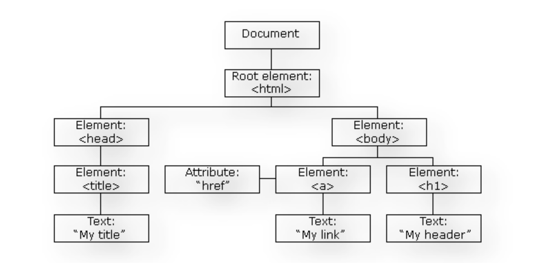
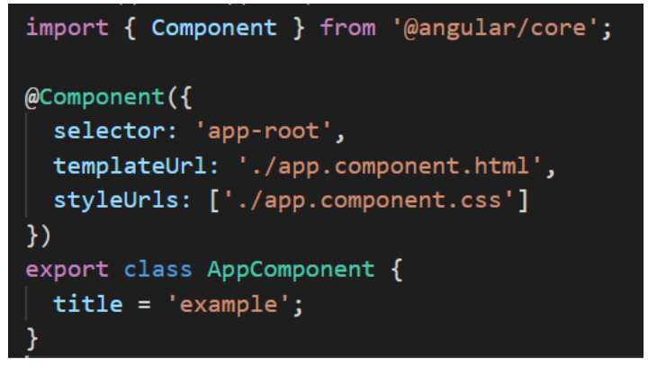
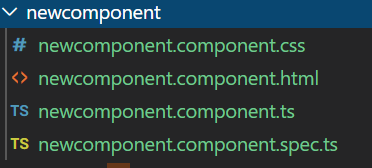
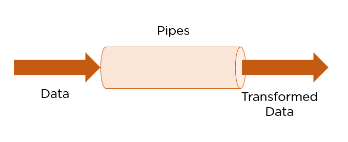

# Basic Angular

1. **What Is Angular ?**

Angular is an open-source, JavaScript framework written in TypeScript. Google maintains it, and its primary purpose is to develop single-page applications. As a framework, Angular has clear advantages while also providing a standard structure for developers to work with. It enables users to create large applications in a maintainable manner. 

2. **What is TypeScript ?**

TypeScript, a programming language created by Microsoft is the source. It extends JavaScript by incorporating typing, classes, interfaces and other enhanced functionalities. In TypeScript the code is transformed into JavaScript for execution, in JavaScript runtime environments.

**TypeScript Command**

```ts
npm install -g typescript
```

3. **What is the Document Object Model (DOM) ?**

Angular uses regular DOM. Consider that ten updates are made on the same HTML page. Instead of updating the ones that were already updated, Angular will update the entire tree structure of HTML tags.




4. **What is the Data Binding ?**

Data binding in angular is a powerful mechanism. Data Binding in Angular automatically synchronizes data between the model (business logic) and the view (what the user sees). In simpler terms, it's a way to bind the data (variables, objects, arrays, etc.)

5. **What is the Modules ?**

Module in Angular refers to a place where you can group the `components, directives, pipes, and services`, which are related to the application. In case you are developing a website, the `header, footer, left, center and the right section` become part of a module. To define module, we can use the NgModule.

6. **What is the Components ?**

Components are the basic building blocks of the user interface in an Angular application. Every component is associated with a template and is a subset of directives. An Angular application typically consists of a root component, which is the AppComponent, that then branches out into other components creating a hierarchy.



* `How to Created Components Files Command `

```ts
ng g c component-name 
```



7. **What is the Selector ?**
   
It is the CSS selector that identifies this component in a template. This corresponds to the HTML tag that is included in the parent component. You can create your HTML tag. However, the same has to be included in the parent component.

8. **What is the Template ?**

It is an inline-defined template for the view. The template can define some markup, typically including headings or paragraphs displayed on the UI.

**Example**

```ts
@Component({
  selector: 'app-about-page',
  template: `<h2>About Page</h2>
              <p>This is rendering the HTML from the TypeScript file!</p>`
})
```

9. **What is the templateUrl ?**

The angular component decorator provides the property of templateUrl and using this property we can set the external HTML code file path. By default, Angular creates an HTML code file with the name of app.

**Example**

```ts
@Component({
  selector: 'app-about-page',
  templateUrl: './about-page.component.html',
  styles: ['h2 {color:red}','p {color:green}']
})
```

10. **What is the Styles ?**

Angular applications are styled with standard CSS. That means you can apply everything you know about CSS stylesheets, selectors, rules, and media queries directly to Angular applications.

**Example**

```ts
@Component({
  selector: 'app-about-page',
  templateUrl: './about-page.component.html',
  styles: ['h2 {color:red}','p {color:green}']
})
```

11. **What is the styleUrls ?**

In the TypeScript file, you can add any logic required for the UI to work, such as retrieving data from a server. You can also render the component's HTML and CSS using TypeScript, by specifying its template and style attributes. You can use templateUrl or styleUrls to link to external HTML or CSS files

**Example**

```ts
@Component({
  selector: 'app-about-page',
  templateUrl: './about-page.component.html',
  styleUrls: ['./about-page.component.css']
})
```

12. **What is the Dependency Injection ?**

Angular enables users to write modular services and inject them wherever they are needed. This improves the testability and reusability of the same services. 

13. **What are Single Page Applications (SPA)?**

Single-page applications are web applications that load once with new features just being mere additions to the user interface. It does not load new HTML pages to display the new page's content, instead generated dynamically. This is made possible through JavaScript's ability to manipulate the DOM elements on the existing page itself. A SPA approach is faster, thus providing a seamless user experience.

14. **What are Directives in Angular?**

Directives are attributes that allow the user to write new HTML syntax specific to their applications. They execute whenever the Angular compiler finds them in the DOM. Angular supports three types of directives.  

- **Component Directives** - Components are directives with Template (or view). We know how to build Angular Components. Structural & Attribute directives do not have an associated view.
  
- **Structural Directives** - Structural directives change the DOM layout by adding and removing DOM elements. All structural Directives are preceded by the Asterix (*) symbol.

- **Attribute Directives** - The Attribute directives can change the appearance or behavior of an element.

15.  **What are Pipes in Angular?**

Pipes are simple functions designed to accept an input value, process, and return as an output, a transformed value in a more technical understanding.

Some key features include: 

- Pipes are defined using the pipe “|” symbol. 
- Pipes can be chained with other pipes.
- Pipes can be provided with arguments by using the colon (:) sign.



16.  **What are NgModule ?**

NgModules are containers that reserve a block of code to an application domain or a workflow. @NgModule takes a metadata object that generally describes the way to compile the template of a component and to generate an injector at runtime. In addition, it identifies the module's components, directives, and pipes, making some of them public, through the export property so that external components can use them.

17. **What is String Interpolation in Angular?**

String Interpolation is a one-way data-binding technique that outputs the data from TypeScript code to HTML view. It is denoted using double curly braces. This template expression helps display the data from the component to the view. 

```ts
{{ data }}
```

18. **What are Template statements?**

Template statements are properties or methods used in HTML for responding to user events. With these template statements, the application that you create or are working on, can have the capability to engage users through actions such as submitting forms and displaying dynamic content.

**For example,** 

```ts
<button (click)="deleteHero()">Delete hero</button>
```

