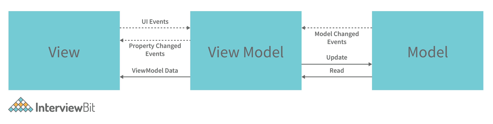
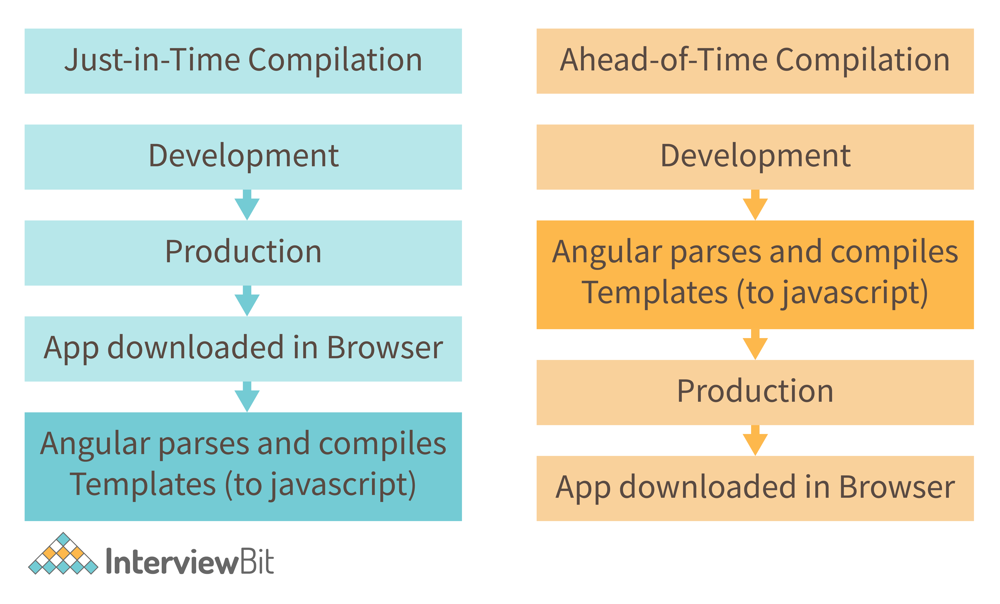

# Advance Angular Interview Question

1. **Explain MVVM architecture**

MVVM architecture consists of three parts:

- Model
- View
- ViewModel



- **Model** contains the structure of an entity. In simple terms it contains data of an object.
- **View** is the visual layer of the application. It displays the data contained inside the Model. In angular terms, this will be the HTML template of a component.
- **ViewModel** is an abstract layer of the application. A viewmodel handles the logic of the application. It manages the data of a model and displays it in the view.

`View` and `ViewModel` are connected with data-binding (two-way data-binding in this case). Any change in the view, the viewmodel takes a note and changes the appropriate data inside the model.

2. **What is a bootstrapping module?**

Every application contains at least one Angular module, which is referred to as the bootstrapping module. AppModule is the most popular name for it.

**Example**: The following is the default structure of an AngularCLI-generated AppModule:

```ts
import { BrowserModule } from '@angular/platform-browser';
import { NgModule } from '@angular/core';
import { FormsModule } from '@angular/forms';
import { HttpClientModule } from '@angular/common/http';
import { AppComponent } from './app.component';

@NgModule({
  declarations: [
    AppComponent
  ],
  imports: [
    BrowserModule,
    FormsModule,
    HttpClientModule
  ],
  providers: [],
  bootstrap: [AppComponent]
})
export class AppModule { }
```

3. **What is Change Detection, and how does the Change Detection Mechanism work?**

The process of synchronizing a model with a view is known as Change Detection. Even when utilizing the ng Model to implement two-way binding, which is syntactic sugar on top of a unidirectional flow. Change detection is incredibly fast, but as an app's complexity and the number of components increase, change detection will have to do more and more work.

Change Detection Mechanism-moves only ahead and never backward, beginning with the root component and ending with the last component. This is what one-way data flow entails. The tree of components is the architecture of an Angular application. Each component is a child, but the child is not a parent. A $digest loop is no longer required with the one-way flow.

4. **What is AOT compilation? What are the advantages of AOT?**

Every Angular application consists of components and templates that the browser cannot understand. Therefore, all the Angular applications need to be compiled first before running inside the browser.

Angular provides two types of compilation:

- JIT(Just-in-Time) compilation
- AOT(Ahead-of-Time) compilation



The advantages of using AOT compilation are:

- Since the application compiles before running inside the browser, the browser loads the executable code and renders the application immediately, which leads to faster rendering.
- In AOT compilation, the compiler sends the external HTML and CSS files along with the application, eliminating separate AJAX requests for those source files, which leads to fewer ajax requests.
- Developers can detect and handle errors during the building phase, which helps in minimizing errors.
- The AOT compiler adds HTML and templates into the JS files before they run inside the browser. Due to this, there are no extra HTML files to be read, which provide better security to the application. 

By default, angular builds and serves the application using JIT compiler:

```ts
ng build
ng serve
```

For using AOT compiler following changes should be made:

```ts
ng build --aot
ng serve --aot
```

5. **What are HTTP interceptors ?**

Using the HttpClient, interceptors allow us to intercept incoming and outgoing HTTP requests. They are capable of handling both HttpRequest and HttpResponse. We can edit or update the value of the request by intercepting the HTTP request, and we can perform some specified actions on a specific status code or message by intercepting the answer.

**Example**: In the following example we will set the Authorization header Bearer for all the requests:

```ts
token.interceptor.ts
import { Injectable } from '@angular/core';
import { HttpInterceptor, HttpRequest, HttpHandler, HttpEvent } from '@angular/common/http';
import { Observable } from 'rxjs/Observable';

@Injectable()
export class TokenInterceptor implements HttpInterceptor {
    public intercept(req: HttpRequest<any>, next: HttpHandler): Observable<HttpEvent<any>> {
    const token = localStorage.getItem('token') as string;
        if (token) {
        req = req.clone({
            setHeaders: {
            'Authorization': `Bearer ${token}`
            }
        });
        }
        return next.handle(req);
    }
}
```

We have to register the interceptor as singleton in the module providers

```ts
app.module.ts
import { NgModule } from '@angular/core';
import { BrowserModule } from '@angular/platform-browser';
import { HTTP_INTERCEPTORS } from '@angular/common/http';
import { AppComponent } from './app.component';
import { TokenInterceptor } from './token.interceptor';

@NgModule({
imports: [
    BrowserModule
],
declarations: [
    AppComponent
],
bootstrap: [AppComponent],
providers: [{
    provide: HTTP_INTERCEPTORS,
    useClass: TokenInterceptor,
    multi: true
}]
})
export class AppModule {}
```

6. **What is transpiling in Angular ?**

Transpiling is the process of transforming the source code of one programming language into the source code of another. Typically, in Angular, this implies translating TypeScript to JavaScript. TypeScript (or another language like as Dart) can be used to develop code for your Angular application, which is subsequently transpiled to JavaScript. This occurs naturally and internally.

7. **What is ngOnInit?**

`ngOnInit` is a lifecycle hook and callback function used by Angular to mark the creation of a component. It accepts no arguments and returns a void type.

**Example**: 

```ts
export class MyComponent implements OnInit {
constructor() { }
    ngOnInit(): void {
        //....
    }
}
```

8. **What does Angular Material means?**

Angular Material is a user interface component package that enables professionals to create a uniform, appealing, and fully functioning websites, web pages, and web apps. It does this by adhering to contemporary web design concepts such as gentle degradation and browser probability.

9. **What exactly is the router state?**

RouterState is a route tree. This tree's nodes are aware of the "consumed" URL segments, retrieved arguments, and processed data. You may use the Router service and the routerState property to get the current RouterState from anywhere in the application.

**Example**: 

```ts
@Component({templateUrl:'example.html'})
class MyComponent {
  constructor(router: Router) {
    const state: RouterState = router.routerState;
    const root: ActivatedRoute = state.root;
    const child = root.firstChild;
    const id: Observable<string> = child.params.map(p => p.id);
    //...
  }
}
```

10. **What are router links?**

RouterLink is an anchor tag directive that gives the router authority over those elements. Because the navigation routes are set.

**Example**: As seen below, you may pass string values to the router-link directive.

```HTML
<h1>Example of an Angular Router</h1>
<nav>
  <a routerLink="/home" >Home Page of our website</a>
  <a routerLink="/about-us" >About us</a>
</nav>
<router-outlet></router-outlet>
```

11. **What are lifecycle hooks in Angular? Explain a few lifecycle hooks.**

Every component in Angular has a lifecycle, and different phases it goes through from the time of creation to the time it's destroyed. Angular provides hooks to tap into these phases and trigger changes at specific phases in a lifecycle.

- `ngOnChanges( )` This hook/method is called before ngOnInit and whenever one or more input properties of the component change. This method/hook receives a SimpleChanges object which contains the previous and current values of the property.
- `ngOnInit( )` This hook gets called once, after the ngOnChanges hook. It initializes the component and sets the input properties of the component.
- `ngDoCheck( )` It gets called after ngOnChanges and ngOnInit and is used to detect and act on changes that cannot be detected by Angular. We can implement our change detection algorithm in this hook. ngAfterContentInit( ) It gets called after the first ngDoCheck hook. This hook responds after the content gets projected inside the component.
- `ngAfterContentChecked( )` It gets called after ngAfterContentInit and every subsequent ngDoCheck. It responds after the projected content is checked.
- `ngAfterViewInit( )` It responds after a component's view, or a child component's view is initialized.
- `ngAfterViewChecked( )` It gets called after ngAfterViewInit, and it responds after the component's view, or the child component's view is checked.
- `ngOnDestroy( )` It gets called just before Angular destroys the component. This hook can be used to clean up the code and detach event handlers.

Let’s understand how to use ngOnInit hook, since it’s the most often used hook. If one has to process a lot of data during component creation, it’s better to do it inside ngOnInit hook rather than the constructor: 

```ts
import { Component, OnInit } from '@angular/core';

      @Component({
        selector: 'app-test',
        templateUrl: './test.component.html',
        styleUrls: ['./test.component.css']
      })
      export class TestComponent implements OnInit {
        constructor() { }

        ngOnInit() {
          this.processData();
        }

        processData(){
          // Do something..
        }

      }
```

As you can see we have imported OnInit but we have used ngOnInit function. This principle should be used with the rest of the hooks as well.


