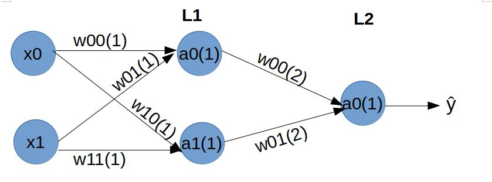
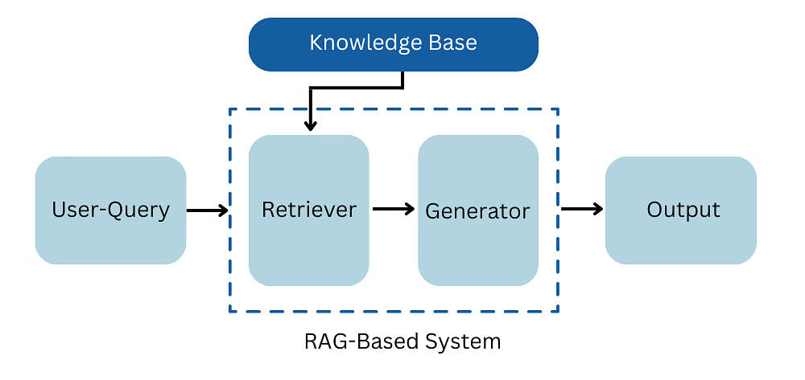

# Generative AI

## Table of Contents

1. [Introduction to Generative AI](#introduction-to-generative-ai)
2. [Foundations of Machine Learning & Deep Learning](#foundations-of-machine-learning-&-deep-learning)
3. [Text Generation Models](#text-generation-models)
4. [Image Generation Techniques](#image-generation-techniques)
5. [Audio and Video Generation](#audio-and-video-generation)
6. [Advanced Topics and Tools](#advanced-topics-and-tools)
7. [Ethical Considerations and Future Trends](#ethical-considerations-and-future-trends)
8. [Retrieval Augmented Generation (RAG)](#retrieval-augmented-generation-(rag))
9. [Advanced LEVEL](#advanced-level)

## Introduction to Generative AI

### Overview of Generative Models

#### 1. Definition Generative AI

Generative models are a type of machine learning model that learn the underlying distribution of a dataset and can generate new data samples that are similar to the original data.

#### 2. What is Generative Adversarial Networks (GANs)

Consist of two neural networks, a generator and a discriminator, that compete in a game-like scenario. The generator creates fake data, while the discriminator tries to differentiate between real and generated data. This adversarial training pushes the generator to create increasingly realistic outputs.

#### 3. What is Variational Autoencoders (VAEs)

A type of autoencoder that learns to generate new data points by mapping input data to a probability distribution. It uses an encoder to compress data into a latent space and a decoder to reconstruct data from that space.

### Autoregressive Models

Examples include GPT (e.g., GPT-3, GPT-4), which predict the next data point in a sequence given prior points. These models are particularly effective for text generation as they learn patterns in language by training on large text datasets.

### Differences Between Generative and Discriminative Models

| **Aspect**        | **Generative Models**                                                                                       | **Discriminative Models**                                                     |
|-------------------|-------------------------------------------------------------------------------------------------------------|------------------------------------------------------------------------------|
| **Core Concept**  | Learn the joint probability distribution $$P(x,y)$$. Generate new data instances that resemble the training data. | Learn the conditional probability distribution $$P(y∣x)$$. Focus on distinguishing between different classes. |
| **Objective**     | Aim to model how data is generated and create new data samples.                                             | Aim to find a decision boundary between classes.                             |
| **Examples**      | GANs, VAEs, PixelCNN, GPT models.                                                                           | Logistic regression, SVM, traditional neural networks (e.g., CNNs for image classification). |
| **Complexity**    | More complex, need to learn the entire data distribution.                                                   | Often simpler, focus on boundaries between classes.                          |
| **Use Cases**     | Data augmentation, creative content generation, anomaly detection, semi-supervised learning.                | Image and speech recognition, spam detection, sentiment analysis.            |

### types of Generative AI?

#### 1. What is Generative AI, and how does it differ across text, image, and audio-based models?

**`Answer:`**

Generative AI refers to machine learning models capable of creating new content such as text, images, or audio.

- Text-based models focus on generating coherent and contextually appropriate text. Examples include GPT and LLaMA.

- Image generation models create visual content based on prompts (e.g., DALL·E, MidJourney).

- Audio-based models generate sound, such as speech or music, like OpenAI’s Jukebox and Amper Music.

#### 2. How do text-based models like GPT and LLaMA work, and what are their practical applications?

**`Answer:`**

Text-based models use large-scale datasets and transformers to predict and generate contextually accurate text. Applications include:

- Chatbots (e.g., customer service)

- Content creation (e.g., articles, blogs)

- Language translation

- Code generation

#### 3.  What differentiates models like DALL·E and MidJourney in the image generation space?

**`Answer:`**

Both models generate images from textual prompts but differ in their focus:

- DALL·E: Known for high-fidelity and realistic images suitable for commercial applications.

- MidJourney: Focuses on artistic and stylized outputs, often used in creative industries.

#### 4 What are the core technologies enabling audio generation and music composition in models like Jukebox and Amper Music?

**`Answer:`**

Audio generation models leverage deep learning techniques like convolutional neural networks (CNNs) or transformers adapted for audio data.

Jukebox: Uses a hierarchical VQ-VAE (Vector Quantized Variational Autoencoder) to create complex, multi-instrument music.
Amper Music: Employs AI to assist non-musicians in composing custom tracks by analyzing user preferences.

#### 5. What are the major challenges faced by text-based generative AI models like GPT?

**`Answer:`**

Challenges include:

- Bias in data: Models may replicate biases present in training datasets.

- Factual inaccuracies: Models can generate plausible but incorrect information.

- Resource intensity: Training and fine-tuning require significant computational power.

#### 6. Can you compare the training process for text-based models and image generation models?

**`Answer:`**

- **`Text-based models:`** Trained on large text corpora using transformers to predict next-word sequences.

- **`Image models:`** Trained on image datasets with techniques like GANs (Generative Adversarial Networks) or diffusion models to generate pixel data from prompts.

#### 7. How does Generative AI handle creativity in music composition?

**`Answer:`**

Generative AI analyzes patterns in music, including melody, harmony, and rhythm, to create new compositions. For example:

- Jukebox recreates specific genres or artists’ styles by training on audio and lyric data.

- Amper Music customizes music tracks based on user input, allowing for creative flexibility without requiring deep musical knowledge.

#### 8. What are the ethical concerns with image generation models like DALL·E and MidJourney?

**`Answer:`**

Key concerns include:

- Misuse: Creating deepfakes or misleading visuals.

- Copyright issues: Ambiguity about ownership of AI-generated images.

- Bias: Models may reflect cultural stereotypes present in training data.

#### 9. How is fine-tuning used to adapt generative AI models for specific industries?

**`Answer:`**

Fine-tuning involves retraining a pre-trained model on domain-specific data. For example:

- Text-based models: Adapted for healthcare by training on medical literature.

- Image models: Fine-tuned to generate specific art styles or brand assets.

- Audio models: Customized to generate sounds tailored for film or gaming.

#### 10. What future trends do you foresee in the development of generative AI across these modalities?

**`Answer:`**

Future trends include:

- **`Multi-modal models:`** Combining text, image, and audio capabilities into unified systems (e.g., OpenAI’s GPT-4 vision).

- **`Real-time applications:`** Faster generation for use in gaming, live events, or AR/VR.

- **`Personalization:`** Tailoring outputs to individual users through adaptive learning.

- **`Improved ethics:`** Developing safeguards to reduce bias and misuse.

### Use Cases and Applications

#### 1. How is Generative AI used in content creation?

**`Answer:`**

Generative AI assists in content creation by automating tasks such as:

- Writing articles, blogs, and social media posts using tools like GPT.

- Generating video scripts or summaries for marketing or educational purposes.

- Assisting programmers by writing and debugging code using tools like GitHub Copilot.

#### 2. What role does Generative AI play in chatbots and virtual assistants?

**`Answer:`**

Generative AI powers chatbots and assistants to:

- Automate customer support by responding to queries quickly and accurately.

- Provide personalized recommendations or task management in tools like Alexa and Siri.

- Simulate real-world conversations for employee training in industries like retail and customer service.

#### 3. How do models like DALL·E contribute to art and media creation?

**`Answer:`**

DALL·E enables users to create unique images based on text prompts. Applications include:

- Generating digital art for creative projects.

- Assisting in film pre-production by designing characters or storyboards.

- Developing visual assets for games or advertisements.

#### 4. What are some applications of Generative AI in marketing and branding?

**`Answer:`**
Generative AI supports marketing by:

- Creating ad designs and marketing copy tailored for specific audiences.

- Generating social media content, including posts and infographics.

- Designing logos and branding materials aligned with company identity.

#### 5. How is Generative AI transforming the gaming industry?

**`Answer:`**

Generative AI is revolutionizing gaming through:

- **`World Design:`** Automating the creation of immersive environments.

- **`Dynamic Storylines:`** Adapting narratives based on player actions.

- **`Procedural Content Generation:`** Creating endless levels, quests, or character dialogue to keep games engaging.

#### 6. Can you explain how Generative AI improves education and training?

**`Answer:`**

Generative AI enhances education by:

- Creating custom study materials like flashcards and summaries.

- Simulating real-world scenarios for training in healthcare or corporate settings.

- Designing personalized learning paths, especially for language learning, as seen in tools like Duolingo.

#### 7. What accessibility solutions does Generative AI provide?

**`Answer:`**

Generative AI promotes inclusivity by:

- Converting text to natural-sounding speech for visually impaired users.

- Generating subtitles or translating content in real time for global audiences.

- Translating spoken language into sign language for hearing-impaired individuals.

#### 8. How is Generative AI used in research and innovation?

**`Answer:`**

Generative AI drives advancements by:

- Assisting in drug discovery by suggesting molecular structures.

- Prototyping designs for architecture or engineering.

- Creating synthetic datasets for testing when real-world data is scarce.

#### 9. What are some examples of music composition using Generative AI?

**`Answer:`**

Generative AI tools like OpenAI’s Jukebox and Amper Music can:

- Compose original tracks in specific genres or styles.

- Assist non-musicians in creating personalized music for ads or films.

- Mimic the style of famous artists to create unique compositions.

#### 10. What is the future potential of Generative AI across these applications?

**`Answer:`**

Future trends include:

- Multi-modal systems combining text, image, and audio generation.

- Real-time, personalized content creation for AR/VR experiences.

- Enhanced ethical guidelines to prevent misuse and ensure fairness.

## Foundations of Machine Learning & Deep Learning

### Review of Machine Learning Concepts

#### 1. What is the difference between supervised and unsupervised learning?

**`Answer:`**

Supervised learning refers to the learning method that trains machines through labeled data. This data is, therefore, already categorized and tagged to the correct set of answers. When a machine is fed this data, it analyzes the training set and produces the correct result.

Unsupervised learning, on the other hand, does not require the data to be labeled. Machines self-learn from identifying patterns and also model data according to probability densities.

#### 2. Can you provide examples of supervised and unsupervised learning applications?

**`Answer:`**

- Supervised Learning Applications:

  - Spam detection: Classifying emails as spam or not spam.

  - Image recognition: Identifying objects like cats or dogs in photos.

  - Medical diagnosis: Predicting diseases based on patient data.

- Unsupervised Learning Applications:

  - Customer segmentation: Grouping users by purchasing behavior.

  - Anomaly detection: Spotting unusual patterns in cybersecurity logs.

  - Recommender systems: Suggesting products based on user similarity.

#### 3. What are some common algorithms used in supervised learning?

**`Answer:`**

- Linear Regression

- Logistic Regression

- Decision Trees

- Support Vector Machines (SVM)

- Neural Networks

#### 4. Name a few algorithms used in unsupervised learning.

**`Answer:`**

- K-Means Clustering

- Hierarchical Clustering

- Principal Component Analysis (PCA)

- Autoencoders

#### 5. What type of data is required for supervised learning?

**`Answer:`**

Supervised learning requires labeled data, where each input example is associated with a known output label, enabling the model to learn a mapping between inputs and outputs.

#### 6. How does unsupervised learning handle the absence of labels?

**`Answer:`**

Unsupervised learning identifies hidden patterns or structures in the data. For instance, clustering algorithms like K-Means group data points with similar characteristics, while dimensionality reduction techniques like PCA simplify complex datasets.

#### 7. What are the key differences between supervised and unsupervised learning?

**`Answer:`**

| **Aspect**       | **Supervised Learning**               | **Unsupervised Learning**                   |
|-------------------|---------------------------------------|---------------------------------------------|
| **Input Data**    | Labeled (input-output pairs)         | Unlabeled (input data only)                |
| **Goal**          | Predict outputs based on input features | Discover patterns or structures in data    |
| **Examples**      | Classification, Regression tasks     | Clustering, Dimensionality Reduction       |

#### 8. How is supervised learning used in deep learning?

**`Answer:`**

In deep learning, supervised learning is often employed for tasks like image classification, speech recognition, and natural language processing. Deep neural networks are trained on labeled data to minimize loss functions and improve predictive accuracy.

#### 9. Can deep learning be applied to unsupervised learning?

**`Answer:`**

Yes, deep learning can be applied to unsupervised tasks. Examples include:

- **`Autoencoders:`** For dimensionality reduction or anomaly detection.

- **`Generative Adversarial Networks (GANs):`** For generating new data samples, such as images or videos.

#### 10. Why is supervised learning generally easier to evaluate than unsupervised learning?

**`Answer:`**

In supervised learning, performance can be evaluated using metrics like accuracy, precision, or recall since there are known output labels for comparison. In unsupervised learning, evaluating performance is more challenging because there are no predefined labels, requiring indirect measures like cluster quality or reconstruction error.

### Deep Learning Basics

#### 1. What are the key components of a neural network architecture?

**`Answer:`**

- **`Input Layer:`** Receives raw data (features).

- **`Hidden Layers:`** Extract patterns and learn representations through weighted connections.

- **`Output Layer:`** Produces predictions or classifications.

- **`Weights and Biases:`** Parameters that adjust during training to optimize performance.

- **`Connections:`** Links between neurons in adjacent layers to pass information.

#### 2. Can you explain the purpose of activation functions in a neural network?

**`Answer:`**

- Activation functions introduce non-linearity to the network, allowing it to model complex relationships. Without activation functions, a neural network would behave like a linear model, limiting its ability to learn from non-linear data patterns.

#### 3.  What are some common activation functions, and where are they used?

**`Answer:`**

- **`Sigmoid:`** Used in output layers for binary classification as it outputs values between 0 and 1.

- **`ReLU:`** Common in hidden layers of CNNs and DNNs due to its efficiency and simplicity.

- **`Softmax:`** Used in the output layer for multi-class classification to generate probabilities.

- **`Tanh:`** Used in RNNs for centered data, as it maps values to (-1, 1).

#### 4. Why is ReLU preferred over Sigmoid in hidden layers?

**`Answer:`**

ReLU is computationally efficient and avoids the vanishing gradient problem common with sigmoid. It ensures faster convergence and better performance, especially in deep networks.

#### 5. What is forward propagation in a neural network?

**`Answer:`**

Forward propagation is the process of passing input data through the layers of a neural network to generate predictions at the output layer. Each neuron processes the data using weighted sums, biases, and activation functions.

#### 6. What is the role of an optimizer in training neural networks?

**`Answer:`**

Optimizers adjust the weights and biases based on gradients computed during backpropagation. Examples include:

- **`SGD (Stochastic Gradient Descent):`** Basic optimizer for weight updates.

- **`Adam:`** Combines momentum and adaptive learning rates for faster convergence.

- **`RMSProp:`** Handles non-stationary objectives by adapting learning rates.

#### 7. Activation Functions

**`Answer:`**

| **Function**      | **Formula**                           | **Characteristics**                                                                 | **Use Cases**                            |
|--------------------|---------------------------------------|------------------------------------------------------------------------------------|------------------------------------------|
| **Sigmoid**        | 𝜎(x) = 1 / (1 + e^(-x))              | Maps input to a range of (0, 1). Suitable for probabilities but suffers from vanishing gradients. | Binary classification (output).          |
| **ReLU**           | f(x) = max(0, x)                    | Sets negative inputs to 0, allowing efficient training. Prone to "dead neurons" if gradients vanish. | Hidden layers in CNNs, DNNs.             |
| **Leaky ReLU**     | f(x) = x if x > 0, 0.01x otherwise   | Prevents dead neurons by allowing small gradients for negative inputs.            | Alternative to ReLU.                     |
| **Tanh**           | f(x) = tanh(x)                      | Maps input to (-1, 1), useful for centered data. Suffers from vanishing gradients. | RNNs (hidden layers).                    |
| **Softmax**        | 𝜎(x)_i = e^(x_i) / ∑e^(x_j)          | Converts logits to probabilities, ensuring they sum to 1.                         | Multi-class classification.              |

### Introduction to Autoencoders and GANs

#### 1. What is an autoencoder, and how does it work?

**`Answer:`**

An autoencoder is a type of neural network designed to encode input data into a smaller representation (latent space) and then reconstruct it back to its original form.

- **`Structure:`** It consists of two main parts:

  - **`Encoder:`** Compresses the input data into a lower-dimensional latent representation.

  - **`Decoder:`** Reconstructs the data from the latent representation.

- **`Training Goal:`** Minimize the reconstruction error between the original input and the output.

#### 2. What is a Generative Adversarial Network (GAN)?

**`Answer:`**

A GAN is a framework consisting of two neural networks that compete against each other:

- Generator: Produces synthetic data that resembles the real data.

- Discriminator: Distinguishes between real and fake data.

#### 3. What are the main differences between autoencoders and GANs?

**`Answer:`**

| **Aspect**         | **Autoencoders**                           | **GANs**                                        |
|---------------------|--------------------------------------------|------------------------------------------------|
| **Architecture**    | Encoder-Decoder structure.                | Generator-Discriminator adversarial setup.     |
| **Output**          | Reconstructs input data.                  | Generates new, realistic data.                 |
| **Training Goal**   | Minimize reconstruction error.            | Improve the generator's ability to fool the discriminator. |
| **Applications**    | Dimensionality reduction, denoising.      | Image synthesis, data augmentation.           |

#### 4. Why are GANs considered powerful tools in generative AI?

**`Answer:`**

GANs are highly effective in creating realistic, high-quality synthetic data because of their adversarial training process. This makes them the backbone of many generative AI applications, such as:

- Text-to-Image Generation (e.g., DALL·E).

- Video Synthesis and Deepfakes.

- Realistic 3D Model Generation for AR/VR.

## Text Generation Models

### Understanding Language Models

#### 1. What are language models, and how do they work?

**`Answer:`**

A language model is a type of AI model designed to predict sequences of text based on previous words or tokens. These models aim to generate coherent, contextually relevant text based on input data. They use deep learning techniques, such as neural networks, to understand and produce human-like language.

#### 2. What are Recurrent Neural Networks (RNNs), and how are they used in text generation?

**`Answer:`**

Recurrent Neural Networks (RNNs) are a type of neural network architecture designed to process sequential data, such as text or speech. RNNs work by maintaining a "memory" of previous elements (words or characters) in the input sequence:

- **`Architecture:`** RNNs contain loops that allow information from previous elements to be used for generating new outputs.

- Usage: In text generation, RNNs predict the next word or phrase based on the context from previous inputs. However, traditional RNNs struggle with longer sequences due to the vanishing gradient problem.

- Variants like Long Short-Term Memory Networks (LSTMs) and Gated Recurrent Units (GRUs) help address this problem, allowing RNNs to better capture long-term dependencies in text data.

#### 3. What is the Transformer architecture, and how does it differ from RNNs in text generation?

**`Answer:`**

The Transformer architecture was introduced to overcome the limitations of RNNs for sequence-to-sequence tasks like text generation:

- **`Architecture:`** The Transformer uses self-attention mechanisms to process input sequences in parallel, allowing it to handle long sequences without the vanishing gradient problem.

- **`Components:`**

  - **`Encoder:`** Converts input tokens into a lower-dimensional representation.

  - **`Decoder:`** Generates output tokens based on previous outputs and context.

- **`Advantages:`** The Transformer is more efficient, able to process longer texts faster, and works better with large-scale datasets compared to RNNs.

**`Applications:`** Transformers have been widely adopted in text generation models, such as GPT (Generative Pre-trained Transformer) series, for generating human-like text.

#### 4. What are the benefits of using Transformers over RNNs for text generation tasks?

**`Answer:`**

Transformers offer several advantages over RNNs for text generation:

- **`Parallelization:`** Transformers can process sequences in parallel, making them more efficient and faster for long texts compared to RNNs, which process sequentially.

- **`Attention Mechanism:`** Transformers can capture longer-term dependencies, resulting in more coherent and contextually relevant text generation.

- **`Scalability:`** Transformers are more suitable for large-scale applications, such as generating human-like text or understanding complex sequences in natural language processing.

- **`No Vanishing Gradient Problem:`** Transformers naturally handle long sequences without losing information, leading to better performance for many NLP tasks.

### Hands-on with GPT-style Models

#### 1. How does the GPT model work?

**`Answer:`**

The GPT (Generative Pre-trained Transformer) model is based on the Transformer architecture, which utilizes self-attention mechanisms to process and generate text. Here's a breakdown of how GPT works:

- **`Self-Attention Mechanism:`**

GPT uses self-attention to weigh the importance of each word in a sequence relative to others, allowing it to understand contextual relationships between words at different positions in the text. This means GPT can focus on different parts of the input text when making predictions.

- **`Transformer Architecture:`**

GPT uses stacked layers of Transformer decoders. Each decoder layer includes attention mechanisms and feed-forward neural networks. This structure helps GPT capture long-range dependencies in text.

- **`Pre-training:`**

GPT is pre-trained on a large corpus of text data to learn general language patterns. During pre-training, GPT learns to predict the next word in a sentence (autoregressive approach), which helps it build a deep understanding of syntax, grammar, and even some factual knowledge.

- **`Generative Process:`**

After pre-training, GPT generates text by conditioning on a given prompt and predicting subsequent words based on the learned probability distribution. The model generates each word one at a time until the desired length or end token is reached.

#### 2. What are the advantages of using a pre-trained GPT model for text generation?

**`Answer:`**

- **`Faster Development:`** Pre-trained models already have a good understanding of language, so they require less training time for task-specific adaptations.

- **`High Quality:`** Pre-trained GPT models are capable of generating high-quality, coherent text because they have been trained on vast datasets and fine-tuned for various use cases.

- **`Cost-Effective:`** Leveraging a pre-trained model reduces the need for large computational resources and extensive datasets, which would be required if training from scratch.

#### 3. What is the role of attention in GPT-style models?

**`Answer:`**

The attention mechanism is central to how GPT models work. It allows the model to focus on different parts of the input sequence while generating each word, helping it capture long-range dependencies in the data. There are two types of attention involved in GPT:

- **`Self-Attention:`**

In GPT, self-attention is used to compute a weighted representation of the entire input sequence. This enables the model to determine which words or tokens in the sequence are most relevant for predicting the next word. For example, in a sentence like “The cat sat on the mat,” self-attention helps the model understand that "cat" is more related to "sat" than to "mat."

- **`Scaled Dot-Product Attention:`**

This is the mathematical operation used to compute attention. The model calculates dot products of query, key, and value vectors derived from the input tokens, scales the results, and applies a softmax function to get the attention weights. These weights are then used to create a weighted sum of values to form the output.

### NLP Tasks

#### 1. What is text completion in Natural Language Processing (NLP), and how does it work?

**`Answer:`**

Text completion in NLP refers to the process of predicting or generating missing parts of a text based on the surrounding context. This task is typically performed using models like GPT, which are trained to understand context and predict subsequent words or phrases.

- **`How it works:`**
  
  - A model is given a prompt or partial text (e.g., "The weather today is") and predicts what words or phrases should follow. The model generates text one token (word or sub-word) at a time, using its learned knowledge of grammar, style, and context.

  - In GPT, this is done using an autoregressive approach, where the model generates the next word based on previous words in the sequence.

- **`Applications:`**
  - Autocompletion in search engines.

  - Writing assistants (e.g., Google Docs, Microsoft Word).

  - Code completion in integrated development environments (IDEs).

#### 2. What is the role of transformers in text summarization tasks?

**`Answer:`**

Transformers, particularly BERT (Bidirectional Encoder Representations from Transformers) and GPT, are highly effective in text summarization due to their powerful attention mechanisms and ability to handle long-range dependencies within text.

- **`BERT:`**

BERT is often used for extractive summarization because it can capture deep contextual information from both directions (left and right) of the text. It helps identify important sentences by understanding the relationships between all words in the text, which is useful for selecting key content.

- **`GPT:`**

GPT is typically used for abstractive summarization because it can generate novel sentences. It uses its autoregressive model to predict the next word based on prior context, allowing it to rewrite the text in a more concise form.

- **`Advantages of Transformers in Summarization:`**

  - Ability to consider the entire context of a document rather than just a fixed window of previous words.

  - Capable of generating human-like summaries that retain meaning and coherence.

#### 3. What is the difference between rule-based and AI-powered chatbots?

**`Answer:`**

| **Aspect**         | **Rule-based Chatbots**                     | **AI-powered Chatbots**                             |
|--------------------|---------------------------------------------|----------------------------------------------------|
| **Functionality**   | Use predefined rules and keyword matching. | Leverage machine learning models for dynamic responses. |
| **Flexibility**     | Limited to predefined responses.           | Can handle a wide range of queries and learn over time. |
| **Context Handling**| Hard to manage complex, context-dependent conversations. | Understand and maintain context over the course of a conversation. |
| **Complexity**      | Simpler, less resource-intensive.          | More complex, requires more training data and computational resources. |
| **Use Cases**       | Simple queries, FAQs, limited scope tasks. | Open-ended conversations, complex customer support, creative tasks. |

#### 4. How do you evaluate the performance of an NLP model for text completion, summarization, or chatbot development?

**`Answer:`**

To evaluate the performance of NLP models for tasks like text completion, summarization, or chatbots, the following metrics are commonly used:

- **For Text Completion:**

  - **`Perplexity:`** Measures how well the model predicts the next word. Lower perplexity indicates better predictive performance.

- **For Summarization:**

  - **`ROUGE Score (Recall-Oriented Understudy for Gisting Evaluation):`** Measures the overlap between the model-generated summary and a reference summary, based on recall, precision, and F1 score.
BLEU Score: Though more common in machine translation, BLEU can also be used to measure how closely the generated summary matches a reference summary.

- **For Chatbots:**

  - **`Intent Recognition Accuracy:`** Measures how well the chatbot identifies user intent.

  - **`Response Coherence:`** Assesses whether the chatbot's responses make sense in the context of the conversation.

  - **`User Satisfaction:`** Can be measured through user feedback or surveys to determine how well the chatbot meets the user's needs.

#### 5. How do transformers like GPT improve chatbot responses?

**`Answer:`**

Transformers like GPT enhance chatbot responses by leveraging their autoregressive nature and ability to generate context-aware, coherent text:

- **`Context Understanding:`**

GPT can understand the full context of the conversation, allowing it to generate responses that feel more natural and aligned with the conversation's flow.

- **`Language Generation:`**

GPT generates human-like text, which is crucial for maintaining natural conversations. The model doesn't just pick pre-written answers; it creates responses on the fly based on the input.

- **`Scalability and Flexibility:`**

GPT can be fine-tuned for specific domains, enabling it to handle a variety of tasks, from simple queries to complex problem-solving interactions.

## Image Generation Techniques

### Introduction to Generative Adversarial Networks (GANs)

#### 1. What are Generative Adversarial Networks (GANs), and how do they work?

**`Answer:`**

Generative Adversarial Networks (GANs) are a class of machine learning models designed to generate realistic data, such as images, videos, and audio, by learning from existing data. GANs consist of two neural networks that compete against each other in a game-like scenario:

- **`Generator:`**

The generator’s goal is to create synthetic data (e.g., images) that resemble real data from a training set. Initially, the generator produces random data, but over time, it learns to improve its outputs by attempting to deceive the discriminator.

- **`Discriminator:`**

The discriminator’s role is to distinguish between real data from the training set and fake data generated by the generator. It outputs a probability value indicating how likely the input is real.

The training process involves both networks competing:

- The generator tries to create data that is increasingly convincing.

- The discriminator tries to become better at detecting fake data.

#### 2. What is the structure of a GAN?

**`Answer:`**

A GAN consists of two primary components:

- **Generator Network (G):**

The generator takes a random noise vector as input and generates synthetic data, such as images. The goal of the generator is to produce data that is indistinguishable from real data.

- **Discriminator Network (D):**

The discriminator receives both real and generated data and classifies each as "real" (from the actual dataset) or "fake" (generated by the generator). It outputs a probability indicating whether the input is real or fake.

The two networks are trained simultaneously in an adversarial manner:

- The generator tries to "fool" the discriminator by producing data that is increasingly realistic.

- The discriminator works to correctly identify real versus fake data.

#### 3. What is the training process of a GAN?

**`Answer:`**

The training process of a GAN involves the following steps:

- **`Generator Initialization:`**

The generator starts with random noise as input, generating random outputs (initially poor quality).

- **`Discriminator Evaluation:`**

The discriminator receives both real data and the generator's output (fake data). It classifies each input as real or fake.

- **`Discriminator Loss Calculation:`**

The discriminator’s goal is to correctly classify real and fake data. Its loss function is based on how well it distinguishes between real and generated data. The discriminator gets feedback and adjusts its parameters.

- **`Generator Loss Calculation:`**

The generator aims to "fool" the discriminator by producing convincing fake data. Its loss function is based on how successfully its outputs are classified as real by the discriminator. The generator receives feedback and adjusts its parameters accordingly.

- **`Iterative Updates:`**
The process repeats, with both the generator and discriminator being updated. Over time, the generator improves its outputs, and the discriminator becomes better at detecting fakes.

- **`Convergence:`**

Eventually, the generator becomes so good at creating realistic data that the discriminator can no longer distinguish between real and fake, indicating that the GAN has successfully learned to generate high-quality data.

#### 4. What are the different types of GANs, and how do they differ?

**`Answer:`**

There are several variations of GANs, each tailored to specific applications or challenges. Some of the most popular types include:

- **`StyleGAN (Generative Adversarial Network):`**

StyleGAN is a type of GAN designed to generate high-resolution images with advanced control over the style and structure of generated images. It introduces the concept of style transfer into the generator's architecture, allowing for more flexible control over different levels of features, such as the texture or shape of the generated images.

- **Use case:** High-quality face generation and other highly detailed image synthesis.

- **`CycleGAN (Cycle-Consistent GAN):`**

CycleGAN is a GAN variant designed for image-to-image translation tasks where paired data is not available. It learns to map images from one domain (e.g., a photo) to another domain (e.g., a painting) by enforcing cycle consistency. The idea is that an image translated from domain A to domain B and then back to domain A should closely resemble the original image.

- **Use case:** Image style transfer, e.g., turning photos into artworks or transforming daytime images into nighttime images.

- **`DCGAN (Deep Convolutional GAN):`**

DCGAN improves the original GAN architecture by incorporating deep convolutional networks (CNNs) into both the generator and discriminator. This helps to stabilize training and improve the quality of generated images.

  - **Use case:** General image generation tasks, especially in the early stages of GAN research.

- **`WGAN (Wasserstein GAN):`**

WGAN addresses the instability in GAN training by using a Wasserstein distance to measure the difference between real and generated distributions, instead of the traditional binary cross-entropy loss. This results in more stable training.

  - **Use case:** Stable generation of images and other data types, especially in complex environments.

#### 5. What are some real-world applications of GANs?

**`Answer:`**

GANs have found applications in a wide range of fields, including:

- **`Art and Entertainment:`**

GANs are used to generate realistic faces, art, and video game characters. StyleGAN, for example, has been used to create lifelike portraits.

- **`Image Super-Resolution:`**

GANs can be used to enhance the resolution of low-quality images, improving detail for applications in medical imaging or satellite imaging.

- **`Data Augmentation:`**

GANs can generate synthetic data to augment training datasets, which is particularly useful in areas where data is scarce (e.g., medical image datasets).

- **`Fashion and Design:`**

GANs are used in creating fashion designs or generating virtual clothing, allowing designers to quickly prototype new concepts.

- **`Autonomous Vehicles:`**

GANs help in generating synthetic driving data, used to train self-driving car models, especially for rare or dangerous driving scenarios.

### Diffusion Models and Their Importance

#### 1. What are diffusion models, and how do they work?

**`Answer:`**

Diffusion models are a class of generative models that create high-quality data, such as images, by learning to reverse a noise-driven diffusion process. They operate through two key phases:

- **`Forward Process (Diffusion):`**

  - Noise is progressively added to the input data (e.g., an image) in small steps, effectively destroying its structure and reducing it to pure noise over time.

  - Each step is designed to incrementally degrade the image while maintaining the ability to track how the noise was added.

- **`Reverse Process (Denoising):`**

  - A neural network learns to reverse the diffusion process by predicting and removing the noise step by step, starting from pure noise, until a high-quality image is generated.

  - The model estimates the conditional probability of the data at each step, gradually reconstructing the original data.

#### 2. How do diffusion models compare to GANs in image generation?

**`Answer:`**

| **Aspect**            | **Diffusion Models**                               | **GANs**                                            |
|-----------------------|----------------------------------------------------|----------------------------------------------------|
| **Training Stability**| More stable, fewer issues with mode collapse.      | Prone to mode collapse and instability during training. |
| **Output Quality**    | Generates highly detailed, photorealistic images.  | Also capable of high-quality images but may lack diversity. |
| **Diversity of Outputs** | Tend to produce more diverse results.            | May focus on limited modes of data (mode collapse). |
| **Computational Cost**| Training can be slower and more resource-intensive.| Typically faster and less resource-intensive.       |
| **Applications**      | Versatile, suited for inpainting, super-resolution.| Popular for general-purpose image generation.       |

#### 3. What are some notable diffusion-based models used in image generation?

**`Answer:`**

- **`DALL·E 2:`**

Combines diffusion models with other techniques to generate creative and high-quality images from text prompts.

- **`Stable Diffusion:`**

A widely used diffusion-based model capable of generating photorealistic images, often used in artistic and professional workflows.

- **`Imagen:`**

Developed by Google, this diffusion-based model specializes in text-to-image generation with state-of-the-art quality.

- **`Latent Diffusion Models (LDMs):`**

These models apply diffusion processes in a compressed latent space, making the process more computationally efficient while retaining high output quality.

## Audio and Video Generation

### Audio Synthesis Models

#### 1. What are audio synthesis models, and what are their primary applications?

**`Answer:`**

Audio synthesis models generate audio signals from various inputs, such as text, noise, or other audio sources. These models use machine learning techniques to create realistic and high-quality audio outputs.

- **`Applications:`**

  - **`Text-to-Speech (TTS):`** Converting written text into spoken words.

  - **`Music Generation:`** Composing melodies, harmonies, or full musical pieces using AI.

  - **`Speech Enhancement:`** Improving audio quality by removing noise or enhancing clarity.

  - **`Sound Design:`** Creating sound effects for films, video games, and virtual reality environments.

#### 2. How does a Text-to-Speech (TTS) system work?

**`Answer:`**

A TTS system converts text into spoken language through the following steps:

- **`Text Processing:`**

  - The input text is analyzed and converted into a phonetic or linguistic representation, including pronunciation, intonation, and rhythm.

- **`Acoustic Modeling:`**

  - Neural networks predict the acoustic features (e.g., pitch, duration) of the speech based on the processed text.

- **`Waveform Generation:`**

  - A vocoder synthesizes the final speech waveform using the predicted acoustic features.

#### 3. How is music generation achieved using AI?

**`Answer:`**

Music generation involves training models on large datasets of musical compositions to learn patterns, styles, and structures. The process typically includes:

- **`Input Representation:`**

  - Inputs can include MIDI files, audio waveforms, or simple prompts specifying tempo, mood, or genre.

- **`Modeling:`**

  - Models like recurrent neural networks (RNNs), transformers, or generative adversarial networks (GANs) predict the sequence of musical notes or audio waveforms.

- **`Output Synthesis:`**

  - The generated output can be in the form of MIDI files (editable musical scores) or synthesized audio.

#### 4. What are the challenges faced in TTS and music generation?

**`Answer:`**

- **`Naturalness in Speech:`**

Generating speech that sounds human-like, with proper intonation and emotion, remains a challenge.

- **`Expressiveness in Music:`**

Capturing human creativity, emotion, and improvisation in music generation is complex.

- **`High Computational Costs:`**

Generating high-quality audio waveforms requires significant computational power and time.

**`Data Quality:`**

High-quality, diverse training datasets are essential for both TTS and music generation, and their availability can be limited.

**`Ethical Concerns:`**

Issues such as copyright infringement in music generation and misuse of TTS for deepfakes are growing concerns.

#### 5. How do transformer models improve audio and music generation?

**`Answer:`**

Transformer models enhance audio and music generation by leveraging attention mechanisms to capture long-term dependencies and relationships in sequences, such as:

- **`In TTS:`** Transformers improve the alignment between input text and generated speech, making the output more fluent and natural.

- **`In Music Generation:`** They capture intricate musical patterns, enabling the generation of compositions with coherent melodies, harmonies, and rhythms over long durations.

### Video Generation and Deepfake Technologies

#### 1. What are video synthesis models, and how do they function?

**`Answer:`**

Video synthesis models generate or manipulate videos using AI techniques, creating new video content or altering existing footage. These models rely on advanced deep learning architectures to process and predict sequences of images (frames) over time.

- **Functioning of Video Synthesis Models:**

  1. **`Frame Generation:`**

  Models like Generative Adversarial Networks (GANs) or Variational Autoencoders (VAEs) generate individual frames using image synthesis techniques.

  2. **`Temporal Consistency:`**
  
  Recurrent Neural Networks (RNNs) or Transformers are used to ensure smooth transitions and consistent motion across frames.

  3. **`Audio Synchronization (if needed):`**

  For tasks like lip-syncing or video dubbing, the model aligns the video with audio cues.

  4. **`Rendering and Post-Processing:`**

  The final video is rendered, ensuring realistic textures, lighting, and motion.

#### 2. What are deepfake technologies, and how do they work?

**`Answer:`**

Deepfake technologies use AI to create highly realistic but artificially generated video content by swapping faces, mimicking expressions, or altering the content of a video.

- **How Deepfake Technologies Work:**

1. **`Data Collection:`**
A dataset of images or videos of the target subject is gathered.

2. **`Face Encoding:`**
Deep neural networks analyze and encode facial features, such as expressions, angles, and movements.

3. **`Training:`**
Models like Autoencoders or GANs learn to map the features of one face onto another by training on paired datasets.

4. **`Synthesis:`**
The trained model generates manipulated video frames with the swapped face, blending them seamlessly with the background and other features.

#### 3. How can AI detect and prevent the misuse of deepfake technologies?

**`Answer:`**

AI can counter deepfakes through:

1. **`Deepfake Detection Models:`**
Models analyze inconsistencies in lighting, shadows, and pixel-level details to identify manipulated content.

2. **`Digital Authentication:`**
Blockchain or cryptographic techniques can verify the authenticity of videos.

3. **`Real-Time Analysis:`**
AI-powered software can detect and flag deepfakes during live broadcasts or uploads.

4. **`Partnerships with Tech Companies:`**
Collaborating with social media platforms to develop tools that automatically remove harmful deepfakes.

#### 4. What are the differences between video synthesis models and traditional CGI techniques?

**`Answer:`**

| **Aspect**            | **Video Synthesis Models**                     | **Traditional CGI Techniques**                 |
|-----------------------|------------------------------------------------|-----------------------------------------------|
| **Technology Base**    | AI-driven (e.g., GANs, transformers).          | Manual animation and rendering tools.         |
| **Automation**         | Highly automated with minimal human intervention. | Requires significant manual input and expertise. |
| **Output Quality**     | Generates realistic results, often mimicking reality. | Creates hyper-realistic, artistic visuals.    |
| **Cost and Time**      | Faster and more cost-effective for certain tasks. | Typically more expensive and time-intensive.  |

#### 5. What are some notable tools or models for video synthesis and deepfake creation?

**`Answer:`**

- **`First Order Motion Model:`** Generates animated videos by transferring motion patterns to static images.

- **`DeepFaceLab:`** A popular tool for creating face-swapping deepfakes.

- **`Synthesia:`** Used for generating AI-driven video avatars for corporate and educational use.

- **`StyleGAN-V:`** Extends StyleGAN for high-quality video synthesis tasks.

- **`RunwayML:`** Provides accessible tools for AI-powered video editing and synthesis.

### Project: Creating a Simple Audio or Video Clip Using AI Tools

#### 1. What is the objective of creating a simple audio or video clip using AI tools?

**`Answer:`**

The objective is to gain hands-on experience with AI-powered creative tools to generate or manipulate audio or video content. This project demonstrates how AI can simplify content creation and enable users to produce high-quality outputs without extensive technical skills in traditional audio or video editing.

#### 2. Which AI tools can be used to create a simple audio or video clip?

**`Answer:`**

1. **Audio Generation Tools:**

- **`Audacity with AI Plugins:`** For basic audio editing and AI-enhanced effects.

- **`Boomy or AIVA:`** For music generation.

- **`Descript:`** For text-to-speech or audio transcription.

2. Video Generation Tools:

- **`RunwayML:`** For video editing and generation.

- **`Synthesia:`** For creating AI-driven video presentations or avatars.

- **`D-ID:`** For animating static images into talking heads.

#### 3. How can audio and video clips created with AI be used in real-world applications?

**`Answer:`**

- **`Marketing and Advertising:`** Personalized promotional videos and jingles.

- **`E-Learning:`** Educational content with narration and animated video.

- **`Entertainment:`** Short films, animated characters, or theme music.

- **`Social Media:`** Quick, engaging content for platforms like Instagram or TikTok.

#### 4. What ethical considerations should be taken into account when creating AI-generated clips?

**`Answer:`**

- **`Authenticity Disclosure:`** Clearly indicate that the content is AI-generated.

- **`Consent:`** Obtain permission for using images, voices, or other identifiable elements.

- **`Avoiding Harm:`** Do not create misleading, defamatory, or harmful content.

- **`Copyright Compliance:`** Use royalty-free materials or ensure proper licensing.

## Advanced Topics and Tools

### Fine-Tuning and Custom Model Training

#### 1. What is fine-tuning in the context of generative models?

**`Answer:`**

Fine-tuning is the process of taking a pre-trained generative model and adapting it to a specific task or dataset. Instead of training a model from scratch, fine-tuning uses the knowledge the model has already learned on a large, general dataset and refines it using task-specific or domain-specific data.

#### 2. What is transfer learning, and how is it related to fine-tuning?

**`Answer:`**

Transfer learning is a machine learning technique where a model trained on one task (source task) is repurposed for another related task (target task). Fine-tuning is a specific form of transfer learning where the pre-trained model's weights are further optimized using new data for a different but related task.

#### 3. Why is fine-tuning important for generative models?

**`Answer:`**

Fine-tuning is important because:

- **`Efficiency:`** It reduces the computational resources and time required compared to training a model from scratch.

- **`Customization:`** Adapts a general-purpose model to domain-specific requirements, improving performance.

- **`Data Requirements:`** Requires significantly less data for training compared to building a model from the ground up.

- **`Improved Performance:`** Leads to higher accuracy and relevance in the generated outputs for specific tasks.

#### 4. How do you evaluate a fine-tuned generative model?

**`Answer:`**

1. **Quantitative Metrics:**

- **`Text Models:`** Perplexity, BLEU score, ROUGE, or accuracy on downstream tasks.

- **`Image Models:`** Inception Score (IS) or Frechet Inception Distance (FID).

2. **Qualitative Assessment:**

- Human evaluation of outputs for relevance, coherence, and creativity.

3. **Overfitting Check:**

- Validate the model on unseen data to ensure it generalizes well and does not overfit to the fine-tuning dataset.

#### 5. How do you avoid overfitting during fine-tuning?

**`Answer:`**

- Use regularization techniques such as dropout or weight decay.

- Apply early stopping during training to halt when validation performance stops improving.

- Use data augmentation to increase dataset diversity.

- Fine-tune with smaller learning rates and fewer epochs.

### Exploring APIs and Frameworks

#### 1. What is OpenAI's API, and what are its key features?

**`Answer:`**

OpenAI's API provides access to state-of-the-art generative AI models like GPT (for text generation) and DALL·E (for image generation). It allows developers to integrate AI capabilities into their applications via RESTful API calls.

**Key Features:**

- **`Natural Language Processing:`** Text completion, summarization, translation, and chatbot development.

- **`Code Generation:`** Generates code snippets and assists with debugging.

- **`Image Generation:`** Create images from text prompts using DALL·E.

- **`Custom Fine-Tuning:`** Allows users to fine-tune models on their own datasets.

- **`Scalability:`** Handles high-volume queries with low latency.

#### 2. How can developers use OpenAI’s API to build applications?

**`Answer:`**

Developers can use OpenAI's API by following these steps:

- **`Sign Up and API Key:`** Register on OpenAI’s platform and obtain an API key.

- **`Integrate API Calls:`** Use programming languages like Python, JavaScript, or others to make requests via OpenAI’s API endpoints.

- **`Provide Inputs:`** Send text prompts or image generation requests through HTTP POST requests.

- **`Handle Responses:`** Parse the JSON responses to extract and use the generated content.

- **`Optimize Usage:`** Adjust parameters like temperature or max tokens to customize the output.

```python
import openai

openai.api_key = "your-api-key"

response = openai.Completion.create(
    engine="text-davinci-003",
    prompt="Explain the concept of APIs.",
    max_tokens=100
)

print(response.choices[0].text.strip())
```

#### 3. What is Hugging Face’s Transformers library, and why is it popular?

**`Answer:`**

The Hugging Face Transformers library is an open-source framework that provides pre-trained models for Natural Language Processing (NLP), computer vision, and other tasks.

**Why it’s Popular:**

- **`Pre-Trained Models:`** Access to thousands of models like GPT, BERT, T5, and CLIP.

- **`Ease of Use:`** Intuitive APIs for text, images, and multi-modal tasks.

- **`Multi-Framework Support:`** Compatible with PyTorch, TensorFlow, and JAX.

- **`Community and Resources:`** Extensive documentation and active developer community.

- **`Customizability:`** Supports fine-tuning and training custom models.

#### 4. How can you use the Hugging Face library to load a pre-trained model?

**`Answer:`**

```Python
from transformers import pipeline

# Load a pre-trained text summarization model
summarizer = pipeline("summarization")

text = "Generative AI involves models like GPT for text and DALL-E for images."
summary = summarizer(text, max_length=30, min_length=10, do_sample=False)

print(summary[0]['summary_text'])
```

- Install the library: `pip install transformers`.

- Use a pipeline for high-level tasks like text generation or summarization.

- Specify task-specific models or use defaults.

#### 5. How does Hugging Face support fine-tuning and custom training?

**`Answer:`**

Hugging Face simplifies fine-tuning and custom training by providing tools like the Trainer API, which handles common tasks such as loading datasets, training loops, and evaluation.

Steps for Fine-Tuning:

1. Load a pre-trained model using from_pretrained().

2. Prepare the dataset with Hugging Face’s Datasets library.

3. Use the Trainer class to configure training parameters.

4. Train and evaluate the model with minimal boilerplate code.

```PYTHON
from transformers import Trainer, TrainingArguments, AutoModelForSequenceClassification

# Load pre-trained model
model = AutoModelForSequenceClassification.from_pretrained("bert-base-uncased")

# Define training arguments
training_args = TrainingArguments(
    output_dir="./results",
    evaluation_strategy="epoch",
    per_device_train_batch_size=16,
    num_train_epochs=3,
    save_steps=10
)

trainer = Trainer(
    model=model,
    args=training_args,
    train_dataset=train_dataset,
    eval_dataset=eval_dataset
)

# Train the model
trainer.train()
```

#### 6. What are the advantages of using APIs like OpenAI’s over open-source frameworks like Hugging Face?

**`Answer:`**

| **Feature**            | **OpenAI’s API**                           | **Hugging Face**                                |
|------------------------|--------------------------------------------|------------------------------------------------|
| **Ease of Use**         | Simplified integration via API calls.     | Requires some coding expertise to set up.      |
| **Custom Fine-Tuning**  | Supported but may incur additional costs. | Flexible and free for custom training.         |
| **Compute Requirements**| Runs on OpenAI's servers, no local infrastructure. | Requires local or cloud-based hardware setup.  |
| **Cost**               | Usage-based pricing.                       | Free unless using paid cloud resources.        |

#### 7. What are some practical use cases for these APIs and frameworks?

**`Answer:`**

1. OpenAI API Use Cases:

- Chatbots and virtual assistants.

- Text summarization and completion.

- Code generation and debugging.

2. Hugging Face Use Cases:

- Training domain-specific NLP models.

- Sentiment analysis, machine translation, and classification tasks.

- Custom image-to-text and multi-modal applications.

#### 8. How do you choose between OpenAI’s API and Hugging Face for a project?

**`Answer:`**

The choice depends on project requirements:

- Use **`OpenAI’s API`** if you need fast integration, pre-built capabilities, and don’t want to manage infrastructure.

- Use **`Hugging Face`** if you require extensive customization, need to fine-tune models, or want control over the training process and costs.

### Prompt Engineering

#### 1. What is prompt engineering in the context of generative AI?

**`Answer:`**

Prompt engineering is the process of designing and refining input instructions (prompts) to guide generative AI models like GPT or DALL·E in producing desired outputs. Effective prompts clearly specify the context, format, and expected results to maximize the quality and relevance of the output.

#### 2. Why is prompt engineering important?

**`Answer:`**

Prompt engineering is critical because:

- **`Improves Accuracy:`** Guides the model to produce relevant and precise outputs.

- **`Reduces Errors:`** Minimizes ambiguous or irrelevant responses.

- **`Saves Time:`** Allows users to achieve the desired results without repeated iterations.

- **`Customizes Outputs:`** Tailors results to meet specific requirements or formats.

#### 3.  What is the role of few-shot and zero-shot prompting?

**`Answer:`**

- **`Zero-shot Prompting:`** The model performs a task without any examples, relying solely on the prompt's instructions.

  - ***Example:*** Summarize the following paragraph in one sentence.

- **`Few-shot Prompting:`** The prompt includes a few examples to demonstrate the desired task before providing the actual input.

  -  ***Example:***

  ```vbnet
  Q: What is the capital of France?  
  A: Paris  
  Q: What is the capital of Japan?  
  A: Tokyo  
  Q: What is the capital of Italy?  
  A:
  ```

#### 4. What are common challenges in prompt engineering?

**`Answer:`**

- **`Ambiguity:`** Vague or unclear prompts can lead to irrelevant responses.

- **`Model Limitations:`** The model may struggle with highly complex or specialized tasks.

- **`Bias in Outputs:`** The prompt might inadvertently lead to biased or incomplete responses.

- **`Over-Complexity:`** Overloading the prompt with excessive detail can confuse the model.

#### 5. What tools or platforms support advanced prompt engineering?

**`Answer:`**

- **`OpenAI Playground:`** A web-based interface for experimenting with and refining prompts.

- **`Hugging Face Spaces:`** Allows testing and deploying prompt-based models with various configurations.

- **`LangChain:`** A framework for building applications with advanced prompt chaining and reasoning.

- **`Prompt Engineering Notebooks:`** Open-source tools or notebooks that provide templates and examples for designing effective prompts.

## Ethical Considerations and Future Trends

### Ethical and Social Implications

#### 1. How do biases in generative models affect outputs?

**`Answer:`**

Biases in generative models arise from the data they are trained on. If the training data contains biased representations (e.g., gender, race, or cultural stereotypes), the model may generate outputs that reflect those biases. For instance, a language model trained on biased text data might generate harmful stereotypes or exclude underrepresented perspectives. This could lead to harmful societal consequences, such as reinforcing discrimination or marginalization.

**Example:**

A generative model trained on biased historical texts might generate content that underrepresents women or minorities in leadership roles.

#### 2. What are deepfakes, and how do they raise ethical concerns?

**`Answer:`**

Deepfakes refer to hyper-realistic videos, images, or audio clips generated by AI, typically using techniques like GANs (Generative Adversarial Networks). They can convincingly manipulate real content to create fabricated scenarios, often making individuals appear to say or do things they never actually did.

**Ethical Concerns:**

- **`Misinformation:`** Deepfakes can spread false information, leading to misinformation or defamation, particularly in politics or media.

- **`Trust Erosion:`** The ability to fake high-quality media can erode public trust in digital content, making it difficult to distinguish real from fake.

- **`Personal Harm:`** Individuals may have their likeness or voice used maliciously, causing reputational damage or emotional distress.

#### 3. How does generative AI contribute to misinformation campaigns?

**`Answer:`**

Generative AI, particularly language models like GPT, can be used to automatically generate large volumes of misleading content, such as fake news articles, social media posts, or malicious propaganda. This can be exploited in misinformation campaigns to spread false narratives, influence public opinion, or interfere in elections.

**Example:**

Automated bots powered by generative models could flood social media with false or biased information, making it harder for users to differentiate between genuine and fake content.

#### 4. How can generative AI be used responsibly in content creation?

**`Answer:`**

Responsible use of generative AI in content creation includes:

- **`Clear Disclosure:`** Clearly label AI-generated content to avoid misleading viewers or readers.

- **`Ethical Guidelines:`** Establish ethical guidelines for AI-generated content, including rules on copyright, privacy, and respect for individuals.

- **`Human Oversight:`** Incorporate human oversight into AI-generated outputs to ensure accuracy and prevent harmful content.

- **`Bias Mitigation:`** Use diverse datasets and fairness algorithms to ensure that generated content is not biased or discriminatory.

### Trends and Future of Generative AI

#### 1. What are multi-modal models in generative AI, and why are they significant?

**`Answer:`**

Multi-modal models are AI systems that can process and generate content across multiple data types (modalities), such as text, images, audio, and video. These models enable seamless integration of different forms of information, enhancing their versatility and applicability.

**Significance:**

- **`Enhanced User Interaction:`** Enables AI to interpret and respond in richer ways, such as generating an image from text or summarizing a video using natural language.

- **`Complex Problem Solving:`** Multi-modal models can integrate data from diverse sources, making them valuable for tasks like medical diagnosis (combining text reports and images) or autonomous systems (processing sensor data and visual inputs).

- **`Examples:`** OpenAI’s GPT-4 vision capabilities and Meta’s ImageBind are key advances in this domain.

#### 2. How do advances in multi-modal AI models influence future applications?

**`Answer:`**

Advances in multi-modal AI enable:

- **`Rich Content Generation:`** Producing synchronized outputs across modalities, such as videos with accompanying narratives.

- **`Human-AI Collaboration:`** Allowing users to interact with AI naturally, combining text, speech, and gestures in applications like virtual assistants or AR/VR systems.

- **`Healthcare Innovation:`** Integrating imaging data, patient records, and other modalities to provide comprehensive insights for diagnosis and treatment.

- **`Creative Industries:`** Tools like generating animated films or designing advertisements that combine text and visual elements.

#### 3. How do advances in generative AI address real-world problems?

**`Answer:`**

Generative AI is applied to solve pressing challenges, such as:

- **`Environmental Modeling:`** AI-generated simulations help predict climate changes and optimize renewable energy systems.

- **`Healthcare Diagnostics:`** Multi-modal models assist in synthesizing medical data for quicker and more accurate diagnoses.

- **`Language Access:`** AI tools break down language barriers by providing real-time translations in text, speech, and even sign language.

- **`Urban Planning:`** Generating 3D models for city layouts to optimize resources and improve infrastructure.

#### 4. What role will collaboration between AI models and humans play in the future?

**`Answer:`**

- **`Decision Support:`** AI will act as a collaborator, offering data-driven insights while humans make final decisions.

- **`Creative Synergy:`** AI tools will assist humans in producing higher-quality creative work, enhancing productivity.

- **`Problem Solving:`** AI-human collaboration will enable tackling complex, multi-disciplinary problems that require both computational power and human intuition.

- **`Education and Training:`** AI will support educators and learners by providing tailored tools and feedback, enriching the learning experience.

#### 5. Can you explain the differences between Generative Adversarial Networks (GANs) and Variational Autoencoders (VAEs)?

**`Answer:`** GANs consist of two networks—a generator and a discriminator—competing in a game where the generator tries to produce realistic data while the discriminator tries to distinguish between real and fake data. VAEs, on the other hand, are probabilistic models that learn a latent variable representation of the data and use it to generate new samples. GANs often produce sharper images but can be more challenging to train, while VAEs are generally more stable but might produce blurrier images.

#### 6. What are the key components of a GAN architecture, and how do they interact during training?

**`Answer:`** A GAN architecture includes a generator and a discriminator. The generator creates fake data samples, while the discriminator evaluates them against real data samples to determine authenticity. During training, the generator tries to improve its data generation to fool the discriminator, while the discriminator improves its ability to distinguish between real and fake data. This adversarial process continues until the generator produces data that the discriminator can no longer reliably classify as fake.

#### 7. What are some common techniques to improve the stability and performance of GANs?

**`Answer:`** Techniques to improve GAN stability and performance include using different architectures such as Deep Convolutional GANs (DCGANs) or Wasserstein GANs (WGANs). Incorporating techniques like batch normalization, feature matching, and gradient penalty can also help stabilize training. Additionally, employing advanced optimizers and loss functions designed specifically for GANs can improve performance.

#### 8 Describe a project where you applied generative models to solve a real-world problem. What was the outcome?

**`Answer:`** In a project aimed at enhancing customer support, I applied a generative model to create a chatbot that could generate contextually relevant responses. By training the model on historical interaction data, we improved response accuracy and user engagement. The chatbot significantly reduced the need for human intervention and increased customer satisfaction through more natural and personalized interactions.

#### 9. How have you used generative models to create synthetic data, and what advantages does this approach offer?

**`Answer:`** Generative models can be used to create synthetic data for various purposes, such as augmenting training datasets or generating samples for testing. For example, I used GANs to generate synthetic medical images for training diagnostic algorithms. The advantages include increased data diversity, enhanced model training, and the ability to generate data where real samples are scarce or difficult to obtain.

#### 10. Can you explain how you have used generative models for content creation, such as generating text, images, or music?

**`Answer:`** I have used generative models for content creation in various ways, such as generating personalized marketing content using language models, creating artwork with GANs, and composing music using models trained on MIDI data. These applications involved fine-tuning models on specific datasets to generate high-quality and contextually appropriate content that met the needs of the target audience.

#### 11. In what ways does Gemini’s architecture optimize training efficiency and stability compared to other multimodal LLMs like GPT-4V?

**`Answer:`** Gemini employs several optimization techniques to enhance training stability and efficiency. It incorporates the Lion optimizer and Low Precision Layer Normalization, which contribute to improved stability during training. Additionally, Gemini’s focus on multimodal tasks allows it to achieve state-of-the-art performance on benchmarks like MMMU, showcasing its efficiency and stability compared to other multimodal LLMs.

#### 12. In what ways does Gemini’s architecture optimize training efficiency and stability compared to other multimodal LLMs like GPT-4V?

**`Answer:`** Gemini employs several optimization techniques to enhance training stability and efficiency. It incorporates the Lion optimizer and Low Precision Layer Normalization, which contribute to improved stability during training. Additionally, Gemini’s focus on multimodal tasks allows it to achieve state-of-the-art performance on benchmarks like MMMU, showcasing its efficiency and stability compared to other multimodal LLMs.

#### 13. How does Gemini optimize training efficiency and stability compared to other multimodal LLMs like GPT-4V?

**`Answer:`** Gemini incorporates optimization techniques like the Lion optimizer and Low Precision Layer Normalization, enhancing training stability. Focusing on multimodal tasks, Gemini achieves state-of-the-art performance on benchmarks like MMMU.

#### 14. How do models like GPT, LLaMA, and Gemini utilize transformer architectures with specific modifications for efficient training and inference on specialized tasks?

**`Answer:`** Models like GPT, LLaMA, and Gemini leverage transformer architectures with tailored modifications for various tasks. For instance, they utilize decoder-only transformer architectures optimized for tasks involving text, images, audio, video, and code. These modifications enable efficient training and inference across diverse modalities, ensuring scalability and performance in specialized tasks.

### Common Generative AI Interview Questions

1. **What is the difference between generative and discriminative models?**

**`Answer:`**

Generative models, such as Variational Autoencoders (VAEs) and Generative Adversarial Networks (GANs), are designed to generate new data samples by understanding and capturing the underlying data distribution. Discriminative models, on the other hand, focus on distinguishing between different classes or categories within the data.
        

        
Image Source: [https://medium.com/@jordi299/about-generative-and-discriminative-models-d8958b67ad32](https://medium.com/@jordi299/about-generative-and-discriminative-models-d8958b67ad32)

---

2. **Describe the architecture of a Generative Adversarial Network and how the generator and discriminator interact during training.**

**`Answer:`**

A Generative Adversarial Network comprises a generator and a discriminator. The generator produces synthetic data, attempting to mimic real data, while the discriminator evaluates the authenticity of the generated samples. During training, the generator and discriminator engage in a dynamic interplay, each striving to outperform the other. The generator aims to create more realistic data, and the discriminator seeks to improve its ability to differentiate between real and generated samples.


Image Source: [https://climate.com/tech-at-climate-corp/gans-disease-identification-model/](https://climate.com/tech-at-climate-corp/gans-disease-identification-model/)

---

3. **Explain the concept of a Variational Autoencoder (VAE) and how it incorporates latent variables into its architecture.**

**`Answer:`**

A Variational Autoencoder (VAE) is a type of neural network architecture used for unsupervised learning of latent representations of data. It consists of an encoder and a decoder network.


Image source: [https://towardsdatascience.com/understanding-variational-autoencoders-vaes-f70510919f73](https://towardsdatascience.com/understanding-variational-autoencoders-vaes-f70510919f73)

The encoder takes input data and maps it to a probability distribution in a latent space. Instead of directly producing a single latent vector, the encoder outputs parameters of a probability distribution, typically Gaussian, representing the uncertainty in the latent representation. This stochastic process allows for sampling from the latent space.

The decoder takes these sampled latent vectors and reconstructs the input data. During training, the VAE aims to minimize the reconstruction error between the input data and the decoded output, while also minimizing the discrepancy between the learned latent distribution and a pre-defined prior distribution, often a standard Gaussian.

By incorporating latent variables into its architecture, the VAE learns a compact and continuous representation of the input data in the latent space. This enables meaningful interpolation and generation of new data samples by sampling from the learned latent distribution. Additionally, the probabilistic nature of the VAE's latent space allows for uncertainty estimation in the generated outputs.

read this article: [https://towardsdatascience.com/understanding-variational-autoencoders-vaes-f70510919f73](https://towardsdatascience.com/understanding-variational-autoencoders-vaes-f70510919f73)

---

4. **How do conditional generative models differ from unconditional ones? Provide an example scenario where a conditional approach is beneficial.**

**`Answer:`**

Conditional generative models differ from unconditional ones by considering additional information or conditions during the generation process. In unconditional generative models, such as vanilla GANs or VAEs, the model learns to generate samples solely based on the underlying data distribution. However, in conditional generative models, the generation process is conditioned on additional input variables or labels.

For example, in the context of image generation, an unconditional generative model might learn to generate various types of images without any specific constraints. On the other hand, a conditional generative model could be trained to generate images of specific categories, such as generating images of different breeds of dogs based on input labels specifying the breed.

A scenario where a conditional approach is beneficial is in tasks where precise control over the generated outputs is required or when generating samples belonging to specific categories or conditions. For instance:

- In image-to-image translation tasks, where the goal is to convert images from one domain to another (e.g., converting images from day to night), a conditional approach allows the model to learn the mapping between input and output domains based on paired data.

- In text-to-image synthesis, given a textual description, a conditional generative model can generate corresponding images that match the description, enabling applications like generating images from textual prompts.

Conditional generative models offer greater flexibility and control over the generated outputs by incorporating additional information or conditions, making them well-suited for tasks requiring specific constraints or tailored generation based on input conditions.

---

5. **What is mode collapse in the context of GANs, and what strategies can be employed to address it during training?**

**`Answer:`**

Mode collapse in the context of Generative Adversarial Networks (GANs) refers to a situation where the generator produces limited diversity in generated samples, often sticking to a few modes or patterns in the data distribution. Instead of capturing the full richness of the data distribution, the generator might only learn to generate samples that belong to a subset of the possible modes, resulting in repetitive or homogeneous outputs.

Several strategies can be employed to address mode collapse during training:

1. **Architectural Modifications:** Adjusting the architecture of the GAN can help mitigate mode collapse. This might involve increasing the capacity of the generator and discriminator networks, introducing skip connections, or employing more complex network architectures such as deep convolutional GANs (DCGANs) or progressive growing GANs (PGGANs).

2. **Mini-Batch Discrimination:** This technique encourages the generator to produce more diverse samples by penalizing mode collapse. By computing statistics across multiple samples in a mini-batch, the discriminator can identify mode collapse and provide feedback to the generator to encourage diversity in the generated samples.

3. **Diverse Training Data:** Ensuring that the training dataset contains diverse samples from the target distribution can help prevent mode collapse. If the training data is highly skewed or lacks diversity, the generator may struggle to capture the full complexity of the data distribution.

4. **Regularization Techniques:** Techniques such as weight regularization, dropout, and spectral normalization can be used to regularize the training of the GAN, making it more resistant to mode collapse. These techniques help prevent overfitting and encourage the learning of more diverse features.

5. **Dynamic Learning Rates:** Adjusting the learning rates of the generator and discriminator dynamically during training can help stabilize the training process and prevent mode collapse. Techniques such as using learning rate schedules or adaptive learning rate algorithms can be effective in this regard.

6. **Ensemble Methods:** Training multiple GANs with different initializations or architectures and combining their outputs using ensemble methods can help alleviate mode collapse. By leveraging the diversity of multiple generators, ensemble methods can produce more varied and realistic generated samples.

---

6. **How does overfitting manifest in generative models, and what techniques can be used to prevent it during training?**

**`Answer:`**

Overfitting in generative models occurs when the model memorizes the training data rather than learning the underlying data distribution, resulting in poor generalization to new, unseen data. Overfitting can manifest in various ways in generative models:

1. **Mode Collapse:** One common manifestation of overfitting in generative models is mode collapse, where the generator produces a limited variety of samples, failing to capture the full diversity of the data distribution.

2. **Poor Generalization:** Generative models might generate samples that closely resemble the training data but lack diversity or fail to capture the nuances present in the true data distribution.

3. **Artifacts or Inconsistencies:** Overfitting can lead to the generation of unrealistic or inconsistent samples, such as distorted images, implausible text sequences, or nonsensical outputs.

To prevent overfitting in generative models during training, various techniques can be employed:

1. **Regularization:** Regularization techniques such as weight decay, dropout, and batch normalization can help prevent overfitting by imposing constraints on the model's parameters or introducing stochasticity during training.

2. **Early Stopping:** Monitoring the performance of the generative model on a validation set and stopping training when performance begins to deteriorate can prevent overfitting and ensure that the model generalizes well to unseen data.

3. **Data Augmentation:** Increasing the diversity of the training data through techniques like random cropping, rotation, scaling, or adding noise can help prevent overfitting by exposing the model to a wider range of variations in the data distribution.

4. **Adversarial Training:** Adversarial training, where the generator is trained to fool a discriminator that is simultaneously trained to distinguish between real and generated samples, can help prevent mode collapse and encourage the generation of diverse and realistic samples.

5. **Ensemble Methods:** Training multiple generative models with different architectures or initializations and combining their outputs using ensemble methods can help mitigate overfitting by leveraging the diversity of multiple models.

6. **Cross-Validation:** Partitioning the dataset into multiple folds and training the model on different subsets while validating on the remaining data can help prevent overfitting by providing more reliable estimates of the model's performance on unseen data.

---

7. **What is gradient clipping, and how does it help in stabilizing the training process of generative models?**

**`Answer:`**

Gradient clipping is a technique used during training to limit the magnitude of gradients, typically applied when the gradients exceed a predefined threshold. It is commonly employed in deep learning models, including generative models like Generative Adversarial Networks (GANs) and Variational Autoencoders (VAEs).

Gradient clipping helps stabilize the training process of generative models in several ways:

1. **Preventing Exploding Gradients:** In deep neural networks, particularly in architectures with deep layers, gradients can sometimes explode during training, leading to numerical instability and hindering convergence. Gradient clipping imposes an upper bound on the gradient values, preventing them from growing too large and causing numerical issues.

2. **Mitigating Oscillations:** During training, gradients can oscillate widely due to the complex interactions between the generator and discriminator (in GANs) or the encoder and decoder (in VAEs). Gradient clipping helps dampen these oscillations by constraining the magnitude of the gradients, leading to smoother and more stable updates to the model parameters.

3. **Enhancing Convergence:** By preventing the gradients from becoming too large or too small, gradient clipping promotes more consistent and predictable updates to the model parameters. This can lead to faster convergence during training, as the model is less likely to encounter extreme gradient values that impede progress.

4. **Improving Robustness:** Gradient clipping can help make the training process more robust to variations in hyperparameters, such as learning rates or batch sizes. It provides an additional safeguard against potential instabilities that may arise due to changes in the training dynamics.

---

8. **Discuss strategies for training generative models when the available dataset is limited.**

**`Answer:`**

When dealing with limited datasets, training generative models can be challenging due to the potential for overfitting and the difficulty of capturing the full complexity of the underlying data distribution. However, several strategies can be employed to effectively train generative models with limited data:

1. **Data Augmentation:** Augmenting the existing dataset by applying transformations such as rotation, scaling, cropping, or adding noise can increase the diversity of the training data. This helps prevent overfitting and enables the model to learn more robust representations of the data distribution.

2. **Transfer Learning:** Leveraging pre-trained models trained on larger datasets can provide a valuable initialization for the generative model. By fine-tuning the pre-trained model on the limited dataset, the model can adapt its representations to the specific characteristics of the target domain more efficiently.

3. **Semi-supervised Learning:** If a small amount of labeled data is available in addition to the limited dataset, semi-supervised learning 
techniques can be employed. These techniques leverage both labeled and unlabeled data to improve model performance, often by jointly optimizing a supervised and unsupervised loss function.

4. **Regularization:** Regularization techniques such as weight decay, dropout, and batch normalization can help prevent overfitting by imposing constraints on the model's parameters or introducing stochasticity during training. Regularization encourages the model to learn more generalizable representations of the data.

5. **Generative Adversarial Networks (GANs) with Progressive Growing:** Progressive growing GANs (PGGANs) incrementally increase the resolution of generated images during training, starting from low resolution and gradually adding detail. This allows the model to learn more effectively from limited data by focusing on coarse features before refining finer details.

6. **Ensemble Methods:** Training multiple generative models with different architectures or initializations and combining their outputs using ensemble methods can help mitigate the limitations of a small dataset. Ensemble methods leverage the diversity of multiple models to improve the overall performance and robustness of the generative model.

7. **Data Synthesis:** In cases where the available dataset is extremely limited, data synthesis techniques such as generative adversarial networks (GANs) or variational autoencoders (VAEs) can be used to generate synthetic data samples. These synthetic samples can be combined with the limited real data to augment the training dataset and improve model performance.

---

9. **Explain how curriculum learning can be applied in the training of generative models. What advantages does it offer?**

**`Answer:`**

Curriculum learning is a training strategy inspired by the way humans learn, where we often start with simpler concepts and gradually move towards more complex ones. This approach can be effectively applied in the training of generative models, a class of AI models designed to generate data similar to some input data, such as images, text, or sound.

To apply curriculum learning in the training of generative models, you would start by organizing the training data into a sequence of subsets, ranging from simpler to more complex examples. The criteria for complexity can vary depending on the task and the data. For instance, in a text generation task, simpler examples could be shorter sentences with common vocabulary, while more complex examples could be longer sentences with intricate structures and diverse vocabulary. In image generation, simpler examples might include images with less detail or fewer objects, progressing to more detailed images with complex scenes.

The training process then begins with the model learning from the simpler subset of data, gradually introducing more complex subsets as the model's performance improves. This incremental approach helps the model to first grasp basic patterns before tackling more challenging ones, mimicking a learning progression that can lead to more efficient and effective learning.

The advantages of applying curriculum learning to the training of generative models include:

1. **Improved Learning Efficiency**: Starting with simpler examples can help the model to quickly learn basic patterns before gradually adapting to more complex ones, potentially speeding up the training process.

2. **Enhanced Model Performance**: By structuring the learning process, the model may achieve better generalization and performance on complex examples, as it has built a solid foundation on simpler tasks.

3. **Stabilized Training Process**: Gradually increasing the complexity of the training data can lead to a more stable training process, reducing the risk of the model getting stuck in poor local minima early in training.

4. **Reduced Overfitting**: By effectively learning general patterns from simpler examples before moving to complex ones, the model might be less prone to overfitting on the training data.

---

10. **Describe the concept of learning rate scheduling and its role in optimizing the training process of generative models over time.**

**`Answer:`**

Learning rate scheduling is a crucial technique in the optimization of neural networks, including generative models, which involves adjusting the learning rate—the step size used to update the model's weights—over the course of training. The learning rate is a critical hyperparameter that determines how much the model adjusts its weights in response to the estimated error each time it is updated. If the learning rate is too high, the model may overshoot the optimal solution; if it's too low, training may proceed very slowly or stall.

In the context of training generative models, such as Generative Adversarial Networks (GANs) or Variational Autoencoders (VAEs), learning rate scheduling can significantly impact the model's ability to learn complex data distributions effectively and efficiently.

**Role in Optimizing the Training Process:**

1. **Avoids Overshooting:** Early in training, a higher learning rate can help the model quickly converge towards a good solution. However, as training progresses and the model gets closer to the optimal solution, that same high learning rate can cause the model to overshoot the target. Gradually reducing the learning rate helps avoid this problem, allowing the model to fine-tune its parameters more delicately.

2. **Speeds Up Convergence:** Initially using a higher learning rate can accelerate the convergence by allowing larger updates to the weights. This is especially useful in the early phases of training when the model is far from the optimal solution.

3. **Improves Model Performance:** By carefully adjusting the learning rate over time, the model can escape suboptimal local minima or saddle points more efficiently, potentially leading to better overall performance on the generation task.

4. **Adapts to Training Dynamics:** Different phases of training may require different learning rates. For example, in the case of GANs, the balance between the generator and discriminator can vary widely during training. Adaptive learning rate scheduling can help maintain this balance by adjusting the learning rates according to the training dynamics.

**Common Scheduling Strategies:**

- **Step Decay:** Reducing the learning rate by a factor every few epochs.

- **Exponential Decay:** Continuously reducing the learning rate exponentially over time.

- **Cosine Annealing:** Adjusting the learning rate following a cosine function, leading to periodic adjustments that can help in escaping local minima.

- **Warm-up Schedules:** Gradually increasing the learning rate from a small to a larger value during the initial phase of training, which can help in stabilizing the training of very deep models.

---

11. **Compare and contrast the use of L1 and L2 loss functions in the context of generative models. When might one be preferred over the other?**

**`Answer:`**

Both loss functions are used to measure the difference between the model's predictions and the actual data, but they do so in distinct ways that affect the model's learning behavior and output characteristics.

**L1 Loss (Absolute Loss):** The L1 loss function calculates the absolute differences between the predicted values and the actual values. This approach is less sensitive to outliers because it treats all deviations the same, regardless of their magnitude. In the context of generative models, using L1 loss can lead to sparser gradients, which may result in models that are more robust to noise in the input data. Moreover, L1 loss tends to produce results that are less smooth, which might be preferable when sharp transitions or details are desired in the generated outputs, such as in image super-resolution tasks.

**L2 Loss (Squared Loss):** On the other hand, the L2 loss function computes the square of the differences between the predicted and actual values. This makes it more sensitive to outliers, as larger deviations are penalized more heavily. The use of L2 loss in generative models often results in smoother outcomes because it encourages smaller and more incremental changes in the model's parameters. This characteristic can be beneficial in tasks where the continuity of the output is critical, like generating realistic textures in images.

**Preference and Application:**

- **Preference for L1 Loss:** You might prefer L1 loss when the goal is to encourage more robustness to outliers in the dataset or when generating outputs where precise edges and details are important. Its tendency to produce sparser solutions can be particularly useful in applications requiring high detail fidelity, such as in certain types of image processing where sharpness is key.

- **Preference for L2 Loss:** L2 loss could be the preferred choice when aiming for smoother outputs and when dealing with problems where the Gaussian noise assumption is reasonable. Its sensitivity to outliers makes it suitable for tasks where the emphasis is on minimizing large errors, contributing to smoother and more continuous generative outputs.

---

12. **In the context of GANs, what is the purpose of gradient penalties in the loss function? How do they address training instability?**

**`Answer:`**

Gradient penalties are a crucial technique designed to enhance the stability and reliability of the training process. GANs consist of two competing networks: a generator, which creates data resembling the target distribution, and a discriminator, which tries to distinguish between real data from the target distribution and fake data produced by the generator. While powerful, GANs are notorious for their training difficulties, including instability, mode collapse, and the vanishing gradient problem.

**Purpose of Gradient Penalties:**

The primary purpose of introducing gradient penalties into the loss function of GANs is to impose a regularization constraint on the training process. This constraint ensures that the gradients of the discriminator (with respect to its input) do not become too large, which is a common source of instability in GAN training. By penalizing large gradients, these methods encourage smoother decision boundaries from the discriminator, which, in turn, provides more meaningful gradients to the generator during backpropagation. This is crucial for the generator to learn effectively and improve the quality of the generated samples.

Gradient penalties help to enforce a Lipschitz continuity condition on the discriminator function. A function is Lipschitz continuous if there exists a constant such that the function does not change faster than this constant times the change in input. In the context of GANs, ensuring the discriminator adheres to this condition helps in stabilizing training by preventing excessively large updates that can derail the learning process.

**Addressing Training Instability:**

1. **Improved Gradient Flow:** By penalizing extreme gradients, gradient penalties ensure a more stable gradient flow between the discriminator and the generator. This stability is critical for the generator to learn effectively, as it relies on feedback from the discriminator to adjust its parameters.

2. **Prevention of Mode Collapse:** Mode collapse occurs when the generator produces a limited variety of outputs. Gradient penalties can mitigate this issue by ensuring that the discriminator provides consistent and diversified feedback to the generator, encouraging it to explore a wider range of the data distribution.

3. **Enhanced Robustness:** The regularization effect of gradient penalties makes the training process more robust to hyperparameter settings and initialization, reducing the sensitivity of GANs to these factors and making it easier to achieve convergence.

4. **Encouraging Smooth Decision Boundaries:** By enforcing Lipschitz continuity, gradient penalties encourage the discriminator to form smoother decision boundaries. This can lead to more gradual transitions in the discriminator's judgments, providing the generator with more nuanced gradients for learning to produce high-quality outputs.

**Examples of Gradient Penalties:**

- **Wasserstein GAN with Gradient Penalty (WGAN-GP):** A well-known variant that introduces a gradient penalty term to the loss function to enforce the Lipschitz constraint, significantly improving the stability and quality of the training process.

- **Spectral Normalization:** Although not a gradient penalty per se, spectral normalization is another technique to control the Lipschitz constant of the discriminator by normalizing its weights, which indirectly affects the gradients and contributes to training stability.

---

## Large Language Models

1. **Discuss the concept of transfer learning in the context of natural language processing. How do pre-trained language models contribute to various NLP tasks?**

**`Answer:`**

Transfer learning typically involves two main phases:

1. **Pre-training:** In this phase, a language model is trained on a large corpus of text data. This training is unsupervised or semi-supervised and aims to learn a general understanding of the language, including its syntax, semantics, and context. Models learn to predict the next word in a sentence, fill in missing words, or even predict words based on their context in a bidirectional manner.

2. **Fine-tuning:** After the pre-training phase, the model is then fine-tuned on a smaller, task-specific dataset. During fine-tuning, the model's parameters are slightly adjusted to specialize in the specific NLP task at hand, such as sentiment analysis, question-answering, or text classification. The idea is that the model retains its general understanding of the language learned during pre-training while adapting to the nuances of the specific task.

Pre-trained language models have revolutionized NLP by providing a strong foundational knowledge of language that can be applied to a multitude of tasks. Some key contributions include:

- **Improved Performance:** Pre-trained models have set new benchmarks across various NLP tasks by leveraging their extensive pre-training on diverse language data. This has led to significant improvements in tasks such as text classification, named entity recognition, machine translation, and more.

- **Efficiency in Training:** By starting with a model that already understands language to a significant degree, researchers and practitioners can achieve high performance on specific tasks with relatively little task-specific data. This drastically reduces the resources and time required to train models from scratch.

- **Versatility:** The same pre-trained model can be fine-tuned for a wide range of tasks without substantial modifications. This versatility makes pre-trained language models highly valuable across different domains and applications, from healthcare to legal analysis.

- **Handling of Contextual Information:** Models like BERT (Bidirectional Encoder Representations from Transformers) and its successors (e.g., RoBERTa, GPT-3) are particularly adept at understanding the context of words in a sentence, leading to more nuanced and accurate interpretations of text. This capability is crucial for complex tasks such as sentiment analysis, where the meaning can significantly depend on context.

- **Language Understanding:** Pre-trained models have advanced the understanding of language nuances, idioms, and complex sentence structures. This has improved machine translation and other tasks requiring deep linguistic insights.

---

2. **Highlight the key differences between models like GPT (Generative Pre-trained Transformer) and BERT (Bidirectional Encoder Representations from Transformers)?**

**`Answer:`**


Image Source: [https://heidloff.net/article/foundation-models-transformers-bert-and-gpt/](https://heidloff.net/article/foundation-models-transformers-bert-and-gpt/)

GPT (Generative Pre-trained Transformer) and BERT (Bidirectional Encoder Representations from Transformers) are two foundational architectures in the field of NLP (Natural Language Processing), each with its unique approach and capabilities. Although both models leverage the Transformer architecture for processing text, they are designed for different purposes and operate in distinct ways.

### **Architecture and Training Approach:**

- **GPT:**

  - GPT is designed as an autoregressive model that predicts the next word in a sequence given the previous words. Its training is based on the left-to-right context only.

  - It is primarily used for generative tasks, where the model generates text based on the input it receives.

  - GPT's architecture is a stack of Transformer decoder blocks.

- **BERT:**
  
  - BERT, in contrast, is designed to understand the context of words in a sentence by considering both left and right contexts (i.e., bidirectionally). It does not predict the next word in a sequence but rather learns word representations that reflect both preceding and following words.
  
  - BERT is pre-trained using two strategies: Masked Language Model (MLM) and Next Sentence Prediction (NSP). MLM involves randomly masking words in a sentence and then predicting them based on their context, while NSP involves predicting whether two sentences logically follow each other.
  
  - BERT's architecture is a stack of Transformer encoder blocks.

### **Use Cases and Applications:**

- **GPT:**

  - Given its generative nature, GPT excels in tasks that require content generation, such as creating text, code, or even poetry. It is also effective in tasks like language translation, text summarization, and question-answering where generating coherent and contextually relevant text is crucial.

- **BERT:**

  - BERT is particularly effective for tasks that require understanding the context and nuances of language, such as sentiment analysis, named entity recognition (NER), and question answering where the model provides answers based on given content rather than generating new content.

### **Training and Fine-tuning:**

- **GPT:**
  
  - GPT models are trained on a large corpus of text in an unsupervised manner and then fine-tuned for specific tasks by adjusting the model on a smaller, task-specific dataset.

- **BERT:**
  
  - BERT is also pre-trained on a large text corpus but uses a different set of pre-training objectives. Its fine-tuning process is similar to GPT's, where the pre-trained model is adapted to specific tasks with additional task-specific layers if necessary.

### **Performance and Efficiency:**

- **GPT:**
  
  - GPT models, especially in their later iterations like GPT-3, have shown remarkable performance in generating human-like text. However, their autoregressive nature can sometimes lead to less efficiency in tasks that require understanding the full context of input text.

- **BERT:**
  
  - BERT has been a breakthrough in tasks requiring deep understanding of context and relationships within text. Its bidirectional nature allows it to outperform or complement autoregressive models in many such tasks.

---

3. **What problems of RNNs do transformer models solve?**

**`Answer:`**

Transformer models were designed to overcome several significant limitations associated with Recurrent Neural Networks, including:

- **Difficulty with Parallelization:** RNNs process data sequentially, which inherently limits the possibility of parallelizing computations. Transformers, by contrast, leverage self-attention mechanisms to process entire sequences simultaneously, drastically improving efficiency and reducing training time.

- **Long-Term Dependencies:** RNNs, especially in their basic forms, struggle with capturing long-term dependencies due to vanishing and exploding gradient problems. Transformers address this by using self-attention mechanisms that directly compute relationships between all parts of the input sequence, regardless of their distance from each other.

- **Scalability:** The sequential nature of RNNs also makes them less scalable for processing long sequences, as computational complexity and memory requirements increase linearly with sequence length. Transformers mitigate this issue through more efficient attention mechanisms, although they still face challenges with very long sequences without modifications like sparse attention patterns.

---

4. **Why is incorporating relative positional information crucial in transformer models? Discuss scenarios where relative position encoding is particularly beneficial.**

**`Answer:`**

In transformer models, understanding the sequence's order is essential since the self-attention mechanism treats each input independently of its position in the sequence. Incorporating relative positional information allows transformers to capture the order and proximity of elements, which is crucial for tasks where the meaning depends significantly on the arrangement of components.

Relative position encoding is particularly beneficial in:

**Language Understanding and Generation:** The meaning of a sentence can change dramatically based on word order. For example, "The cat chased the mouse" versus "The mouse chased the cat."

**Sequence-to-Sequence Tasks:** In machine translation, maintaining the correct order of words is vital for accurate translations. Similarly, for tasks like text summarization, understanding the relative positions helps in identifying key points and their significance within the text.

**Time-Series Analysis:** When transformers are applied to time-series data, the relative positioning helps the model understand temporal relationships, such as causality and trends over time.

---

5. **What challenges arise from the fixed and limited attention span in the vanilla Transformer model? How does this limitation affect the model's ability to capture long-term dependencies?**

**`Answer:`**

The vanilla Transformer model has a fixed attention span, typically limited by the maximum sequence length it can process, which poses challenges in capturing long-term dependencies in extensive texts. This limitation stems from the quadratic complexity of the self-attention mechanism with respect to sequence length, leading to increased computational and memory requirements for longer sequences.

This limitation affects the model's ability in several ways:

**Difficulty in Processing Long Documents:** For tasks such as document summarization or long-form question answering, the model may struggle to integrate critical information spread across a large document.

**Impaired Contextual Understanding:** In narrative texts or dialogues where context from early parts influences the meaning of later parts, the model's fixed attention span may prevent it from fully understanding or generating coherent and contextually consistent text.

---

6. **Why is naively increasing context length not a straightforward solution for handling longer context in transformer models? What computational and memory challenges does it pose?**

**`Answer:`**

Naively increasing the context length in transformer models to handle longer contexts is not straightforward due to the self-attention mechanism's quadratic computational and memory complexity with respect to sequence length. This increase in complexity means that doubling the sequence length quadruples the computation and memory needed, leading to:

**Excessive Computational Costs:** Processing longer sequences requires significantly more computing power, slowing down both training and inference times.

**Memory Constraints:** The increased memory demand can exceed the capacity of available hardware, especially GPUs, limiting the feasibility of processing long sequences and scaling models effectively.

---

7. **How does self-attention work?**

**`Answer:`**

Self-attention is a mechanism that enables models to weigh the importance of different parts of the input data relative to each other. In the context of transformers, it allows every output element to be computed as a weighted sum of a function of all input elements, enabling the model to focus on different parts of the input sequence when performing a specific task. The self-attention mechanism involves three main steps:

**Query, Key, and Value Vectors:** For each input element, the model generates three vectors—a query vector, a key vector, and a value vector—using learnable weights.

**Attention Scores:** The model calculates attention scores by performing a dot product between the query vector of one element and the key vector of every other element, followed by a softmax operation to normalize the scores. These scores determine how much focus or "attention" each element should give to every other element in the sequence.

**Weighted Sum and Output:** The attention scores are used to create a weighted sum of the value vectors, which forms the output for each element. This process allows the model to dynamically prioritize information from different parts of the input sequence based on the


---

8. **What pre-training mechanisms are used for LLMs, explain a few**

**`Answer:`**

Large Language Models utilize several pre-training mechanisms to learn from vast amounts of text data before being fine-tuned on specific tasks. Key mechanisms include:

**Masked Language Modeling (MLM):** Popularized by BERT, this involves randomly masking some percentage of the input tokens and training the model to predict these masked tokens based on their context. This helps the model learn a deep understanding of language context and structure.

**Causal (Autoregressive) Language Modeling:** Used by models like GPT, this approach trains the model to predict the next token in a sequence based on the tokens that precede it. This method is particularly effective for generative tasks where the model needs to produce coherent and contextually relevant text.

**Permutation Language Modeling:** Introduced by XLNet, this technique involves training the model to predict a token within a sequence given the other tokens, where the order of the input tokens is permuted. This encourages the model to understand language in a more flexible and context-aware manner.

---

9. **Why is a multi-head attention needed?**

**`Answer:`**

Multi-head attention allows a model to jointly attend to information from different representation subspaces at different positions. This is achieved by running several attention mechanisms (heads) in parallel, each with its own set of learnable weights. The key benefits include:

**Richer Representation:** By capturing different aspects of the information (e.g., syntactic and semantic features) in parallel, multi-head attention allows the model to develop a more nuanced understanding of the input.

**Improved Attention Focus:** Different heads can focus on different parts of the sequence, enabling the model to balance local and global information and improve its ability to capture complex dependencies.

**Increased Model Capacity:** Without significantly increasing computational complexity, multi-head attention provides a way to increase the model's capacity, allowing it to learn more complex patterns and relationships in the data.

---

10. **What is RLHF, how is it used?**

**`Answer:`**


Image Source: [https://huggingface.co/blog/rlhf](https://huggingface.co/blog/rlhf)

Reinforcement Learning from Human Feedback (RLHF) is a method used to fine-tune language models in a way that aligns their outputs with human preferences, values, and ethics. The process involves several steps:

**Pre-training:** The model is initially pre-trained on a large corpus of text data to learn a broad understanding of language.

**Human Feedback Collection:** Human annotators review the model's outputs in specific scenarios and provide feedback or corrections.

**Reinforcement Learning:** The model is fine-tuned using reinforcement learning techniques, where the human feedback serves as a reward signal, encouraging the model to produce outputs that are more aligned with human judgments.

RLHF is particularly useful for tasks requiring a high degree of alignment with human values, such as generating safe and unbiased content, enhancing the quality of conversational agents, or ensuring that AI-generated advice is ethically sound.

Read the article form Huggingface: [https://huggingface.co/blog/rlhf](https://huggingface.co/blog/rlhf)

---

11. **What is catastrophic forgetting in the context of LLMs**

**`Answer:`**

Catastrophic forgetting refers to the phenomenon where a neural network, including Large Language Models, forgets previously learned information upon learning new information. This occurs because neural networks adjust their weights during training to minimize the loss on the new data, which can inadvertently cause them to "forget" what they had learned from earlier data. This issue is particularly challenging in scenarios where models need to continuously learn from new data streams without losing their performance on older tasks.

---

12. **In a transformer-based sequence-to-sequence model, what are the primary functions of the encoder and decoder? How does information flow between them during both training and inference?**

**`Answer:`**

In a transformer-based sequence-to-sequence model, the encoder and decoder serve distinct but complementary roles in processing and generating sequences:

**Encoder:** The encoder processes the input sequence, capturing its informational content and contextual relationships. It transforms the input into a set of continuous representations, which encapsulate the input sequence's information in a form that the decoder can utilize.

**Decoder:** The decoder receives the encoder's output representations and generates the output sequence, one element at a time. It uses the encoder's representations along with the previously generated elements to produce the next element in the sequence.

During training and inference, information flows between the encoder and decoder primarily through the encoder's output representations. In addition, the decoder uses self-attention to consider its previous outputs when generating the next output, ensuring coherence and contextuality in the generated sequence. In some transformer variants, cross-attention mechanisms in the decoder also allow direct attention to the encoder's outputs at each decoding step, further enhancing the model's ability to generate relevant and accurate sequences based on the input.

---

13. **Why is positional encoding crucial in transformer models, and what issue does it address in the context of self-attention operations?**

**`Answer:`**

Positional encoding is a fundamental aspect of transformer models, designed to imbue them with the ability to recognize the order of elements in a sequence. This capability is crucial because the self-attention mechanism at the heart of transformer models treats each element of the input sequence independently, without any inherent understanding of the position or order of elements. Without positional encoding, transformers would not be able to distinguish between sequences of the same set of elements arranged in different orders, leading to a significant loss in the ability to understand and generate meaningful language or process sequence data effectively.

**Addressing the Issue of Sequence Order in Self-Attention Operations:**

The self-attention mechanism allows each element in the input sequence to attend to all elements simultaneously, calculating the attention scores based on the similarity of their features. While this enables the model to capture complex relationships within the data, it inherently lacks the ability to understand how the position of an element in the sequence affects its meaning or role. For example, in language, the meaning of a sentence can drastically change with the order of words ("The cat ate the fish" vs. "The fish ate the cat"), and in time-series data, the position of data points in time is critical to interpreting patterns and trends.

**How Positional Encoding Works:**

To overcome this limitation, positional encodings are added to the input embeddings at the beginning of the transformer model. These encodings provide a unique signature for each position in the sequence, which is combined with the element embeddings, thus allowing the model to retain and utilize positional information throughout the self-attention and subsequent layers. Positional encodings can be designed in various ways, but they typically involve patterns that the model can learn to associate with sequence order, such as sinusoidal functions of different frequencies.

---

14. **When applying transfer learning to fine-tune a pre-trained transformer for a specific NLP task, what strategies can be employed to ensure effective knowledge transfer, especially when dealing with domain-specific data?**

**`Answer:`**

Applying transfer learning to fine-tune a pre-trained transformer model involves several strategies to ensure that the vast knowledge the model has acquired is effectively transferred to the specific requirements of a new, potentially domain-specific task:

**Domain-Specific Pre-training:** Before fine-tuning on the task-specific dataset, pre-train the model further on a large corpus of domain-specific data. This step helps the model to adapt its general language understanding capabilities to the nuances, vocabulary, and stylistic features unique to the domain in question.

**Gradual Unfreezing:** Start fine-tuning by only updating the weights of the last few layers of the model and gradually unfreeze more layers as training progresses. This approach helps in preventing the catastrophic forgetting of pre-trained knowledge while allowing the model to adapt to the specifics of the new task.

**Learning Rate Scheduling:** Employ differential learning rates across the layers of the model during fine-tuning. Use smaller learning rates for earlier layers, which contain more general knowledge, and higher rates for later layers, which are more task-specific. This strategy balances retaining what the model has learned with adapting to new data.

**Task-Specific Architectural Adjustments:** Depending on the task, modify the model architecture by adding task-specific layers or heads. For instance, adding a classification head for a sentiment analysis task or a sequence generation head for a translation task allows the model to better align its outputs with the requirements of the task.

**Data Augmentation:** Increase the diversity of the task-specific training data through techniques such as back-translation, synonym replacement, or sentence paraphrasing. This can help the model generalize better across the domain-specific nuances.

**Regularization Techniques:** Implement techniques like dropout, label smoothing, or weight decay during fine-tuning to prevent overfitting to the smaller, task-specific dataset, ensuring the model retains its generalizability.

---

15. **Discuss the role of cross-attention in transformer-based encoder-decoder models. How does it facilitate the generation of output sequences based on information from the input sequence?**

**`Answer:`**

Cross-attention is a mechanism in transformer-based encoder-decoder models that allows the decoder to focus on different parts of the input sequence as it generates each token of the output sequence. It plays a crucial role in tasks such as machine translation, summarization, and question answering, where the output depends directly on the input content.

During the decoding phase, for each output token being generated, the cross-attention mechanism queries the encoder's output representations with the current state of the decoder. This process enables the decoder to "attend" to the most relevant parts of the input sequence, extracting the necessary information to generate the next token in the output sequence. Cross-attention thus facilitates a dynamic, content-aware generation process where the focus shifts across different input elements based on their relevance to the current decoding step.

This ability to selectively draw information from the input sequence ensures that the generated output is contextually aligned with the input, enhancing the coherence, accuracy, and relevance of the generated text.

---

16. **Compare and contrast the impact of using sparse (e.g., cross-entropy) and dense (e.g., mean squared error) loss functions in training language models.**

**`Answer:`**

Sparse and dense loss functions serve different roles in the training of language models, impacting the learning process and outcomes in distinct ways:

**Sparse Loss Functions (e.g., Cross-Entropy):** These are typically used in classification tasks, including language modeling, where the goal is to predict the next word from a large vocabulary. Cross-entropy measures the difference between the predicted probability distribution over the vocabulary and the actual distribution (where the actual word has a probability of 1, and all others are 0). It is effective for language models because it directly penalizes the model for assigning low probabilities to the correct words and encourages sparsity in the output distribution, reflecting the reality that only a few words are likely at any given point.

**Dense Loss Functions (e.g., Mean Squared Error (MSE)):** MSE measures the average of the squares of the differences between predicted and actual values. While not commonly used for categorical outcomes like word predictions in language models, it is more suited to regression tasks. In the context of embedding-based models or continuous output tasks within NLP, dense loss functions could be applied to measure how closely the generated embeddings match expected embeddings.

**Impact on Training and Model Performance:**

**Focus on Probability Distribution:** Sparse loss functions like cross-entropy align well with the probabilistic nature of language, focusing on improving the accuracy of probability distribution predictions for the next word. They are particularly effective for discrete output spaces, such as word vocabularies in language models.

**Sensitivity to Output Distribution:** Dense loss functions, when applied in relevant NLP tasks, would focus more on minimizing the average error across all outputs, which can be beneficial for tasks involving continuous data or embeddings. However, they might not be as effective for typical language generation tasks due to the categorical nature of text.

---

17. **How can reinforcement learning be integrated into the training of large language models, and what challenges might arise in selecting suitable loss functions for RL-based approaches?**

**`Answer:`**

Integrating reinforcement learning (RL) into the training of large language models involves using reward signals to guide the model's generation process towards desired outcomes. This approach, often referred to as Reinforcement Learning from Human Feedback (RLHF), can be particularly effective for tasks where traditional supervised learning methods fall short, such as ensuring the generation of ethical, unbiased, or stylistically specific text.

**Integration Process:**

**Reward Modeling:** First, a reward model is trained to predict the quality of model outputs based on criteria relevant to the task (e.g., coherence, relevance, ethics). This model is typically trained on examples rated by human annotators.

**Policy Optimization:** The language model (acting as the policy in RL terminology) is then fine-tuned using gradients estimated from the reward model, encouraging the generation of outputs that maximize the predicted rewards.

**Challenges in Selecting Suitable Loss Functions:**

**Defining Reward Functions:** One of the primary challenges is designing or selecting a reward function that accurately captures the desired outcomes of the generation task. The reward function must be comprehensive enough to guide the model towards generating high-quality, task-aligned content without unintended biases or undesirable behaviors.

**Variance and Stability:** RL-based approaches can introduce high variance and instability into the training process, partly due to the challenge of estimating accurate gradients based on sparse or delayed rewards. Selecting or designing loss functions that can mitigate these issues is crucial for successful integration.

**Reward Shaping and Alignment:** Ensuring that the reward signals align with long-term goals rather than encouraging short-term, superficial optimization is another challenge. This requires careful consideration of how rewards are structured and potentially the use of techniques like reward shaping or constrained optimization.

Integrating RL into the training of large language models holds the promise of more nuanced and goal-aligned text generation capabilities. However, it requires careful design and implementation of reward functions and loss calculations to overcome the inherent challenges of applying RL in complex, high-dimensional spaces like natural language.

---

## Multimodal Models (Includes non-generative models)

1. **In multimodal language models, how is information from visual and textual modalities effectively integrated to perform tasks such as image captioning or visual question answering?**

**`Answer:`**

Multimodal language models integrate visual and textual information through sophisticated architectures that allow for the processing and analysis of data from both modalities. These models typically utilize a combination of convolutional neural networks (CNNs) for image processing and transformers or recurrent neural networks (RNNs) for text processing. The integration of information occurs in several ways:

**Joint Embedding Space:** Both visual and textual inputs are mapped to a common embedding space where their representations can be compared directly. This allows the model to understand and manipulate both types of information in a unified manner.

**Attention Mechanisms:** Attention mechanisms, particularly cross-modal attention, enable the model to focus on specific parts of an image given a textual query (or vice versa), facilitating detailed analysis and understanding of the relationships between visual and textual elements.

**Fusion Layers:** After initial processing, the features from both modalities are combined using fusion layers, which might involve concatenation, element-wise addition, or more complex interactions. This fusion allows the model to leverage combined information for tasks like image captioning, where the model generates descriptive text for an image, or visual question answering, where the model answers questions based on the content of an image.

---

2. **Explain the role of cross-modal attention mechanisms in models like VisualBERT or CLIP. How do these mechanisms enable the model to capture relationships between visual and textual elements?**

**`Answer:`**

Cross-modal attention mechanisms are pivotal in models like VisualBERT and CLIP, enabling these systems to dynamically focus on relevant parts of visual data in response to textual cues and vice versa. This mechanism works by allowing one modality (e.g., text) to guide the attention process in the other modality (e.g., image), thereby highlighting the features or areas that are most relevant to the task at hand.


**VisualBERT:** Uses cross-modal attention within the transformer architecture to attend to specific regions of an image based on the context of the text. This is crucial for tasks where understanding the visual context is essential for interpreting the textual content correctly.


**CLIP:** Though not using cross-modal attention in the same way as VisualBERT, CLIP learns to associate images and texts effectively by training on a vast dataset of image-text pairs. It uses contrastive learning to maximize the similarity between corresponding text and image embeddings while minimizing the similarity between non-corresponding pairs.

In both cases, the cross-modal attention or learning mechanisms allow the models to understand and leverage the complex relationships between visual elements and textual descriptions, improving their performance on tasks that require a nuanced understanding of both modalities.

---

3. **For tasks like image-text matching, how is the training data typically annotated to create aligned pairs of visual and textual information, and what considerations should be taken into account?**

**`Answer:`**

For image-text matching tasks, the training data consists of pairs of images and textual descriptions that are closely aligned in terms of content and context. Annotating such data typically involves:

**Manual Annotation:** Human annotators describe images or annotate existing descriptions to ensure they accurately reflect the visual content. This process requires careful guideline development to maintain consistency and accuracy in the descriptions.

**Automated Techniques:** Some datasets are compiled using automated techniques, such as scraping image-caption pairs from the web. However, these methods require subsequent cleaning and verification to ensure high data quality.

**Considerations:** When annotating data, it's important to consider diversity (in terms of both imagery and language), bias (to avoid reinforcing stereotypes or excluding groups), and specificity (descriptions should be detailed and closely aligned with the visual content). Additionally, the scalability of the annotation process is a practical concern, especially for large datasets.

---

4. **When training a generative model for image synthesis, what are common loss functions used to evaluate the difference between generated and target images, and how do they contribute to the training process?**

**`Answer:`**

In image synthesis, common loss functions include:

**Pixel-wise Loss Functions:** Such as Mean Squared Error (MSE) or Mean Absolute Error (MAE), which measure the difference between corresponding pixels in the generated and target images. These loss functions are straightforward and contribute to ensuring overall fidelity but may not capture perceptual similarities well.

**Adversarial Loss:** Used in Generative Adversarial Networks (GANs), where a discriminator model is trained to distinguish between real and generated images, providing a signal to the generator on how to improve. This loss function encourages the generation of images that are indistinguishable from real images, contributing to the realism of synthesized images.

**Perceptual Loss:** Measures the difference in high-level features extracted from pre-trained deep neural networks. This loss function is designed to capture perceptual and semantic similarities between images, contributing to the generation of visually and contextually coherent images.

---

5. **What is perceptual loss, and how is it utilized in image generation tasks to measure the perceptual similarity between generated and target images? How does it differ from traditional pixel-wise loss functions?**

**`Answer:`**

Perceptual loss measures the difference in high-level features between the generated and target images, as extracted by a pre-trained deep neural network (usually a CNN trained on a large image classification task). This approach focuses on perceptual and semantic similarities rather than pixel-level accuracy.

**Utilization in Image Generation:** Perceptual loss is used to guide the training of generative models by encouraging them to produce images that are similar to the target images in terms of content and style, rather than exactly matching pixel values. This is particularly useful for tasks like style transfer, super-resolution, and photorealistic image synthesis, where the goal is to generate images that look visually pleasing and coherent to human observers.

**Difference from Pixel-wise Loss Functions:** Unlike pixel-wise loss functions (e.g., MSE or MAE) that measure the direct difference between corresponding pixels, perceptual loss operates at a higher level of abstraction, capturing differences in textures, shapes, and patterns that contribute to the overall perception of the image. This makes it more aligned with human visual perception, leading to more aesthetically pleasing and contextually appropriate image synthesis.

---

6. **What is Masked language-image modeling?**

**`Answer:`**

Masked language-image modeling is a training technique used in multimodal models to learn joint representations of textual and visual information. Similar to the masked language modeling approach used in BERT for text, this method involves randomly masking out parts of the input (both in the image and the text) and training the model to predict the masked elements based on the context provided by the unmasked elements.

**In Images:** This might involve masking portions of the image and asking the model to predict the missing content based on the surrounding visual context and any associated text.

**In Text:** Similarly, words or phrases in the text may be masked, and the model must use the visual context along with the remaining text to predict the missing words.

This approach encourages the model to develop a deep, integrated understanding of the content and context across both modalities, enhancing its capabilities in tasks that require nuanced understanding and manipulation of visual and textual information.

---

7. **How do attention weights obtained from the cross-attention mechanism influence the generation process in multimodal models? What role do these weights play in determining the importance of different modalities?**

**`Answer:`**

In multimodal models, attention weights obtained from the cross-attention mechanism play a crucial role in the generation process by dynamically determining how much importance to give to different parts of the input from different modalities. These weights influence the model's focus during the generation process in several ways:

**Highlighting Relevant Information:** The attention weights enable the model to focus on the most relevant parts of the visual input when processing textual information and vice versa. For example, when generating a caption for an image, the model can focus on specific regions of the image that are most pertinent to the words being generated.

**Balancing Modalities:** The weights help in balancing the influence of each modality on the generation process. Depending on the task and the context, the model might rely more heavily on textual information in some instances and on visual information in others. The attention mechanism dynamically adjusts this balance.

**Enhancing Contextual Understanding:** By allowing the model to draw on context from both modalities, the attention weights contribute to a richer, more nuanced understanding of the input, leading to more accurate and contextually appropriate outputs.

The ability of cross-attention mechanisms to modulate the influence of different modalities through attention weights is a powerful feature of multimodal models, enabling them to perform complex tasks that require an integrated understanding of visual and textual information.

---

8. **What are the unique challenges in training multimodal generative models compared to unimodal generative models?**

**`Answer:`**

Training multimodal generative models introduces unique challenges not typically encountered in unimodal generative models:

**Data Alignment:** One of the primary challenges is ensuring proper alignment between different modalities. For instance, matching specific parts of an image with corresponding textual descriptions requires sophisticated modeling techniques to accurately capture and reflect these relationships.

**Complexity and Scalability:** Multimodal generative models deal with data of different types (e.g., text, images, audio), each requiring different processing pipelines. Managing this complexity while scaling the model to handle large datasets effectively is a significant challenge.

**Cross-Modal Coherence:** Generating coherent output that makes sense across all modalities (e.g., an image that accurately reflects a given text description) is challenging. The model must understand and maintain the context and semantics across modalities.

**Diverse Data Representation:** Different modalities have inherently different data representations (e.g., pixels for images, tokens for text). Designing a model architecture that can handle these diverse representations and still learn meaningful cross-modal interactions is challenging.

**Sparse Data:** In many cases, comprehensive datasets that cover the vast spectrum of possible combinations of modalities are not available, leading to sparse data issues. This can make it difficult for the model to learn certain cross-modal relationships.

---

9. **How do  multimodal generative models address the issue of data sparsity in training?**

**`Answer:`**

Current multimodal generative models employ several strategies to mitigate the issue of data sparsity during training:

**Data Augmentation:** By artificially augmenting the dataset (e.g., generating new image-text pairs through transformations or translations), models can be exposed to a broader range of examples, helping to fill gaps in the training data.

**Transfer Learning:** Leveraging pre-trained models on large unimodal datasets can provide a strong foundational knowledge that the multimodal model can build upon. This approach helps the model to generalize better across sparse multimodal datasets.

**Few-Shot and Zero-Shot Learning:** These techniques are particularly useful for handling data sparsity by enabling models to generalize to new, unseen examples with minimal or no additional training data.

**Synthetic Data Generation:** Generating synthetic examples of underrepresented modalities or combinations can help to balance the dataset and provide more comprehensive coverage of the possible input space.

**Regularization Techniques:** Implementing regularization methods can prevent overfitting on the limited available data, helping the model to better generalize across sparse examples.

---

10. **Explain the concept of Vision-Language Pre-training (VLP) and its significance in developing robust vision-language models.**

**`Answer:`**

Vision-Language Pre-training involves training models on large datasets containing both visual (images, videos) and textual data to learn general representations that can be fine-tuned for specific vision-language tasks. VLP is significant because it allows models to capture rich, cross-modal semantic relationships between visual and textual information, leading to improved performance on tasks like visual question answering, image captioning, and text-based image retrieval. By leveraging pre-trained VLP models, developers can achieve state-of-the-art results on various vision-language tasks with relatively smaller datasets during fine-tuning, enhancing the model's understanding and processing of multimodal information.

---

11. **How do models like CLIP and DALL-E demonstrate the integration of vision and language modalities?**

**`Answer:`**

CLIP (Contrastive Language-Image Pre-training) and DALL-E (a model designed for generating images from textual descriptions) are two prominent examples of models that integrate vision and language modalities effectively:

**CLIP:** CLIP learns visual concepts from natural language descriptions, training on a diverse range of images paired with textual descriptions. It uses a contrastive learning approach to align the image and text representations in a shared embedding space, enabling it to perform a wide range of vision tasks using natural language as input. CLIP demonstrates the power of learning from natural language supervision and its ability to generalize across different vision tasks without task-specific training data.

**DALL-E:** DALL-E generates images from textual descriptions, demonstrating a deep understanding of both the content described in the text and how that content is visually represented. It uses a version of the GPT-3 architecture adapted for generating images, showcasing the integration of vision and language by creating coherent and often surprisingly accurate visual representations of described scenes, objects, and concepts.

These models exemplify the potential of vision-language integration, highlighting how deep learning can bridge the gap between textual descriptions and visual representations to enable creative and flexible applications.

---

12. **How do attention mechanisms enhance the performance of vision-language models?**

**`Answer:`**

Attention mechanisms significantly enhance the performance of vision-language models in multimodal learning by allowing models to dynamically focus on relevant parts of the input data:

**Cross-Modal Attention:** These mechanisms enable the model to attend to specific regions of an image given textual input or vice versa. This selective attention helps the model to extract and integrate relevant information from both modalities, improving its ability to perform tasks such as image captioning or visual question answering by focusing on the salient details that are most pertinent to the task at hand.

**Self-Attention in Language:** Within the language modality, self-attention allows the model to emphasize important words or phrases in a sentence, aiding in understanding textual context and semantics that are relevant to the visual data.

**Self-Attention in Vision:** In the visual modality, self-attention mechanisms can highlight important areas or features within an image, helping to better align these features with textual descriptions or queries.

By leveraging attention mechanisms, vision-language models can achieve a more nuanced and effective integration of information across modalities, leading to more accurate, context-aware, and coherent multimodal representations and outputs.

---

### Embeddings

1. **What is the fundamental concept of embeddings in machine learning, and how do they represent information in a more compact form compared to raw input data?**

**`Answer:`**

Embeddings are dense, low-dimensional representations of high-dimensional data, serving as a fundamental concept in machine learning to efficiently capture the essence of data entities (such as words, sentences, or images) in a form that computational models can process. Unlike raw input data, which might be sparse and high-dimensional (e.g., one-hot encoded vectors for words), embeddings map these entities to continuous vectors, preserving semantic relationships while significantly reducing dimensionality. This compact representation enables models to perform operations and learn patterns more effectively, capturing similarities and differences in the underlying data. For instance, in natural language processing, word embeddings place semantically similar words closer in the embedding space, facilitating a more nuanced understanding of language by machine learning models.

---

2. **Compare and contrast word embeddings and sentence embeddings. How do their applications differ, and what considerations come into play when choosing between them?**

**`Answer:`**

**Word Embeddings:**

- **Scope:** Represent individual words as vectors, capturing semantic meanings based on usage context.

- **Applications:** Suited for word-level tasks like synonym detection, part-of-speech tagging, and named entity recognition.

- **Characteristics:** Offer static representations where each word has one embedding, potentially limiting their effectiveness for words with multiple meanings.

**Sentence Embeddings:**

- **Scope:** Extend the embedding concept to entire sentences or longer texts, aiming to encapsulate the overall semantic content.

- **Applications:** Used for tasks requiring comprehension of broader contexts, such as document classification, semantic text similarity, and sentiment analysis.

- **Characteristics:** Provide dynamic representations that consider word interactions and sentence structure, better capturing the context and nuances of language use.

### **Considerations for Choosing Between Them:**

- **Task Requirements:** Word embeddings are preferred for analyzing linguistic features at the word level, while sentence embeddings are better for tasks involving understanding of sentences or larger text units.

- **Contextual Sensitivity:** Sentence embeddings or contextual word embeddings (like BERT) are more adept at handling the varying meanings of words across different contexts.

- **Computational Resources:** Generating and processing sentence embeddings, especially from models like BERT, can be more resource-intensive.

- **Data Availability:** The effectiveness of embeddings correlates with the diversity and size of the training data.

The decision between word and sentence embeddings hinges on the specific needs of the NLP task, the importance of context, computational considerations, and the nature of the training data. Each type of embedding plays a crucial role in NLP, and their effective use is key to solving various linguistic challenges.

---

3. **Explain the concept of contextual embeddings. How do models like BERT generate contextual embeddings, and in what scenarios are they advantageous compared to traditional word embeddings?**

**`Answer:`**

Contextual embeddings are dynamic representations of words that change based on the word's context within a sentence, offering a more nuanced understanding of language. Models like BERT generate contextual embeddings by using a deep transformer architecture, processing the entire sentence at once, allowing the model to capture the relationships and dependencies between words.

**Advantages:** Contextual embeddings excel over traditional, static word embeddings in tasks requiring a deep understanding of context, such as sentiment analysis, where the meaning of a word can shift dramatically based on surrounding words, or in language ambiguity resolution tasks like homonym and polysemy disambiguation. They provide a richer semantic representation by considering the word's role and relations within a sentence.

---

4. **Discuss the challenges and strategies involved in generating cross-modal embeddings, where information from multiple modalities, such as text and image, is represented in a shared embedding space.**

**`Answer:`**

Generating cross-modal embeddings faces several challenges, including aligning semantic concepts across modalities with inherently different data characteristics and ensuring the embeddings capture the essence of both modalities. Strategies to address these challenges include:

**Joint Learning:** Training models on tasks that require understanding both modalities simultaneously, encouraging the model to find a common semantic ground.

**Canonical Correlation Analysis (CCA):** A statistical method to align the embeddings from different modalities in a shared space by maximizing their correlation.

**Contrastive Learning:** A technique that brings embeddings of similar items closer together while pushing dissimilar items apart, applied across modalities to ensure semantic alignment.

---

5. **When training word embeddings, how can models be designed to effectively capture representations for rare words with limited occurrences in the training data?**

**`Answer:`**

To capture representations for rare words, models can:

**Subword Tokenization:** Break down rare words into smaller units (like morphemes or syllables) for which embeddings can be learned more robustly.

**Smoothing Techniques:** Use smoothing or regularization techniques to borrow strength from similar or more frequent words.

**Contextual Augmentation:** Increase the representation of rare words by artificially augmenting sentences containing them in the training data.

---

6. **Discuss common regularization techniques used during the training of embeddings to prevent overfitting and enhance the generalization ability of models.**

**`Answer:`**

Common regularization techniques include:

**L2 Regularization:** Adds a penalty on the magnitude of embedding vectors, encouraging them to stay small and preventing overfitting to specific training examples.

**Dropout:** Randomly zeroes elements of the embedding vectors during training, forcing the model to rely on a broader context rather than specific embeddings.

**Noise Injection:** Adds random noise to embeddings during training, enhancing robustness and generalization by preventing reliance on precise values.

---

7. **How can pre-trained embeddings be leveraged for transfer learning in downstream tasks, and what advantages does transfer learning offer in terms of embedding generation?**

**`Answer:`**

Pre-trained embeddings, whether for words, sentences, or even larger textual units, are a powerful resource in the machine learning toolkit, especially for tasks in natural language processing (NLP). These embeddings are typically generated from large corpora of text using models trained on a wide range of language understanding tasks. When leveraged for transfer learning, pre-trained embeddings can significantly enhance the performance of models on downstream tasks, even with limited labeled data.

**Leveraging Pre-trained Embeddings for Transfer Learning:**

- **Initialization:** In this approach, pre-trained embeddings are used to initialize the embedding layer of a model before training on a specific downstream task. This gives the model a head start by providing it with rich representations of words or sentences, encapsulating a broad understanding of language.

- **Feature Extraction:** Here, pre-trained embeddings are used as fixed features for downstream tasks. The embeddings serve as input to further layers of the model that are trained to accomplish specific tasks, such as classification or entity recognition. This approach is particularly useful when the downstream task has relatively little training data.

Pre-trained embeddings can be directly used or fine-tuned in downstream tasks, leveraging the general linguistic or semantic knowledge they encapsulate. This approach offers several advantages:

**Efficiency:** Significantly reduces the amount of data and computational resources needed to achieve high performance on the downstream task.

**Generalization:** Embeddings trained on large, diverse datasets provide a broad understanding of language or visual concepts, enhancing the model's generalization ability.

**Quick Adaptation:** Allows models to quickly adapt to specific tasks by fine-tuning, speeding up development cycles and enabling more flexible applications.

---

8. **What is quantization in the context of embeddings, and how does it contribute to reducing the memory footprint of models while preserving representation quality?**

**`Answer:`**

Quantization involves converting continuous embedding vectors into a discrete, compact format, typically by reducing the precision of the numbers used to represent each component of the vectors. This process significantly reduces the memory footprint of the embeddings and the overall model by allowing the storage and computation of embeddings in lower-precision formats without substantially compromising their quality.  Typically, embeddings are stored as 32-bit floating-point numbers. Quantization involves converting these high-precision embeddings into lower-precision formats, such as 16-bit floats (float16) or even 8-bit integers (int8), thereby reducing the model's memory footprint. Quantization is particularly beneficial for deploying large-scale models on resource-constrained environments, such as mobile devices or in browser applications, enabling faster loading times and lower memory usage.

---

9. **When dealing with high-cardinality categorical features in tabular data, how would you efficiently implement and train embeddings using a neural network to capture meaningful representations?**

**`Answer:`**

For high-cardinality categorical features, embeddings can be efficiently implemented and trained by:

**Embedding Layers:** Introducing embedding layers in the neural network specifically designed to convert high-cardinality categorical features into dense, low-dimensional embeddings.

**Batch Training:** Utilizing mini-batch training to efficiently handle large datasets and high-cardinality features by processing a subset of data at a time.

**Regularization:** Applying regularization techniques to prevent overfitting, especially important for categories with few occurrences.

---

10. **When dealing with large-scale embeddings, propose and implement an efficient method for nearest neighbor search to quickly retrieve similar embeddings from a massive database.**

**`Answer:`**

For efficient nearest neighbor search in large-scale embeddings, methods such as approximate nearest neighbor (ANN) algorithms can be used. Techniques like locality-sensitive hashing (LSH), tree-based partitioning (e.g., KD-trees, Ball trees), or graph-based approaches (e.g., HNSW) enable fast retrieval by approximating the nearest neighbors without exhaustively comparing every pair of embeddings. Implementing these methods involves constructing an index from the embeddings that can quickly narrow down the search space for potential neighbors.

---

11. **In scenarios where an LLM encounters out-of-vocabulary words during embedding generation, propose strategies for handling such cases.**

**`Answer:`**

To handle out-of-vocabulary (OOV) words, strategies include:

**Subword Tokenization:** Breaking down OOV words into known subwords or characters and aggregating their embeddings.

**Zero or Random Initialization:** Assigning a zero or randomly generated vector for OOV words, optionally fine-tuning these embeddings if training data is available.

**Fallback to Similar Words:** Using embeddings of semantically or morphologically similar words as a proxy for OOV words.

---

12. **Propose metrics for quantitatively evaluating the quality of embeddings generated by an LLM. How can the effectiveness of embeddings be assessed in tasks like semantic similarity or information retrieval?**

**`Answer:`**

Quality of embeddings can be evaluated using metrics such as:

**Cosine Similarity:** Measures the cosine of the angle between two embedding vectors, useful for assessing semantic similarity.

**Precision@k and Recall@k for Information Retrieval:** Evaluates how many of the top-k retrieved documents (or embeddings) are relevant to a query.

**Word Embedding Association Test (WEAT):** Assesses biases in embeddings by measuring associations between sets of target words and attribute words.

---

13. **Explain the concept of triplet loss in the context of embedding learning.**

**`Answer:`**

Triplet loss is used to learn embeddings by ensuring that an anchor embedding is closer to a positive embedding (similar content) than to a negative embedding (dissimilar content) by a margin. This loss function helps in organizing the embedding space such that embeddings of similar instances cluster together, while embeddings of dissimilar instances are pushed apart, enhancing the model's ability to discriminate between different categories or concepts.

---

14. **In loss functions like triplet loss or contrastive loss, what is the significance of the margin parameter?**

**`Answer:`**

The margin parameter in triplet or contrastive loss functions specifies the desired minimum difference between the distances of positive and negative pairs to the anchor. Adjusting the margin impacts the strictness of the separation enforced in the embedding space, influencing both the learning process and the quality of the resulting embeddings. A larger margin encourages embeddings to be spread further apart, potentially improving the model's discrimination capabilities, but if set too high, it might lead to training difficulties or degraded performance due to an overly stringent separation criterion.
    

---

## Training, Inference and Evaluation

1. **Discuss challenges related to overfitting in LLMs during training. What strategies and regularization techniques are effective in preventing overfitting, especially when dealing with massive language corpora?**

**`Answer:`**

**Challenges:** Overfitting in Large Language Models can lead to models that perform well on training data but poorly on unseen data. This is particularly challenging with massive language corpora, where the model may memorize rather than generalize.

**Strategies and Techniques:**

**Data Augmentation:** Increases the diversity of the training set, helping models to generalize better.

**Regularization:** Techniques such as dropout, L2 regularization, and early stopping can discourage the model from memorizing the training data.

**Model Simplification:** Although challenging for LLMs, reducing model complexity can mitigate overfitting.

**Batch Normalization:** Helps in stabilizing the learning process and can contribute to preventing overfitting.

---

2. **Large Language Models often require careful tuning of learning rates. How do you adapt learning rates during training to ensure stable convergence and efficient learning for LLMs?**

**`Answer:`**

**Adapting Learning Rates:**

**Learning Rate Scheduling:** Gradually reducing the learning rate during training can help in achieving stable convergence. Techniques like step decay, exponential decay, or cosine annealing are commonly used.

**Adaptive Learning Rate Algorithms:** Methods such as Adam or RMSprop automatically adjust the learning rate based on the training process, improving efficiency and stability.

---

3. **When generating sequences with LLMs, how can you handle long context lengths efficiently? Discuss techniques for managing long inputs during real-time inference.**

**`Answer:`**

Some solutions are:

- **Fine-tuning on Longer Contexts:** Training a model on shorter sequences and then fine-tuning it on longer sequences may seem like a solution. However, this approach may not work well with the original Transformer due to Positional Sinusoidal Encoding limitations.

- **Flash Attention:** FlashAttention optimizes the attention mechanism for GPUs by breaking computations into smaller blocks, reducing memory transfer overheads and enhancing processing speed.

- **Multi-Query Attention (MQA):** MQA is an optimization over the standard Multi-Head Attention (MHA), sharing a common weight matrix for projecting "key" and "value" across heads, leading to memory efficiency and faster inference speed.

- **Positional Interpolation (PI):** Adjusts position indices to fit within the existing context size using mathematical interpolation techniques.

- **Rotary Positional Encoding (RoPE):** Rotates existing embeddings based on their positions, capturing sequence position in a more fluid manner.

- **ALiBi (Attention with Linear Biases):** Enhances the Transformer's adaptability to varied sequence lengths by introducing biases in the attention mechanism, optimizing performance on extended contexts.

- **Sparse Attention:** Considers only some tokens within the content size when calculating attention scores, making computation linear with respect to input token size.

---

4. **What evaluation metrics can be used to judge LLM generation quality**

**`Answer:`**

Common metrics used to evaluate Language Model performance include:

1. **Perplexity**: Measures how well the model predicts a sample of text. Lower perplexity values indicate better performance.

2. **Human Evaluation**: Involves enlisting human evaluators to assess the quality of the model's output based on criteria like relevance, fluency, coherence, and overall quality.

3. **BLEU (Bilingual Evaluation Understudy)**: A metric primarily used in machine translation tasks. It compares the generated output with reference translations and measures their similarity.

4. **ROUGE (Recall-Oriented Understudy for Gisting Evaluation)**: Used for evaluating the quality of summaries. It compares generated summaries with reference summaries and calculates precision, recall, and F1-score.

5. **Diversity**: Measures the variety and uniqueness of generated responses, often analyzed using metrics such as n-gram diversity or semantic similarity. Higher diversity scores indicate more diverse and unique outputs.

6. **Truthfulness Evaluation**: Evaluating the truthfulness of LLMs involves techniques like comparing LLM-generated answers with human answers, benchmarking against datasets like TruthfulQA, and training true/false classifiers on LLM hidden layer activations.

---

5. **Hallucination in LLMs a known issue, how can you evaluate and mitigate it?**

**`Answer:`**

Some approaches to detect and mitigate hallucinations ([source](https://www.rungalileo.io/blog/5-techniques-for-detecting-llm-hallucinations)):

1. **Log Probability (Seq-Logprob):**
  
- Introduced in the paper "Looking for a Needle in a Haystack" by Guerreiro et al. (2023).

- Utilizes length-normalized sequence log-probability to assess the confidence of the model's output.

- Effective for evaluating translation quality and detecting hallucinations, comparable to reference-based methods.

- Offers simplicity and ease of computation during the translation process.

2. **Sentence Similarity:**

- Proposed in the paper "Detecting and Mitigating Hallucinations in Machine Translation" by David et al. (Dec 2022).

- Evaluates the percentage of source contribution to generated translations and identifies hallucinations by detecting low source contribution.

- Utilizes reference-based, internal measures, and reference-free techniques along with measures of semantic similarity between sentences.

- Techniques like LASER, LaBSE, and XNLI significantly improve detection and mitigation of hallucinations, outperforming previous approaches.

3. **SelfCheckGPT:**

- Introduced in the paper "SelfCheckGPT: Zero-Resource Black-Box Hallucination Detection for Generative Large Language Models" by Manakul et al. (2023).

- Evaluates hallucinations using GPT when output probabilities are unavailable, commonly seen in black-box scenarios.

- Utilizes variants such as SelfCheckGPT with BERTScore and SelfCheckGPT with Question Answering to assess informational consistency.

- Combination of different SelfCheckGPT variants provides complementary outcomes, enhancing the detection of hallucinations.

4. **GPT4 Prompting:**

- Explored in the paper "Evaluating the Factual Consistency of Large Language Models Through News Summarization" by Tam et al. (2023).

- Focuses on summarization tasks and surveys different prompting techniques and models to detect hallucinations in summaries.

- Techniques include chain-of-thought prompting and sentence-by-sentence prompting, comparing various LLMs and baseline approaches.

- Few-shot prompts and combinations of prompts improve the performance of LLMs in detecting hallucinations.

5. **G-EVAL:**

- Proposed in the paper "G-Eval: NLG Evaluation using GPT-4 with Better Human Alignment" by Liu et al. (2023).

- Provides a framework for LLMs to evaluate the quality of Natural Language Generation (NLG) using chain of thoughts and form filling.

- Outperforms previous approaches by a significant margin, particularly effective for summarization and dialogue generation datasets.

- Combines prompts, chain-of-thoughts, and scoring functions to assess hallucinations and coherence in generated text.

---

6. **What are mixture of experts models?**

**`Answer:`**

Mixture of Experts (MoE) models consist of several specialized sub-models (experts) and a gating mechanism that decides which expert to use for a given input. This architecture allows for handling complex problems by dividing them into simpler, manageable tasks, each addressed by an expert in that area.

---

7. **Why might over-reliance on perplexity as a metric be problematic in evaluating LLMs? What aspects of language understanding might it overlook?**

**`Answer:`**

Over-reliance on perplexity can be problematic because it primarily measures how well a model predicts the next word in a sequence, potentially overlooking aspects such as coherence, factual accuracy, and the ability to capture nuanced meanings or implications. It may not fully reflect the model's performance on tasks requiring deep understanding or creative language use.

---

## Retrieval Augmented Generation (RAG)

### 1. What is Retrieval-Augmented Generation (RAG) ?

Retrieval-augmented generation (RAG) is an innovative approach in the field of natural language processing (NLP) that combines the strengths of retrieval-based and generation-based models to enhance the quality of generated text. This hybrid model aims to leverage the vast amounts of information available in large-scale databases or knowledge bases, making it particularly effective for tasks that require accurate and contextually relevant information.

### 2. Benefits of Retrieval-Augmented Generation (RAG)

The Retrieval-Augmented Generation (RAG) approach offers several benefits:

**`Up-to-date and Accurate Responses:`** RAG ensures responses are based on current external data sources, reducing the risk of providing outdated or incorrect information.

**`Reduced Inaccuracies and Hallucinations:`** By grounding responses in relevant external knowledge, RAG helps mitigate the risk of generating inaccurate or fabricated information, known as hallucinations.

**`Domain-specific and Relevant Responses:`** RAG allows models to provide contextually relevant responses tailored to an organization's proprietary or domain-specific data, improving the quality of the answers.

**`Efficiency and Cost-effectiveness:`** RAG is a simple and cost-effective way to customize LLMs with domain-specific data, as it does not require extensive model customization or fine-tuning.

As for when to use RAG versus fine-tuning the model, RAG is a good starting point and may be entirely sufficient for some use cases. Fine-tuning, on the other hand, is more suitable when you need the LLM to learn a different "language" or "behavior". These approaches are not mutually exclusive, and you can use fine-tuning to improve the model's understanding.

### 3. Basics steps of Retrieval-Augmented Generation (RAG)

1. **`Retriever:`** This component is responsible for fetching relevant information from a large corpus or database. The retriever is typically based on models like BERT (Bidirectional Encoder Representations from Transformers), which can effectively search and rank documents based on their relevance to the input query.

2. **`Generator:`** This component takes the information retrieved by the retriever and generates coherent and contextually appropriate responses. The generator is usually a transformer-based model, such as GPT-3 or T5, known for its powerful language generation capabilities.

### 4. What problems does RAG solve?

The retrieval-augmented generation (RAG) approach helps solve several challenges in natural language processing (NLP) and AI applications:

1. **`Access to Custom Data:`** RAG allows AI models, especially large language models (LLMs), to access and incorporate custom data specific to an organization's domain. This enables the models to provide more relevant and accurate responses tailored to the organization's needs.

2. **`Dynamic Adaptation:`** Unlike traditional LLMs that are static once trained, RAG models can dynamically adapt to new data and information, reducing the risk of providing outdated or incorrect answers.

3. **`Reduced Training Costs:`** RAG eliminates the need for retraining or fine-tuning LLMs for specific tasks, as it can leverage existing models and augment them with relevant data.

4. **`Improved Performance:`** By incorporating real-time data retrieval, RAG can enhance the performance of AI applications, such as chatbots and search engines, by providing more accurate and contextually relevant responses.

5. **`Broader Applicability:`** RAG can be applied to various use cases, including question answering, chatbots, search engines, and knowledge engines, making it a versatile solution for a wide range of NLP tasks.

### 5. Advantages of RAG Models in NLP Applications

RAG models provide a number of benefits for NLP applications.

**`Factual Consistency:`** RAG models improve the factual correctness of language models by obtaining and integrating data from a large corpus, which lowers the production of erroneous or misleading assertions.

**`Understanding Long-Range Dependencies:`** RAG models are able to comprehend and capture long-range dependencies that are often difficult for standard language models to capture since they have access to pertinent information from the full corpus.

**`Flexible Generation:`** RAG models are more flexible and adaptable to various tasks and user demands because they combine retrieval and generation to create both extractive and abstractive replies.

**`Extensibility:`** RAG models are adaptable and suitable across a broad variety of knowledge-intensive applications. They can be readily extended to new domains or tasks by altering the non-parametric memory (the corpus of text used for retrieval).

### 6. What is the significance of retrieval models in RAG?

The retrieval models in RAG play a crucial role in accessing and identifying relevant information from large datasets or document corpora. These models are responsible for searching the available data based on the input query and retrieving relevant documents. The retrieved documents then serve as the basis for the generative model to generate accurate and informative responses. The significance of retrieval models lies in their ability to provide access to external knowledge. Therefore, this enhances the context awareness and accuracy of RAG systems.

### 7. What types of data sources are typically used in RAG systems?

In RAG systems, various types of data sources can be used, including:

- **`Document Corpora:`** RAG systems commonly use collections of text documents, such as books, articles, and websites, as data sources. These corpora provide a rich source of information that the generative model can retrieve and utilize.

- **`Knowledge Bases:`** RAG systems can also use structured databases containing factual information, such as Wikis or encyclopedias, as data sources to retrieve specific and factual information.

- **`Web Sources:`** RAG systems can also retrieve information from the web by accessing online databases, websites, or search engine results to gather relevant data for generating responses.

### 8. What are the benefits of using RAG over other NLP techniques?

Some of the key benefits of using RAG over other NLP techniques include:

- **`Enhanced Accuracy:`** Utilizing external knowledge sources, RAG can produce more accurate and contextually appropriate replies than standard language models.

- **`Context-Awareness:`** RAG’s retrieval component enables it to comprehend and consider a query’s context, producing more meaningful and persuasive answers.

- **`Flexibility:`** RAG is a flexible solution for a broad range of NLP applications. It can be tailored to different tasks and domains using multiple data sources.

- **`Bias and Misinformation Mitigation:`** RAG may help reduce bias and misinformation by prioritizing reliable sources and confirming retrieved information.

### 9. Can you explain how RAG models are trained?

RAG models are typically trained in two main stages: pre-training and fine-tuning.

- **`Pre-training:`** In order to understand the underlying patterns, structures, and language representations of the generative model (such as a transformer-based architecture like GPT), developers train it on a sizable corpus of text data during the pre-training phase. Language modeling tasks, such as predicting the next word in a sequence based on the input text, are part of this phase.

- **`Fine-tuning:`** After pre-training the model architecture, developers add the retriever component. They train the retriever to search through a dataset or document corpus for relevant information based on input queries. Then, they fine-tune the generative model on this retrieved data to generate contextually relevant and accurate responses.

This two-stage training approach allows RAG models to leverage the strengths of both retrieval-based and generative methods, leading to improved performance in natural language understanding and generation tasks.

### 10. How does RAG differ from Parameter-Efficient Fine-Tuning (PEFT)?

A. RAG and Parameter-Efficient Fine-Tuning (PEFT) are two distinct approaches in natural language processing.

- **`RAG (Retrieval-Augmented Generation):`** It improves natural language processing problems by fusing generative models with retrieval-based techniques. Using a retriever component, it obtains pertinent data from a dataset or document corpus and then applies it to a generative model to produce replies.

- **`PEFT (Parameter-Efficient Fine-Tuning):`** PEFT aims to reduce the computing resources and parameters needed by optimizing and fine-tuning pre-trained language models to increase their performance on specific tasks. Strategies like information distillation, pruning, and quantization seek to achieve comparable or superior performance with fewer parameters.

## Advanced LEVEL

### 1. What is the difference between a Perceptron and Logistic Regression?

A Multi-Layer Perceptron (MLP) is one of the most basic neural networks that we use for classification. For a binary classification problem, we know that the output can be either 0 or 1. This is just like our simple logistic regression, where we use a logit function to generate a probability between 0 and 1.

### 2. Can we have the same bias for all neurons of a hidden layer?

Essentially, you can have a different bias value at each layer or at each neuron as well. However, it is best if we have a bias matrix for all the neurons in the hidden layers as well.A point to note is that both these strategies would give you very different results.

### 3. How does forward propagation and backpropagation work in deep learning?

**`Forward propagation:`** The inputs are provided with weights to the hidden layer. At each hidden layer, we calculate the output of the activation at each node and this further propagates to the next layer till the final output layer is reached. Since we start from the inputs to the final output layer, we move forward and it is called forward propagation

**`Backpropagation:`** We minimize the cost function by its understanding of how it changes with changing the weights and biases in a neural network. This change is obtained by calculating the gradient at each hidden layer (and using the chain rule). Since we start from the final cost function and go back each hidden layer, we move backward and thus it is called backward propagation



### 4. What is Deep Learning?

Deep learning is a subset of machine learning that is entirely based on artificial neural networks. Much like neural networks, deep learning emulates the functioning of the human brain due to its design. Furthermore, deep learning models excel at autonomously identifying and prioritizing the most relevant features within data, often requiring minimal input from the programmer. These relevant features can encompass various aspects of the data set, such as patterns, characteristics, or variables that contribute significantly to the model’s ability to make accurate predictions or classifications. This capability greatly enhances their effectiveness in resolving the dimensionality problem and extracting meaningful information from complex data sets.

### 5. What are Neural Networks?

Neural networks are artificial systems that resemble the biological neural networks in the human body. Neural networks, similar to the human brain, employ algorithms to uncover underlying data relationships. These artificial systems learn tasks without predefined rules, thereby adapting to changing inputs. Built on threshold logic models, they achieve optimal outcomes by dynamically adjusting to diverse data sets. In other words, they have the ability to adjust their parameters and settings to fit the specific characteristics and requirements of the data they are processing, ultimately leading to optimal performance.

### 6. What are some common frameworks for building Generative AI models?

**`Answer:`** Common frameworks for building Generative AI models include TensorFlow, PyTorch, and Keras. These frameworks provide the necessary tools and libraries to develop, train, and deploy generative models effectively.

### 7. Discuss the trade-offs between different generative models, such as GANs vs. VAEs?

**`Answer:`** GANs and VAEs are two popular types of generative models, each with its own strengths and weaknesses:

GANs:
Strengths: GANs are known for producing sharp and high-quality images that can often look more realistic than those produced by VAEs. They are particularly effective in tasks requiring fine details, such as image generation and style transfer.
Weaknesses: GANs can be difficult to train due to issues like mode collapse, non-convergence, and the delicate balance required between the generator and discriminator. They also lack a straightforward way to estimate the likelihood of data.
VAEs:
Strengths: VAEs provide a probabilistic framework, which allows for a smooth latent space and the ability to generate interpolations between data points. They are easier to train than GANs and are more stable due to their well-defined loss function.
Weaknesses: The images generated by VAEs tend to be blurrier compared to GANs because of the trade-off between reconstruction accuracy and the smoothness of the latent space.

### 8. What is the difference between a strong AI and a weak AI?

| **Strong AI**                                                                                                         | **Weak AI**                                                                                       |
|-----------------------------------------------------------------------------------------------------------------------|---------------------------------------------------------------------------------------------------|
| Strong AI is a theoretical form of AI with a view that machines can develop consciousness and cognitive abilities equal to humans. | Weak AI, also called narrow AI, is AI with limited functionality. It refers to building machines with complex algorithms to accomplish complex problem-solving, but it does not show the entire range of human cognitive capabilities. |
| Strong AI can perform a wide range of functions.                                                                     | In comparison to strong AI, weak AI has fewer functions. Weak AI is unable to achieve self-awareness or demonstrate the full spectrum of human cognitive capacities and operates within a pre-defined range of functions. |
| Strong AI-powered machines have a mind of their own, and they can think and accomplish tasks on their own.            | Weak AI-powered machines do not have a mind of their own.                                        |
| No machine of strong AI exists in reality.                                                                           | Examples include Siri or Google Assistant.                                                       |

### 9. What Is An RNN?

An RNN (Recurrent Neural Network) is a neural network that processes sequential data using recurrent connections. Specifically, it suits tasks involving sequences, such as natural language processing, speech recognition, and time series analysis. RNNs have an internal memory that allows them to retain information from previous inputs and use it to make predictions or decisions based on the context of the entire sequence.

### 10. How Does An RNN Differ From Other Neural Networks?

The critical difference between RNNs and other neural networks is their ability to handle sequential data. Unlike feedforward networks that process inputs independently, RNNs maintain hidden states that carry information from previous time steps. This recurrent nature enables RNNs to model temporal dependencies and capture the sequential patterns inherent in the data. In contrast, tasks where input order is unimportant better suit feedforward networks.

### 11. What Are Some Typical Applications of RNNs?

**`Natural Language Processing:`** Using RNNs extensively for language modeling, sentiment analysis, machine translation, text generation, and speech recognition.

**`Time Series Analysis:`** RNNs can effectively handle time-dependent data. Thus, making them suitable for tasks like stock market prediction, weather forecasting, and anomaly detection.

**`Image and Video Processing:`** Employing RNNs for image captioning, video analysis, and action recognition tasks. Using them wherever sequential information is crucial.

**`Music Generation:`** RNNs can learn patterns from musical sequences and generate new melodies or harmonies.

**`Handwriting Recognition:`** RNNs can analyze the temporal structure of pen strokes to recognize and interpret the handwritten text.

### 12. What are Sequence-to-Sequence Models, and what tasks do they address in natural language processing?

**`A:`** Sequence-to-Sequence (Seq2Seq) models are a type of Recurrent Neural Network (RNN) used for tasks like Machine Translation, Text Summarization, and Question Answering. They generate an output sequence based on an input sequence.

### 13. Explain the fundamental architecture of the Transformer model

**`A:`** The Transformer architecture employs stacked self-attention and feed-forward layers in both encoder and decoder. It uses multi-head self-attention in the encoder, with residual connections and layer normalization.

### 14. Explain the role of positional encodings in the Transformer model

A: Positional encodings are added to input embeddings to provide information about the absolute or relative position of tokens in a sequence. They help the model understand the order and distance between words.

### 15. What is the significance of multi-head attention in Transformers?

A: Multi-head attention allows the model to jointly attend to information from different representation subspaces at various positions. It enhances the model’s ability to capture diverse patterns in the data.

### 16. What is ChatGPT and how does it relate to language models like GPT-3?

As an advanced version of OpenAI's Generative Pre-trained Transformer (GPT-3), ChatGPT is optimized specifically for conversational applications. Unlike its predecessor, ChatGPT is fine-tuned to generate coherent, context-aware responses using natural language processing (NLP) techniques.

**`Key Features of ChatGPT`**

- **Model Architecture:** ChatGPT employs a transformer-based architecture, facilitating non-linear and long-range data interactions within conversational contexts.

- **Parameter Tuning:** It has approximately 175 billion parameters, making it more contextually attuned and knowledgeable in comparison to GPT-3, which has 175 billion parameters.

- **Text Generation:** Unconstrained text generation can create anything from multiple coherent paragraphs to disjoint sentences.

- **Prompt Sensitivity**: Certain patterns and cues can guide ChatGPT in generating more contextually aligned responses.

**`How ChatGPT is Different from GPT-3`**

- **Fine-Tuned for Conversations:** ChatGPT is tailored for interaction and dialogue, while GPT-3 is more general-purpose.

- **Priming Suppression:** To prevent excessive repetition, ChatGPT is trained to suppress duplications initiated by prompts.

**`Working with ChatGPT`**

Incorporating a pre-trained ChatGPT model into applications is straightforward:

- **Data Access:** For robust responses, provide ChatGPT with relevant, diverse training data.

- **Prompt Selection:** A carefully crafted prompt can steer ChatGPT towards specific discourses or moods.

- **Feedback Loops:** Regularly assess the model's responses and provide it with corrective feedback to enhance its future performance.

- **Response Quality:** Deploy mechanisms to gauge and ensure response coherence and contextual alignment.

### 17. How do transformers, the architecture behind ChatGPT, work?

The transformer architecture behind models like ChatGPT excels at capturing sequential, long-range dependencies. It combines self-attention layers with position-wise feed-forward networks to process sequences.

**`Core Components`**

- **Self-Attention Mechanism:** Allows each element in a sequence to focus on the others. Encoded in matrix form, it enables parallelization for computational efficiency.

- **Layer Normalization:** Improves training stability by scaling features along the hidden unit dimension.

- **Skip Connections and Residual Connections:** Foster gradient flow during training, particularly in models with many layers.

- **Positional Encoding:** Embeds the position of words in the sequence, partially offsetting the lack of inherent word order in GPT.

- **Multi-head Attention:** Multiple attention mechanisms run in parallel, enhancing the model's representation capacity.

- **Feed-Forward Neural Network:** Summarizes sequential relationships through non-linear transformations.

- **Output Layers:** Typically consist of a linear transformation and a softmax activation for classification tasks.

### 18. What differentiates ChatGPT from rule-based chatbots?

ChatGPT, a variant of the more general GPT-3 language model, is an AI-in-the-loop conversational system that has several key distinctions when compared to traditional rule-based chatbots.

**`ChatGPT's Advantages Over Rule-Based Chatbots`**

- **Context Flexibility:** Rule-based bots normally struggle with open-ended or evolving dialogues. ChatGPT, on the other hand, is designed to handle diverse conversational threads and generate human-like responses.

- **Handling Novel Queries:** While rule-based systems function well when dealing with predefined rules, they often fail when faced with unfamiliar questions. ChatGPT relies on its extensive training on diverse text data and can often provide contextually relevant answers to novel queries.

- **Understanding Nuances:** ChatGPT can interpret semantic nuances and subtleties, such as humor, whereas rule-based bots might miss or misinterpret them.

- **Multi-Turn Conversations:** ChatGPT is engineered to maintain context across multiple turns. This means that, unlike many traditional chatbots, it can understand references made earlier in a conversation.

- **Learning from Data:** Initial versions like GPT-2 were trained on a diverse range of internet text, while GPT-3 refined its capabilities using more recent data. Continuous learning is also a feature of ChatGPT's underlying mechanism, while rule-based bots are typically static, hinging on the rules originally provided.

**`ChatGPT's Limitations`**

Despite its many strengths, it's important to recognize that ChatGPT isn't infallible:

- **Data Biases:** ChatGPT's responses might reflect underlying biases found in its training data.

- **Fact Verification:** It's not explicitly designed to verify or fact-check information, unlike some rule-based bots which have integrated mechanisms for this purpose.

- **Focused Domains:** For highly specialized tasks or industry-specific knowledge, a customized rule-based bot may outperform ChatGPT, especially in certain tightly circumscribed scenarios.

### 19. What is Fine-tuning?

Fine-tuning adjusts a pre-trained large language model (LLM) to perform better in a specific area by continuing its training with a focused dataset related to the task. The initial training phase equips the LLM with a broad understanding of language from a large body of data. Fine-tuning, however, allows the model to become proficient in a specific field by modifying its parameters to align with the unique demands and characteristics of that area.

In this phase, the model refines its weights using a dataset tailored to the particular task, enabling it to grasp distinctive linguistic features, terminology, and context crucial for the task. This enhancement reduces the gap between a universal language model and one tailored to specific needs, making the LLM more effective and precise in generating outputs for the chosen application. Fine-tuning maximizes the effectiveness of LLMs in specific tasks, improves their utility, and customizes their functions to address particular organizational or academic needs.

### 20 Describe the Fine-tuning process.

Fine-tuning a pre-trained model for a specific application or use case entails a detailed procedure to optimize results. Given below are fine-tuning steps:

- **`Data preparation:`** Selecting and preprocessing the dataset involves cleansing, handling missing values, and arranging text to meet input criteria. Data augmentation enhances resilience.

- **`Choosing the right pre-trained model:`** Consider size, training data nature, and performance on similar tasks.

- **`Identifying fine-tuning parameters:`** Set parameters like learning rate, epochs, and batch size. Freezing some layers prevents overfitting.

- **`Validation:`** Test the fine-tuned model against a validation dataset, tracking metrics like accuracy, loss, precision, and recall.

- **`Model iteration:`** Adjust parameters based on validation outcomes, including learning rate, batch size, and freezing layers.

- **`Model deployment:`** Consider hardware, scalability, real-time functionality, and security protocols for deploying the fine-tuned model.

### 21. What are the different Fine-tuning methods?

Fine-tuning large language models (LLMs) is a powerful technique used to adapt pre-trained models to specific tasks or domains, enhancing their performance and applicability. This process involves modifying a pre-trained model so that it can better perform a specific function, leveraging its general capabilities while focusing on particular nuances of a dataset. Below, we outline various fine-tuning methods commonly employed in enhancing LLMs.

**`Supervised Fine-Tuning`**

Supervised fine-tuning directly involves further training the large language model (LLM) on a new dataset containing labeled data relevant to the specific task. In this approach, the model adjusts its weights based on the mistakes it makes while predicting the labels of the new training samples. This method is especially useful for tasks with precise labels, such as sentiment analysis or classification tasks, or in situations where the outcomes are linked to the input data.

**`Techniques within Supervised Fine-Tuning:`**

- **Hyperparameter Tuning:** Adjusting model parameters like learning rate and batch size to optimize performance.

- **Transfer Learning:** Using a pre-trained model and fine-tuning it on a smaller, task-specific dataset.

- **Multi-task Learning:** Fine-tuning the model on multiple tasks simultaneously to leverage commonalities across tasks.

- **Few-shot Learning:** Training the model on a very small amount of labeled data, typical of scenarios where data collection is challenging.

**`Reinforcement Learning from Human Feedback (RLHF)`**

RLHF is a more complex form of fine-tuning where models are adjusted based on feedback from humans rather than static data labels. This approach is used to align the model’s outputs with human preferences or desired outcomes.

- **Reward Modeling:** Training the model to predict human preferences on different outputs.

- **Proximal Policy Optimization (PPO):** An algorithm that helps in adjusting the policy in incremental steps, focusing on improving the expected reward without making drastic changes.

- **Comparative Ranking and Preference Learning:** These techniques involve humans comparing and ranking different model outputs, which the model then uses to learn the preferred outputs.

**`Parameter-Efficient Fine-Tuning (PEFT)`**

PEFT techniques aim to update a smaller subset of model parameters, which helps in reducing computational costs and preserving much of the pre-trained model’s knowledge.

- **Adapter Layers:** Inserting small, trainable layers between existing layers of the model that are fine-tuned while keeping the rest of the model frozen.

- **LoRA:** Low-Rank Adaptation where the model is augmented with low-rank matrices to modify the behavior of its layers without extensive retraining.

- **Prompt Tuning:** Adjusting prompts are used to elicit specific responses from the model, effectively steering it without extensive retraining.

Fine-tuning LLMs involves a variety of methods tailored to specific needs and constraints of the task at hand. Whether through supervised learning, leveraging human feedback, or employing parameter-efficient strategies, each method has its strengths and appropriate use cases. The choice of fine-tuning approach depends largely on the specific requirements of the application, the available data, and the desired outcome.

### 22. Explaining RLHF in Detail.

Reinforcement Learning from Human Feedback (RLHF) is a machine learning technique that involves training a “reward model” with direct human feedback and then using it to optimize the performance of an artificial intelligence (AI) agent through reinforcement learning. RLHF, also known as reinforcement learning from human preferences, has gained prominence in enhancing the relevance, accuracy, and ethics of large language models (LLMs), particularly in their use as chatbots.

**`How RLHF Works`**

Training an LLM with RLHF typically occurs in four phases:

- **`Pre-training Models:`** RLHF is generally employed to fine-tune and optimize a pre-trained model rather than as an end-to-end training method. For example, InstructGPT used RLHF to enhance the pre-existing GPT model

- **`Reward Model Training:`** Human feedback powers a reward function in reinforcement learning, requiring the design of an effective reward model to translate human preference into a numerical reward signal.

- **`Policy Optimization:`** The final hurdle of RLHF involves determining how and how much the reward model should be used to update the AI agent’s policy. Proximal policy optimization (PPO) is one of the most successful algorithms used for this purpose.

- **`Validation, Tuning, and Deployment:`** Once the AI model is trained with RLHF, it undergoes validation, tuning, and deployment to ensure its effectiveness and ethical considerations.

**`Limitations of RLHF`**

Despite its impressive results in training AI agents for complex tasks, RLHF has limitations, including the expensive nature of human preference data and the challenge of designing an effective reward model due to the subjective nature of human values.

### 23 What is the full form of NLP? / What is Natural Language Processing?

NLP stands for "Natural Language Processing". NLP is a field of computer science that deals with communication between computer systems and humans. This technique uses Artificial Intelligence and Machine Learning to create automated software that helps understand the human spoken languages and extract useful information from the data gathered from the audio.

The techniques used in NLP allow computer systems to process and interpret data in the form of natural languages. It designs algorithms that can extract meaning from large datasets in audio or text format by applying machine learning algorithms. In other words, we can say that NLP is software that uses artificial intelligence and machine learning algorithms to understand natural languages or the way human beings read and write in a language and extracts required information from such data.

### 24. What are some real-life applications / real-world examples of Natural Language Processing (NLP)?

Some real-life applications of NLP or Natural Language Processing are as follows:

- **`Spelling/Grammar Checking Apps:`** Spelling and grammar checking applications are real-life examples of Natural Language Processing. These apps are mainly used in mobile applications and websites that facilitate users to correct grammar mistakes in the entered text rely on NLP algorithms. They also recommend the best possible substitutes that the users might type. This is possible because of specific NLP models being used in the backend.

- **`Google Translate:`** Google Translate is the most famous application of Natural Language Processing. Using this, you can convert your written or spoken sentences into any language. You can also get the correct pronunciation and meaning of a word by using Google Translate. The Google Translate application uses some advanced techniques of Natural Language Processing to provide translation of sentences into various languages.

- **`Chatbots apps:`** Chatbots applications provide a better customer support service. Many websites and companies use this to offer customer support through these virtual bots that chat with the user and resolve their problems. Many companies use chatbots for 24/7 service to resolve the basic queries of customers. Generally, it filters the basic issues that do not require an interaction with the companies' customer executives. It makes the customers feel that the customer support team quickly attends them. If a chatbot cannot resolve any user's query, it forwards it to the support team while still engaging the customer. Chatbots also make companies capable of building cordial relations with customers. These all are only possible because of Natural Language Processing.

### 25. What are the most used NLP (Natural Language Processing) Terminologies?

Following is the list of most used NLP (Natural Language Processing) Terminologies:

- **`Preprocessing:`** This is a method used to remove unwanted text or noise from the given text and make it "clean." It is the first step of any NLP task.

- **`Documents:`** Documents are the body of text and are collectively used to form a corpus.
Corpus, or Corpora (Plural): It is a collection of text of similar type, for example, movie reviews, social media posts, etc.

- **`Vocabulary:`** It is a group of terms used in a text or speech.

- **`Out of Vocabulary:`** It specifies the terms not included in the vocabulary. We put the terms created during the model's training in this category.

- **`Tokenization:`** It is used in NLP to break down large sets of text into small parts for easy readability and understanding. Here, the small parts are referred to as 'text' and provide a piece of meaningful information.

- **`N-grams:`** It specifies the continuous sequence (similar to the power set in number theory) of n-tokens of a given text.

- **`Parts of Speech (POS):`** It specifies the word's functions, such as a noun, verb, etc.

- **`Parts of Speech Tagging:`** It is the process of tagging words in the sentences into different parts of speech.

### 26. What are some most common areas of usage of Natural Language Processing?

Following is a list of some most common areas of usage of Natural Language Processing:

- Semantic Analysis

- Text classification

- Automatic summarization

- Questioning Answering

### 27. What are the tools used for training NLP models?

The most common tools used for training NLP models are NLTK, spaCY, PyTorch-NLP, openNLP, etc.

### 28. What is tokenization in Natural Language Processing?

In Natural Language Processing, tokenization is a method of dividing the text into various tokens. These tokens are the form of the words, just like a word forms into a sentence. In NLP, the program computers process large amounts of natural language data. These large amounts of natural language data have to be cut into shorter forms. So, tokenization is an important step in NLP that cuts the text into minimal units for further processing.

### 29. Can you explain the basic principles behind Generative Adversarial Networks (GANs)?

GANs are constructed of two neural networks competing together (hence the word Adversarial): a generator and a discriminator.

The generator creates fake data samples while the discriminator evaluates them against the real training data. The two networks are trained simultaneously:

- The generator aims to produce images so indistinguishable from the real data that the discriminator cannot tell the difference.

- The discriminator aims to accurately identify whether a given image is real or generated.

### 30. What is "Mode Collapse" in GANs, and how do we address it?

Just like a content creator who finds a certain format of videos results in more reach and interactions, the generative model of a GAN could likely become fixated on a limited diversity of outputs that deceives the discriminator model. This results in the generator producing a small set of outputs, costing the diversity and flexibility of the generated data.

Possible solutions to this could be focusing on training techniques by adjusting the hyperparameters and various optimization algorithms, applying regularizations that promote diversity, or combining multiple generators to cover different modes of generating data.

### 31. How can you use generative AI for tasks like Image-to-Image translation or Text-to-Image generation?

Generative AI models have shown remarkable capabilities in transforming images and generating visuals from textual descriptions. Here are some popular approaches:

Image-to-image translation:
Pix2Pix: Uses conditional GANs (CGAN) for tasks like transferring image styles.
CycleGAN: Allows for unpaired image-to-image translation by introducing cycle consistency loss.
Text-to-image generation:
Attentional GANs: Incorporate attention mechanisms to align text descriptions with image.
Transformers: Use self-attention mechanisms to generate images from textual descriptions.

### 32. Can you discuss the challenges of generating high-resolution or long-form content using generative AI?

As you increase the complexity of AI generation, you should also tackle:

- **Computational cost:** High-resolution outputs require bigger networks and more computational power.

- **Multi-GPU training:** Larger models may not fit into a single GPU, requiring multi-GPU training. Online platforms can mitigate the complexity of implementing such systems.

- **Training stability:** Bigger networks and more complex architectures make it more challenging to maintain a stable training procedure.

- **Data quality:** Higher resolution and longer-form content require higher quality data.

### 32. Can you discuss your experience with implementing and deploying generative AI models in production environments?
Just as the question above, this question can be answered based on your experience, but by also keeping in mind to:

- **`Focus on deployment:`** Mention infrastructure (cloud services, MLOps tools) and key deployment tasks (scaling, low-latency optimization). There is no need to go into details. Just showing that you are on top of the game is adequate.

- **`Mention a challenge:`** It pays off to mention one or two common challenges to stay away from, to show your expertise.

- **`Cover post-deployment:`** Include monitoring and maintenance strategies to ensure consistent performance.

- **`Address safety:`** Mention any measures taken to handle bias or safety during the rollout.

### 33. Explain the GAN Architecture’s Operation & Its Difference From Other Models.

Generative Adversarial Networks (GANs) are a type of neural network designed to generate new, previously unseen data similar to some training data. They are made up of two parts: a generator network and a discriminator network.


The generator network is trained to generate new data samples similar to the training data. It does this by taking in a random noise signal as input and transforming it through a series of mathematical operations implemented using neural networks into an output data sample.

The discriminator network is trained to take in data samples and predict whether each sample is a “real” sample from the training data or a “fake” sample generated by the generator network.

During training, the generator and discriminator networks are trained separately and alternately. The generator is trained to try to generate samples that the discriminator will classify as real. In contrast, the discriminator is trained to try to correctly classify the samples as either real or fake. This process is repeated many times, and through this adversarial process, the generator learns to generate data samples that are increasingly similar to the training data.

GANs are different from traditional machine learning models in that they are designed to generate new data rather than classify or predict values for a given input. They are also different in that they are trained using an adversarial process, with the generator and discriminator networks competing with each other to improve their performance.

### 34. Provide an Example of a Real-world Issue that GAN Was Used to Resolve.

There are many potential applications for GANs, including:

- Generating synthetic images (e.g., photographs of people, objects, landscapes, etc.) that are indistinguishable from real images

- Generating synthetic audio (e.g., speech, music, etc.) that is realistic and sounds like it was produced by a human or a musical instrument

- Generating synthetic text (e.g., news articles, social media posts, etc.) that is coherent and resembles human-written text

- Up-sampling low-resolution images or video to higher resolutions

- Translating images from one domain to another (e.g., converting a day-time image to a night-time image)

### 35. Can you explain the concept of Retrieval-Augmented Generation (RAG) and its main components?

Retrieval-augmented generation (RAG) is an advanced natural language processing (NLP) approach that enhances the performance of language models by integrating retrieval-based techniques with generative AI. RAG aims to improve accuracy, relevance, and factual correctness in generated responses by incorporating external knowledge sources. Traditional generative models often struggle with complex queries or nuanced questions due to limited knowledge of their training data. However, RAG addresses this limitation by combining a retriever, which fetches relevant external information, with a generator, which formulates responses based on the query and the retrieved content. This method is particularly valuable in scenarios where real-time information, factual accuracy, or specialized knowledge is crucial, such as in customer support, legal, or technical domains.

RAG operates through two main components: the retriever and the generator.



The retriever component is typically a search model trained to find relevant information from a vast corpus or database, acting as a knowledge retrieval tool. When a query is presented, the retriever scans through indexed documents or data, retrieving passages, documents, or contextually related snippets that are most relevant to the query. These retrieved pieces of information are then passed to the generator.

The generator component, often a transformer-based model like GPT or BERT, synthesizes a coherent response by integrating the query with the retrieved content, creating accurate and contextually enriched responses. This fusion enables the generator to leverage real-time or up-to-date data, making the responses more robust and relevant than those generated by conventional standalone language models.

### 36. How would you approach designing and implementing a RAG system for a large-scale application with real-time constraints?

If tasked with designing a RAG (Retrieval-Augmented Generation) system for a large-scale application with real-time constraints, the approach should focus on optimizing retrieval speed, relevance, and generation quality. Start by selecting a high-performance vector database (like Pinecone or FAISS) to efficiently store and retrieve data embeddings. Using a high-performing retrieval model (such as a fine-tuned transformer) can process large data volumes, quickly matching relevant embeddings. Implementing caching for frequently accessed data and batch processing for concurrent queries can significantly reduce latency for real-time responsiveness.

In the generation phase, integrate a lightweight, optimized language model (such as OpenAI's GPT-4-turbo) to ensure fast response times without sacrificing output quality. Fine-tuning the model or applying prompt engineering techniques can enhance relevance to the application's domain while minimizing computational overhead. Finally, establishing monitoring and feedback mechanisms will allow continuous refinement of both retrieval and generation stages, ensuring that the system maintains performance standards and adapts to evolving query patterns.

### 37. Explain how to handle multi-turn or context-aware conversations in a RAG-based chatbot.

To handle multi-turn or context-aware conversations in an RAG-based chatbot, it's essential to maintain context across user interactions. This can be achieved by incorporating a memory mechanism that tracks past exchanges and uses them to inform the chatbot’s responses. During the retrieval phase, the model fetches relevant documents based on both the current query and the conversation history, ensuring answers are contextually appropriate. Additionally, the response generation process integrates this context, allowing the chatbot to produce coherent, relevant answers that align with previous interactions, creating a smooth, multi-turn conversation experience.

### 38. Can you explain the basic difference between RAG and traditional language models?

A. Traditional language models, like GPT-3, generate text based on the patterns and structures they have learned from training data. They cannot retrieve specific information from external sources but generate responses based on the input they receive.

On the other hand, RAG incorporates a retrieval component. It first searches for relevant information from a corpus of documents before generating a response. This allows RAG to access and utilize external knowledge. Thus making it more contextually aware and capable of providing more accurate and informative responses than traditional language models.

### 39. What is the significance of retrieval models in RAG?

A. The retrieval models in RAG play a crucial role in accessing and identifying relevant information from large datasets or document corpora. These models are responsible for searching the available data based on the input query and retrieving relevant documents. The retrieved documents then serve as the basis for the generative model to generate accurate and informative responses. The significance of retrieval models lies in their ability to provide access to external knowledge. Therefore, this enhances the context awareness and accuracy of RAG systems.

### 40. How does RAG handle bias and misinformation?

A. RAG can help mitigate bias and misinformation by leveraging a two-step approach involving retrieval-based methods and generative models. Designers can configure the retrieval component to prioritize credible and authoritative sources when retrieving information from document corpora or knowledge bases. Furthermore, they can train the generative model to cross-reference and validate the retrieved information before generating a response. Thereby reducing biased or inaccurate information propagation. RAG aims to provide more reliable and accurate responses by incorporating external knowledge sources and validation mechanisms.

### 41. Can you discuss a scenario where RAG would be particularly useful?

A. RAG might be especially helpful in developing a healthcare chatbot that gives consumers accurate and customized medical information. Based on user queries concerning symptoms, treatments, or illnesses, the retrieval component in this scenario may search through a library of academic journals, medical literature, and reliable healthcare websites to get pertinent information. Afterward, the generative model would use this knowledge to provide replies relevant to the user’s context and instructive.

RAG has the potential to enhance the precision and dependability of the healthcare chatbot by integrating external knowledge sources with generating capabilities. This would guarantee that users obtain reliable and current medical information. This approach can enhance the user experience, build trust with users, and provide valuable support in accessing reliable healthcare information.

### 42. Can you explain how RAG models are trained?

A. RAG models are typically trained in two main stages: pre-training and fine-tuning.

- **`Pre-training:`** In order to understand the underlying patterns, structures, and language representations of the generative model (such as a transformer-based architecture like GPT), developers train it on a sizable corpus of text data during the pre-training phase. Language modeling tasks, such as predicting the next word in a sequence based on the input text, are part of this phase.

- **`Fine-tuning:`** After pre-training the model architecture, developers add the retriever component. They train the retriever to search through a dataset or document corpus for relevant information based on input queries. Then, they fine-tune the generative model on this retrieved data to generate contextually relevant and accurate responses.

### 43. Can you explain the technical architecture of a RAG system?

A. The technical architecture of a RAG system typically consists of two main components:

**`Retriever Component:`** This component is responsible for searching through a dataset or document corpus to retrieve relevant information based on the input query. It uses retrieval techniques like keyword matching, semantic search, or neural retrievers to identify and extract pertinent data.

**`Generative Model:`** After the data is obtained, it is sent to a generative model, such as a transformer-based architecture (like GPT), which uses the information to process it and respond. Based on the information gathered, this model is taught to comprehend and produce writing that resembles a person’s.

### 44. You are tasked with building a customer support chatbot using an LLM. What considerations would you take into account to ensure the chatbot understands user queries accurately and provides relevant responses?

Implement mechanisms to identify user intents accurately using training data that includes various ways users might phrase their queries.

Ensure the model maintains context throughout the conversation for coherent responses.

Use diverse training data that reflects common customer inquiries and includes edge cases to improve understanding.

Incorporate user feedback to continuously improve the model's performance and adjust responses based on real interactions.

### 45. During the deployment of your LLM-based application, users report that the generated responses sometimes contain biases. How would you address this issue to improve the fairness and neutrality of the model's outputs?

To address bias in LLM outputs:

Regularly evaluate the model using fairness metrics to identify biases in responses.

Ensure training data is diverse and representative to minimize inherent biases.

Apply bias mitigation techniques such as adversarial training or fine-tuning the model on de-biased datasets.

Provide users with guidelines on how to phrase queries to reduce bias in responses.

### 46. What is gradient clipping, and why is it important in training generative models?

Gradient clipping involves capping the gradients at a certain threshold during backpropagation to prevent them from becoming too large. In generative models, especially GANs, gradient explosion can destabilize training, leading to erratic updates and poor model convergence. By clipping the gradients, training remains stable, ensuring smoother convergence and preventing the model from getting stuck in undesirable states.

### 47.  What strategies can be used to train generative models on a limited dataset?

When training generative models with limited data, several strategies can help avoid overfitting:

**`Data augmentation`** - Introduce variety by transforming the data through rotations, flips, cropping, or noise injection.

**`Transfer learning`** - Pretrain the model on a larger dataset and fine-tune it on the smaller target dataset.

**`Regularization techniques`** - Use L1/L2 regularization or dropout to avoid overfitting to the small dataset.

**`Few-shot learning`**- Adapt generative models to generate useful outputs from very few examples.

### 48. What is the role of L1 and L2 regularization in generative models?
L1 and L2 regularization are techniques to penalize large weights in the model, encouraging it to learn simpler, more generalizable representations.

- L1 regularization encourages sparsity, which can help reduce overfitting and make the model focus on the most important features.

- L2 regularization prevents the model from relying too heavily on any specific weight, smoothing the learned function and reducing the risk of overfitting, particularly useful in large generative models like GANs or VAEs.

### 49. How can you use generative AI for tasks like Image-to-Image translation or Text-to-Image generation?

Generative AI models have shown remarkable capabilities in transforming images and generating visuals from textual descriptions.

**`Image-to-image translation:`**

- Pix2Pix: Uses conditional GANs (CGAN) for tasks like transferring image styles.

- CycleGAN: Allows for unpaired image-to-image translation by introducing cycle consistency loss.

**`Text-to-image generation:`**

- Attentional GANs: Incorporate attention mechanisms to align text descriptions with image.

- Transformers: Use self-attention mechanisms to generate images from textual descriptions.

### 50. Can you discuss the challenges of generating high-resolution or long-form content using generative AI?

As you increase the complexity of AI generation, you should also tackle:

Computational cost: High-resolution outputs require bigger networks and more computational power.
Multi-GPU training: Larger models may not fit into a single GPU, requiring multi-GPU training. Online platforms can mitigate the complexity of implementing such systems.
Training stability: Bigger networks and more complex architectures make it more challenging to maintain a stable training procedure.
Data quality: Higher resolution and longer-form content require higher quality data.

### 51. Discuss the challenges and potential solutions for ensuring the safety and robustness of LLMs during deployment.

Ensuring the safety and robustness of LLMs comes with several challenges. A primary challenge includes the potential of generating outputs that are harmful or biased, as these models are trained on vast or even unfiltered data sources and may produce toxic or misleading content.

Another major issue with LLM-generated content is the danger of hallucination, where the model generates confidently sounding content that is, in fact, incorrect information. Another challenge is the security against adversarial prompts that violate the model’s safety measures and produce harmful or unethical responses, as has been proven many times regarding various models.

Incorporating safety filters and moderation layers can help identify and remove harmful content that is being generated. Ongoing human-in-the-loop oversight further enhances model safety. While these challenges can be mitigated, currently, there are no strict solutions that eliminate the potential of jail-breaking or hallucination.

### 52. How would you approach the task of creating a new generative AI model for a specific application?

Creating a new generative AI model for a specific application requires a systematic approach. Here's how you can tackle this task:

Domain knowledge: Understand the domain in which you want to work.
Data collection: Gather a high-quality filtered dataset.
Model selection: Choose an appropriate architecture (GANs, VAEs, etc.).
Training strategy: Plan the training process, including hyperparameter tuning and extensive experimentations.
Evaluation metrics: Define how to measure success.
Deployment plan: Consider how the model will be integrated into the application. Decide on the infrastructure and the rollout procedure.

