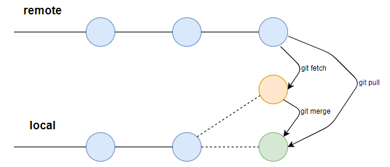
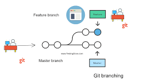

# Git

## Table of Contents

1. [Introduction to GitHub](#introduction-to-github)
2. [Basic Git Commands and Concepts](#basic-git-commands-and-concepts)
3. [Intermediate GitHub Features](#intermediate-github-features)
4. [Advanced Git Techniques](#advanced-git-techniques)
5. [GitHub Collaboration and Workflow](#github-collaboration-and-workflow)
6. [GitHub Security and Permissions](#github-security-and-permissions)
7. [Common Interview Questions](#common-interview-questions)

---

## Introduction to GitHub

### 1. What Is Github?

**`Answer:`** GitHub is industry-standard version control and publishing platform for web developers. GitHub is the place where developers store the code. It is the best place to share code with friends, co-workers, classmates, and total strangers. For understanding GitHub, we should understand about “Git.” “Git” is the version control system, which means that whenever the developer creates something and makes changes to the code or releases new versions, anyone can keep track of all the modifications in a central repository.

### 2. What Is Github Link?

**`Answer:`** GitHub is a web-based Git or version control repository on the Internet with a hosting service. It offers the distributed version control and source code management (SCM) functionality of Git as well as adding its own new features.

### 3. Is Github Open Source Software?

**`Answer:`** GitHub is not open-source software because they have a commercial offer based known as “GitHub for Enterprise.” Nevertheless, anyone can apply their ideas just like open-source software on GitHub look-alike, known as GitLab which is a ruby application with its source code here.

### 4.  What Is A Git Pull?



**`Answer:`** Git pull is shorthand for Git fetch, followed by Git merge FETCH_HEAD. More specifically, Git pull runs Git fetch with the given parameters and calls Git to merge the retrieved branch heads into the current branch. Should be the name of a remote repository as forwarded to Git-fetch.

### 5. Explain the difference between Git and GitHub

**`Answer:`**

| Git | GitHub |
| --- | --- |
| A version control system to manage and track code changes. | A cloud-based platform for hosting Git repositories. |
| Runs locally on a developer's machine. | Used for collaboration, sharing repositories, and version control. |
| Command-line interface or GUI tools. | Web interface with additional features like issue tracking and pull requests. |
| Open-source project. | Owned by Microsoft. |
| Can be used offline, as it operates locally on your machine. | Requires an internet connection because it is hosted on the web. |

### 6. What language is used in GIT?

**`Answer:`** C is the programming language that is used for creating Git which ensures that the overheads are reduced.

### 7. What is a git repository?

A repository is a file structure where git stores all the project-based files. Git can either stores the files on the local or the remote repository.

### 8. What Is A Branch On Github?



**`Answer:`** Branch in Git means a lightweight movable pointer to one of these commits. The default branch name in Git is the master. As we initially make commits, we are given a master branch that points to the last commit being made. Every time we commit, it moves forward automatically.

## Basic Git Commands and Concepts

### 1. Common Commands

1. `git init:` Initializes a new Git repository in the current directory, allowing version control for a project.

2. `git clone [repository URL]:` Creates a local copy of an existing remote repository.

3. `git add [file/folder]:` Stages files for the next commit, indicating which changes should be recorded.

4. `git commit -m "message":` Commits the staged changes to the repository with a descriptive message explaining the changes.

5. `git status:` Shows the current state of the working directory and the staging area, indicating any modified or untracked files.

6. `git push:` Sends committed changes from a local repository to a remote one (e.g., GitHub).

7. `git pull:` Fetches and integrates changes from a remote repository into the current branch, combining `git fetch` and `git merge`.

### 2. Branching

1. `git branch:` Lists, creates, or deletes branches. The command `git branch [branch-name]`creates a new branch.

2. `git checkout [branch-name]:` Switches to the specified branch. This command can also be used with `-b` to create and switch to a new branch in one step.

3. `git merge [branch-name]:` Merges the specified branch into the current branch, combining the code changes from both.

### 3. Workflow Basics: Pull Request Creation and Management

1. A pull request (PR) is a feature used to propose and collaborate on changes to a repository. It allows developers to review code, discuss changes, and suggest improvements before merging the code into the main branch.

2. **`Creating a pull request involves:`**
  
- Pushing a new branch with changes to a remote repository.

- Navigating to the repository on GitHub and selecting the "New Pull Request" option.

- Providing a title and description for the pull request to explain the changes.

3. Managing a pull request includes reviewing the code, requesting changes, approving, and merging the PR once it's approved by reviewers. This ensures a structured code integration process and promotes code quality.

## Intermediate GitHub Features

### 1. Managing Branches and Handling Merges

1. **Branch Management** is crucial for organized and parallel development. Developers use branches to work on features or bug fixes without affecting the main codebase. Merging integrates these branches into the main branch or other branches.

2. **Handling Merges** involves ensuring that changes from one branch are combined with another. Developers typically use `git merge` for fast-forward or three-way merges, depending on the history and how branches have diverged.

### 2. Resolving Merge Conflicts

- **Merge conflicts** occur when changes from two branches clash due to simultaneous edits in the same section of code or conflicting file modifications. Resolving them requires:
  
  1. Running `git status` to identify conflicted files.
  
  2. Opening those files and manually editing to choose which changes to keep.

  3. Adding the resolved file using `git add` and committing the changes to finalize the merge with `git commit`.

- Tools like GitHub's conflict editor or external merge tools help streamline this process by visualizing conflicts and possible resolutions.

### 3. Understanding .gitignore and Version Control Best Practices

The `.gitignore` file tells Git which files or directories to ignore and not track in version control. Common examples include:

  Compiled code (`*.class`, `*.o`)
  
  Environment files (`.env`)
  
  Dependency directories (`node_modules/`)

**`Best Practices for Version Control:`**

- Commit frequently with clear, descriptive messages.

- Work on feature branches and avoid pushing changes directly to the main branch.

- Sync branches regularly using git pull to reduce the likelihood of large merge conflicts.

### 4. Forking and Contributing to Open-Source Projects

- Forking a repository creates a personal copy of the original project under your GitHub account. This allows you to make changes without affecting the original project.

- Contributing involves:
  
  1. Forking the repository.

  2. Cloning the forked repository locally using git clone.
  
  3. Creating a new branch (git checkout -b feature-branch), making changes, and committing them.

  4. Pushing the branch to your forked repository (git push origin feature-branch).

  5. Creating a pull request from your branch to the original repository’s main branch.

- Open-source contribution etiquette includes following the project’s contribution guidelines, writing clear pull request descriptions, and adhering to coding standards.

## Advanced Git Techniques

### 1. Rebasing: `git rebase` vs `git merge`

- `git rebase:`

  1. Used to move or reapply commits from one branch onto another, creating a linear project history.

  2. It changes the base of your branch, making the history cleaner and easier to read.

  3. `Example:` `git rebase main` replays your branch’s commits on top of the main branch.
  
- `git merge:`
  
  1. Combines changes from one branch into another, creating a new "merge commit" that preserves the history of both branches.

  2. Keeps the full history but may result in a more complex graph with multiple branches converging.

  - `Comparison:` While git rebase rewrites commit history to create a linear history, git merge preserves all commit paths. Merging is safer in collaborative work to avoid rewriting shared history.

### 2. Cherry-picking: git cherry-pick

- `git cherry-pick` is used to apply a specific commit from one branch to another.

- Ideal for situations where a bug fix or feature from a different branch needs to be applied without merging the entire branch.

- Example: `git cherry-pick [commit-hash]` applies that specific commit to the current branch.

### 3. Stashing and Applying Stashed Changes: `git stash`, `git stash apply`

- `git stash` temporarily saves changes in the working directory that are not ready to be committed, allowing you to switch branches or perform other tasks without losing progress.

- Example: `git stash` saves changes, and `git stash list` shows stashed entries.

- `git stash apply`restores the most recent stashed changes, while `git stash apply [stash@{index}]` can be used to apply a specific stash.

- `git stash pop` applies and removes the stash entry from the stash list.

### 4. Reverting and Resetting: `git reset`, `git revert`

**`git reset:`**

- Used to move the branch pointer backward in history and optionally modify the working directory.

- Options include:

  - `--soft:` Moves the branch pointer, keeping changes staged.
  
  - `--mixed (default):` Moves the branch pointer, unstaging changes but keeping them in the working directory.

  - `--hard:` Moves the branch pointer and clears the working directory, removing changes.

- **`Example:`** `git reset --hard [commit-hash]` resets the branch to a specific commit, erasing all changes made since.

**`git revert:`**

- Safely undoes a commit by creating a new commit that reverses the effects of the previous one, preserving history.

- Example: git revert [commit-hash] generates a new commit that reverts the specified commit.

Difference: git reset changes history and should be used with caution, particularly --hard, while git revert is safer as it maintains history and can be used in shared branches.

## GitHub Collaboration and Workflow

### 1. Best Practices for Team Collaboration

- **`Branching Strategy:`** Adopt a clear branching model such as Git Flow or GitHub Flow to standardize how work is structured (e.g., `feature/, hotfix/`).
- **`Commit Hygiene:`** Use descriptive, consistent commit messages (e.g., `feat: add user authentication`).

- **`Keep Branches Short-Lived:`** Regularly push and merge feature branches to avoid long-lived branches that are hard to manage.

- **`Synchronize with the Team:`** Pull changes frequently from the main branch to reduce merge conflicts.

- **`Communicate Changes:`** Notify team members of significant changes or when PRs are ready for review to keep everyone aligned.

### 2. Code Review Processes and Pull Request Etiquette

- **`Create Thorough PR Descriptions:`** Include what the PR does, why the change is necessary, relevant issues, and any special notes for the reviewers.

- **`Add Reviewers and Assignees:`** Assign teammates to review and make sure the right people are notified.

- **`Follow Structured Feedback:`**
  - Use GitHub’s code comment feature to provide clear and constructive feedback.

  - Balance praise and suggestions for improvements.

- **`Respect Review Turnaround Time:`** Acknowledge reviews promptly and address feedback to keep the process efficient.

- **`Merge with Care:`** Ensure all checks pass before merging. Squash commits when appropriate to keep the commit history clean.

- **`Code Review Standards:`**

  - Focus on code clarity, best practices, and adherence to project guidelines.
  - Avoid focusing solely on small issues (e.g., style), especially when tools like linters are in place.

### 3. Using GitHub Issues and Projects for Project Management

**`GitHub Issues:`**

- Use issues to document bugs, features, and tasks with detailed descriptions.

- **`Tag Issues with Labels:`** Apply tags like bug, enhancement, help wanted, etc., to organize and prioritize issues.

- **`Assign and Track:`** Assign issues to team members and link them to milestones to track project goals.

**`GitHub Projects:`**

- Utilize Projects to create a visual representation of tasks using columns like To Do, In Progress, and Done.

- **`Automate Project Updates:`** Configure automations so issues and pull requests move across columns as work progresses.

**`Milestones:`**

- Set up milestones for larger initiatives to bundle issues and track overall progress towards goals.

### 4. Leveraging GitHub Actions for CI/CD Automation

- **`Introduction to GitHub Actions:`**

  - A robust feature for creating custom workflows to build, test, and deploy code.
  
- **`Automated Workflows:`**

  - Create workflows to trigger on specific events like `push`, `pull_request`, or at scheduled times.

  - Use `.github/workflows/[workflow-name].yaml` to define actions.

- **`Common Workflow Examples:`**

  - Continuous Integration: Run unit tests and static analysis checks on each PR to ensure code quality.

  - Deployment: Set up automated deployment pipelines to push code to production or staging after PRs are merged.

- **`Workflow Structure:`**

  - **`Jobs:`** Individual tasks like checking out code, running tests, or deploying.

  - **`Steps:`** Commands or pre-built actions within a job.

- **`Example YAML Workflow:`**

```yaml
name: CI/CD Pipeline
on: [push, pull_request]
jobs:
  build-and-test:
    runs-on: ubuntu-latest
    steps:
      - name: Checkout code
        uses: actions/checkout@v3
      - name: Install dependencies
        run: npm install
      - name: Run tests
        run: npm test
  deploy:
    needs: build-and-test
    runs-on: ubuntu-latest
    steps:
      - name: Deploy to Production
        run: ./deploy.sh
```

- **`Security Best Practices:`**

- Use secrets management to store sensitive information like API keys.

- Implement branch protection rules to ensure workflows pass before merging.

## GitHub Security and Permissions

### 1. Setting Up Repository Access and Permissions

- **`Access Levels:`**

  - GitHub provides different permission levels, such as read, write, and admin, which can be assigned to users or teams in a repository.

  - **`Read Access:`** Allows users to view the repository and download the contents.

  - **`Write Access:`** Permits users to push changes to branches.

  - **`Admin Access:`** Grants full control over the repository, including the ability to manage settings and user access.

- **`Configuring Access:`**

  - Navigate to the repository’s Settings > Manage Access.

  - Add collaborators or teams and assign the appropriate permission level.

  - Use GitHub Organizations to manage teams for more structured access control across multiple repositories.
  
### 2. Implementing Branch Protection Rules

- **`Purpose:`** Protect branches from unauthorized or unreviewed changes to ensure stability in critical branches like main or production.

- **`Creating Branch Protection Rules:`**

  1. Go to Settings > Branches.

  2. Click Add Rule and specify the branch name pattern (e.g., main).

  3. Enable settings such as:

  - **`Require pull request reviews:`** Ensure that code changes are reviewed and approved before merging.

  - **`Require status checks to pass:`** Specify required CI checks (e.g., tests, linting) that must be successful before merging.

  - **`Require signed commits:`** Enforces cryptographic verification for commit authenticity.

  - **`Prevent force pushes and deletions:`** Disables force-pushing and protects against accidental deletion.

- **`Additional Protection Options:`**

- **`Enforce linear history:`** Prohibits merge commits and maintains a strict sequence of commits.

- **`Restrict who can push:`** Limits push access to specified users or teams.

### 3. Secrets Management for GitHub Actions

- **`Purpose:`** Store sensitive information like API keys, tokens, and passwords securely for use in workflows without exposing them in code.

- **`Adding Secrets:`**

  - Navigate to the repository’s Settings > Secrets and variables > Actions.

  - Click New repository secret, enter a name (e.g., API_KEY), and provide the secret value.

**`Accessing Secrets in Workflows:`**

- Secrets are referenced using `secrets.[SECRET_NAME]` in a GitHub Actions workflow.

- `Example:`

    ```yaml
    jobs:
    build:
        runs-on: ubuntu-latest
        steps:
        - name: Checkout code
            uses: actions/checkout@v3
        - name: Run script with secret
            run: echo ${{ secrets.API_KEY }}

    ```

- **`Best Practices:`**

  - Regularly update and rotate secrets to minimize exposure risks.

  - Use encrypted secrets only in necessary workflows, and avoid logging secrets during workflow execution.

  - Apply organizational secrets for consistency and to avoid redundancy across multiple repositories in an organization.

## Common Interview Questions

**`Basic Level:`**

### 1. Explain the difference between `git fetch` and `git pull`

- **`git fetch:`** Downloads changes from a remote repository but does not integrate them with the local branch. This allows you to review the changes before merging.

- **`git pull:`** Combines `git fetch` and `git merge` in one step. It downloads and integrates changes from the remote branch into the current branch, updating the local repository directly.

### 2.  How do you create and delete a branch?

- **`Create a branch:`** Use `git branch [branch-name]` to create a new branch or `git checkout -b [branch-name]` to create and switch to it immediately.

**`Delete a branch:`**

- **`Locally:`** Use `git branch -d [branch-name]` for a safe delete or `git branch -D [branch-name]` to force delete.
  
- **`Remotely:`** Use `git push origin --delete [branch-name]`.

**`Intermediate Level:`**

### 3. How do you resolve a merge conflict?

- When a conflict occurs, Git marks the conflicting sections in the affected files. Steps to resolve:
  1. Open the files with conflicts and manually edit the content to choose which changes to keep.
  
  2. Mark the file as resolved using `git add [file-name]`.
  
  3. Complete the merge with `git commit`.

- Use tools like GitHub’s built-in editor or external merge tools (e.g., VSCode, Beyond Compare) for better conflict visualization.

### 4.  What is the purpose of a `.gitignore` file?

- The `.gitignore` file specifies which files and directories Git should ignore and not track. This is used to exclude files such as:
  
  1. Temporary files (`*.log`, `*.tmp`)

  2. Build directories (`dist/`, `build/`)
  
  3. Environment configuration files (`.env`)

- This helps keep the repository clean and avoids pushing sensitive or unnecessary files to the remote repository.

**`Advanced Level:`**

### 5.  Describe the process and use case for `git rebase`

- `git rebase` changes the base of a branch by replaying its commits on top of another branch. It’s used to create a linear, cleaner commit history.

- **`Use case:`** Rebase when incorporating changes from the main branch into a feature branch to keep the history linear and avoid merge commits.

**`Process:`**

- Switch to the feature branch with `git checkout feature-branch`.

- Run `git rebase main` to move the commits from `feature-branch` on top of `main`.

- Resolve any conflicts if they arise, use `git rebase --continue`, or `git rebase --abort` to stop the rebase.

### 6.  How do you handle a detached HEAD state?

- A detached HEAD state occurs when the HEAD points to a specific commit instead of a branch, usually after checking out a commit directly (`git checkout [commit-hash]`).

- **`Handling it:`**

  - To retain any changes made in this state, create a new branch using `git checkout -b [new-branch-name]` and commit changes there.

  - If no changes need to be saved, simply use `git checkout [branch-name]` to return to a regular branch state.

### 7. How to Switch Branch in GitHub?

**`Answer:`**

Switch branch which simply means, to navigate from one branch to another.
By the use of command, we can do this easily by the use of a versioning tool. Also, we can do this via GitHub to see the changes in the other branches. Just we have to go to the GitHub official site and select the branch we want to move to.

### 8. How to Add Files to the Local Repository in GitHub?

**`Answer:`** To add the files which we want to commit, to the remote repository, this can be also be done via the git command prompt.

For this we need to run a few commands which is as follows:

`git add "your file name with full path"`

### 9. What Is A Gist Programming?

**`Answer:`** GitHub provides a hosting service that facilitates a web-based Git repository. It includes all the functionality of Git with additional features added in. The gist is an additional attribute added to GitHub, which facilitates the sharing of code snippets, notes, to do lists and more. We can save our Gists as secret or public in the repository.

### 10. How Can We Create A Gist?

**`Answer:`** Creating a gist requires a very simple process as depicted in the steps below: –

1. Sign in to GitHub.

2. We should the navigate to the gist home page.

3. After this, we need to type an optional description and name for the gist.

4. Key in the text of your gist into the gist text box.

5. Following this we should select either to create a public gist or to create a secret gist.

### 11. What is the gist of Git?

Gists are a great way to share the work of any developer. They can share parts of files, full applications, or single files. Each Gist is a Git repository, which means, it can be forked and cloned.

### 12. What do you mean by the Commit message?

It is basically a message which you can see on the screen while working on Git whenever a change is committed. It is possible to keep a record of all the changes made by the user in an editor. The history of changes needs to be explored lately for a specific task

### 13. Name a few graphical Git clients for the Linux platforms?

These are

Git-g, Git cola
Git GUI
Giggle

### 14. What is Gitlog and when you can use it?

It is basically a command that can be executed when it comes to finding the history of a project according to the date, changes made, the developer who handled it, and the usefulness of the same.

### 15. What is SHAI name?

It is basically a string character that is responsible for the identification of the committed objects. The fact is users are free to make the changes to the default commit objects and the same is used for knowing and locating the overall changes made with a track record of the same.

### 16. Name any two Git repository hosting services that are common

These are Visual Studio Online and Git Enterprise

### 17. What do you know about the significance of software development?

In the century we are living in, the overall time is taken to accomplish a task largely matters when it comes to the corporate level. The software is powerful in saving a lot of time. Also, they impose a strict upper limit on the dependency of a task on humans. The tasks are generally governed, controlled, monitored, and accomplished by the software in the current time. Thus, the scope is software development is booming and users should pay attention to using the best available technology of the same.

### 18. How many characters are there in the SHAI name?

It is a 40 Character String that can vary in some special cases.

### 19. How it is possible for a developer to simply update the remote references related to the different objects?

This is possible through the Git PUSH. In fact, it is actually the prime function of the same.

### 20 Tell us whatever you know about the Github development process?

It is basically nothing but quite similar to that of a life cycle of any specific software. Thus, you should have knowledge about the life cycle of software and the factors that can directly influence the same. There are actually several activities that are a part of the process and they are:

- Analysis of the requirement

- Specifications of the project

- The architecture of the software

- Real time implementation

- Testing of software

- Documentation and reporting

- Maintenance

- Training and support available with the same

### 21 On what projects you have already worked on which are based on Github?

This question is often asked in IT interviews. You need to give a short or a detailed overview of the projects you have handled, the problems you faced, the outcome of the project, the benefits organization and you as a developer derived from it, the scope of the project, and the time taken to complete it. Moreover, you should mention what sort of experience you derived from them.

### 22. Compare Git with SVN?

When it comes to handling data with large size, Git is not widely preferred. However, for users, it is possible to handle more than one project with the latter provided they remain in the same repository. In multiple branches, Git fails to support the commits while the SVN can do so easily.

### 23. Name the tool that can be deployed for Git migration?

SubGit

### 24. What language is considered in Git and what is the benefit of same in this approach according to you?

Git is purely based on the C and the same makes sure of imposing a limit on the overhead of runtimes which are generally associated with other platforms in its class. Also, c makes it compatible with all the other domains and the developer’s already existing work.
