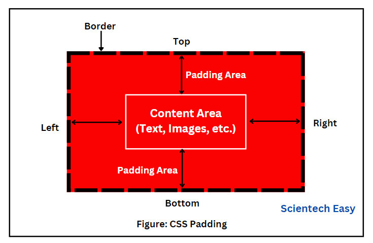
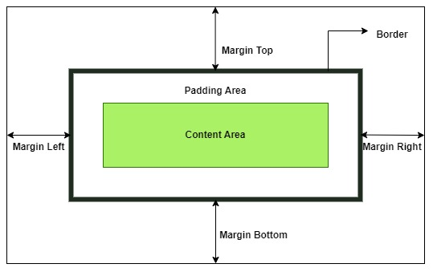

# CSS_Interview_Question

1. **What is CSS?**

CSS stands for Cascading Style Sheet. It is a popular styling language which is used with HTML to design websites. It can also be used with any XML documents including plain XML, SVG, and XUL.

2. **What is the origin of CSS?**

SGML (Standard Generalized Markup Language) is the origin of CSS. It is a language that defines markup languages.

3. **What are the different variations of CSS?**

Following are the different variations of CSS:

- CSS1
- CSS2
- CSS2.1
- CSS3
- CSS4

4. **How can you integrate CSS on a web page?**

There are three methods to integrate CSS on web pages.

- **Inline method** - It is used to insert style sheets in HTML document
  
**Example**

```css
<p style="color:blue">Hello CSS</p>  
```

- **Embedded/Internal method** - It is used to add a unique style to a single document
 
**Example**

```css
<style>  
p{color:blue}  
</style>  
```

- **Linked/Imported/External method** - It is used when you want to make changes on multiple pages.
 
**Example**

```css
<link rel="stylesheet" type="text/css" href="style.css">  
```


5. **What are the advantages of CSS?**

- Bandwidth
- Site-wide consistency
- Page reformatting
- Accessibility
- Content separated from presentation

6. **What are the limitations of CSS?**

- Ascending by selectors is not possible
- Limitations of vertical control
- No expressions
- No column declaration
- Pseudo-class not controlled by dynamic behavior
- Rules, styles, targeting specific text not possible

7. **What are the CSS frameworks?**

CSS frameworks are the preplanned libraries which make easy and more standard compliant web page styling. The frequently used CSS frameworks are: -

- Bootstrap
- Foundation
- Semantic UI
- Gumby
- Ulkit

8. **Why background and color are the separate properties if they should always be set together?**

It enhances the legibility of style sheets. The background property is a complex property in CSS, and if it is combined with color, the complexity will further increase.
Color is an inherited property while the background is not. So this can make confusion further.

9. **What is Embedded Style Sheet?**

An Embedded style sheet is a CSS style specification method used with HTML. You can embed the entire stylesheet in an HTML document by using the STYLE element.

**Example**

```css
 <style>    
body {    
    background-color: linen;    
}    
h1 {    
    color: red;    
    margin-left: 80px;    
}     
</style>    
```

10.  **What are the advantages of Embedded Style Sheets?**

You can create classes for use on multiple tag types in the document.
You can use selector and grouping methods to apply styles in complex situations.
No extra download is required to import the information.

11. **What is a CSS selector?**

It is a string that identifies the elements to which a particular declaration apply. It is also referred as a link between the HTML document and the style sheet. It is equivalent of HTML elements. There are several different types of selectors in CSS: -

- CSS Element Selector
- CSS Id Selector
- CSS Class Selector
- CSS Universal Selector
- CSS Group Selector


12.  **Name some CSS style components.**

Some CSS Style components are:

- Selector
- Property
- Value

13. **What is the use of CSS Opacity?**

The CSS opacity property is used to specify the transparency of an element. In simple word, you can say that it specifies the clarity of the image. In technical terms, Opacity is defined as the degree to which light is allowed to travel through an object. For example:

**Example**

```css
<style>    
img.trans {    
    opacity: 0.4;    
    filter: alpha(opacity=40); /* For IE8 and earlier */    
}    
</style>   
```

14. **Explain universal selector.**

The universal selector matches the name of any of the element type instead of selecting elements of a specific type.

**Example**

```css
<style>    
* {    
   color: green;    
   font-size: 20px;    
}     
</style>    
```

15. **Which command is used for the selection of all the elements of a paragraph?**

The p[lang] command is used for selecting all the elements of a paragraph.

16. **What is the use of % unit?**

It is used for defining percentage values.

17. **Name the property used to specify the background color of an element.**

The background-color property is used to specify the background color of the element. For example:

**Example**

```CSS
<style>    
h2,p{    
    background-color: #b0d4de;    
}    
</style>  
```

18. **Name the property for controlling the image repetition of the background.**

The background-repeat property repeats the background image horizontally and vertically. Some images are repeated only horizontally or vertically.

**Example**

```css
<style>    
body {    
background-image: url("paper1.gif");    
margin-left:100px;    
}    
</style>  
```

19. **Name the property for controlling the image position in the background.**

The background-position property is used to define the initial position of the background image. By default, the background image is placed on the top-left of the webpage.

You can set the following positions:

- center
- top
- bottom
- left
- right

```html
background: white url('goodmorning.jpg');  
background-repeat: no-repeat;  
background-attachment: fixed;  
background-position: center;
```

20. **Name the property for controlling the image scroll in the background.**

The background-attachment property is used to specify if the background image is fixed or scroll with the rest of the page in the browser window. If you set fixed the background image, then the image not move during scrolling in the browser. Let's take an example with the fixed background image.

```htmlm
background: white url('bbb.gif');  
background-repeat: no-repeat;  
background-attachment: fixed;  
```

21. **What is the use of ruleset?**

The ruleset is used to identify that selectors can be attached with other selectors. It has two parts:

**Selector** - Selector indicates the HTML element you want to style.

**Declaration Block** - The declaration block can contain one or more declarations separated by a semicolon.
CSS syntax

22. **What is the difference between class selectors and id selectors?**

An overall block is given to class selector while id selectors take only a single element differing from other elements.

CSS Class Selector

**Example**

```css
<style>    
.center {    
    text-align: center;    
    color: blue;    
}    
</style>  
   
CSS Id Selector
<style>    
#para1 {    
    text-align: left;    
    color: blue;    
}    
</style>    
```

23. **What are the advantages of External Style Sheets?**

You can create classes for reusing it in many documents.
By using it, you can control the styles of multiple documents from one file.
In complex situations, you can use selectors and grouping methods to apply styles.

24. **What is the difference between inline, embedded and external style sheets?**

Inline: Inline Style Sheet is used to style only a small piece of code.

**Example**

```css
<htmltag style="cssproperty1:value; cssproperty2:value;"> </htmltag> 
```    
       
Embedded: Embedded style sheets are put between the `<head>...</head>` tags.

**Example**

```css
<style>    
body {    
    background-color: linen;    
}    
h1 {    
    color: red;    
    margin-left: 80px;    
}     
</style>    
```

External: This is used to apply the style to all the pages within your website by changing just one style sheet.

```css
<head>    
<link rel="stylesheet" type="text/css" href="mystyle.css">    
</head>    
```       
25. **What is RWD?**

RWD stands for Responsive Web Design. This technique is used to display the designed page perfectly on every screen size and device, for example, mobile, tablet, desktop and laptop. You don't need to create a different page for each device.

26. **What are the benefits of CSS sprites?**

If a web page has a large number of images that take a longer time to load because each image separately sends out an HTTP request. The concept of CSS sprites is used to reduce the loading time for a web page because it combines the various small images into one image. It reduces the number of HTTP requests and hence the loading time.

27. **What is the difference between logical tags and physical tags?**

Physical tags are referred to as presentational markup while logical tags are useless for appearances.
Physical tags are newer versions, on the other hand, logical tags are old and concentrate on content.

28. **What is the CSS Box model and what are its elements?**

The CSS box model is used to define the design and layout of elements of CSS.

The elements are:

- **Margin** - It removes the area around the border. It is transparent.
- **Border** - It represents the area around the padding
- **Padding** - It removes the area around the content. It is transparent.
- **Content** - It represents the content like text, images, etc.

29. **What is the difference between padding and margin in CSS?**

In CSS, a margin is the space around an element's border, while padding is the space between an element's border and the element's conten

**Example**

- **Padding**



- **Margin**



30. **How do you add a background image to an element in CSS?**

To add a background image to an element in CSS, you use the background-image property. You'll need to provide the URL of the image file within the url() function as the property's value.

**Example**

```
.selector{
    background-image: url('path/to/image.jpg');
}
```

31. **How do you set the height and width of an element in CSS?**

The CSS height and width properties are used to set the height and width of an element. The CSS max-width property is used to set the maximum width of an element. This element has a height of 50 pixels and a width of 100%.

**Example**

```css
.my-element {
  width: 200px;
  height: 100px;
}
```

32. **What is the purpose of the CSS opacity property?**

The opacity property sets the opacity level for an element. The opacity-level describes the transparency-level, where 1 is not transparent at all, 0.5 is 50% see-through, and 0 is completely transparent.

**Example**

```css
<!DOCTYPE html>
<html>
<head>
<style>
body {
  background-color:#E7E9EB;
}
#myDIV {
  height:300px;
  background-color:#FFFFFF;
}
#div2 {
  border: 1px solid black;
  background-color: yellow;
  width: 200px;
  height: 100px;
  position: relative;
  top: 80px;
  left: 20px;
  padding: 20px;
}
#div1 {
  border: 1px solid black;
  position: relative;
  left: 50px;
  padding: 20px;
  background-color: lightblue;
  width: 200px;
  height: 100px;
  opacity: 1;
}
</style>
</head>
<body>

<h1>The opacity property</h1>

<div id="myDIV">
  <div id="div2">A yellow DIV element.</div>
  <div id="div1">Change the opacity of the blue DIV.</div>
</div>

</body>
</html>
```

**Output**


33. **How do you create a horizontal navigation menu using CSS?**

- Create a <nav> element with `<ul>` and `<li>` for navigation links.
- Use CSS flexbox for a horizontal layout, sticky positioning, and background styling.
- Apply styling for text color, spacing, and alignment.
- Add hover effects to enhance interactivity, like changing link colors.
- Include optional elements (e.g., search bar) and style for consistency.
- Consider media queries for responsiveness, adjusting styles for different screen sizes.

**Example**

```css
<!DOCTYPE html>
<html>

<head>
    <title>Building a Horizontal Navigation Bar</title>
    <style>
        * {
            margin: 0;
            padding: 0;
        }

        body {
            font-family: 'Arial', sans-serif;
        }

        .navbar {
            display: flex;
            position: sticky;
            align-items: center;
            justify-content: space-between;
            top: 0px;
            background: rgba(0, 0, 0, 0.6) url(
'https://media.geeksforgeeks.org/wp-content/uploads/20201215124609/Capture-300x14.PNG');
            background-blend-mode: darken;
            background-size: cover;
            color: white;
            padding: 10px 20px;
        }

        .nav-list {
            display: flex;
            list-style: none;
        }

        .nav-list li {
            margin-right: 20px;
        }

        .nav-list li:last-child {
            margin-right: 0;
        }

        .nav-list li a {
            text-decoration: none;
            color: white;
            font-size: 18px;
            transition: color 0.3s ease-in-out;
        }

        .nav-list li a:hover {
            color: #ffd700;
            /* Change the color on hover */
        }

        .rightNav {
            text-align: right;
        }

        #search {
            padding: 8px;
            font-size: 16px;
            border: 2px solid #fff;
            border-radius: 5px;
        }

        .btn {
            background-color: #ffd700;
            color: #000;
            border: none;
            padding: 8px 12px;
            border-radius: 5px;
            cursor: pointer;
            transition: background-color 0.3s ease-in-out;
        }

        .btn:hover {
            background-color: #000;
            /* Change the background color on hover */
            color: #ffd700;
        }
    </style>
</head>

<body>
    <nav class="navbar">
        <ul class="nav-list">
            <li><a href="#home">Home</a></li>
            <li><a href="#about">About Us</a></li>
            <li><a href="#services">Services</a></li>
            <li><a href="#contact">Contact</a></li>
        </ul>
        <div class="rightNav">
            <input type="text" 
                   name="search" 
                   id="search" 
                   placeholder="Search">
            <button class="btn btn-sm">Search</button>
        </div>
    </nav>
</body>

</html>
```

**Output**


34. **What is Style Table**

This CSS module defines styles applicable to the HTML `<table>` element, which is used to render tabular data. By default, tables are rendered as a two-dimensional grid with cells lined up in a series of consecutive rows and columns.

35. **What is box shadow?**

The box-shadow CSS property adds shadow effects around an element's frame. You can set multiple effects separated by commas. A box shadow is described by X and Y offsets relative to the element, blur and spread radius, and color.