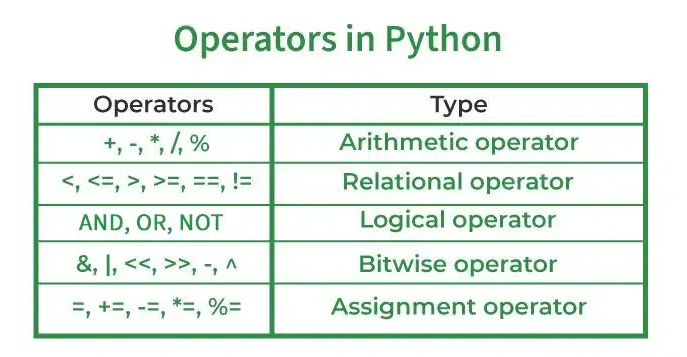

# Basic Python Topics

## Q1. What is Python?

A1. Python is a high-level, interpreted programming language known for its readability and versatility. It supports multiple programming paradigms, including procedural, object-oriented, and functional programming.

## Q2. List some popular applications of Python in the world of technology

A2.

- System Scripting
- Web Development
- Game Development
- Software Development
- Complex Mathematics

## Q3. What are Python keywords?

A3. Python keywords are reserved words that have special meanings and functionalities within the Python programming language. These keywords are part of the language's syntax and cannot be used as identifiers (such as variable names, function names, or class names) because they are integral to the structure and operation of Python code.

## Q4. List of Python Keywords

A4.

35 types in keywords

- `False` - Boolean value indicating false.
- `None` - Represents the absence of a value.
- `True` - Boolean value indicating true.
- `and` - Logical AND operator.
- `as` - Used to create an alias while importing modules.
- `assert` - Used for debugging purposes.
- `async` - Declares an asynchronous function.
- `await` - Used to wait for an asynchronous operation to complete.
- `break` - Exits the nearest enclosing loop.
- `class` - Used to define a new class.
- `continue` - Skips the rest of the code inside a loop for the current iteration.
- `def` - Used to define a function.
- `del` - Deletes objects.
- `elif` - Else if statement.
- `else` - Else statement.
- `except` - Catches exceptions.
- `finally` - Executes code regardless of whether an exception occurred.
- `for` - Used to create a for loop.
- `from` - Used to import specific parts of a module.
- `global` - Declares global variables.
- `if` - Conditional statement.
- `import` - Imports a module.
- `in` - Checks for membership within a sequence.
- `is` - Tests object identity.
- `lambda` - Creates an anonymous function.
- `nonlocal` - Declares non-local variables.
- `not` - Logical NOT operator.
- `or` - Logical OR operator.
- `pass` - Null operation; a statement that does nothing.
- `raise` - Raises an exception.
- `return` - Exits a function and returns a value.
- `try` - Specifies exception handling.
- `while` - Creates a while loop.
- `with` - Simplifies exception handling by encapsulating common preparation and cleanup tasks.
- `yield` - Used in generators to return a value and pause the generator's state.

## Q5. What is an Interpreted language?

A5. An Interpreted language executes its statements line by line. Languages such as Python, Javascript, R, PHP, and Ruby are prime examples of Interpreted languages. Programs written in an interpreted language runs directly from the source code, with no intermediary compilation step.

## Q6. What does the ‘#’ symbol do in Python?

A6.

- In Python, the # symbol is used to denote comments.
- They are primarily used to add explanations, notes, or annotations to the code to make it more understandable for anyone reading

## Q7. What comments in python?

A7. In Python, comments are non-executable lines in your code that are used to explain and clarify the code for anyone reading it, including your future self. They are essential for improving code readability and maintainability.

### Q9. Types of Comments in Python

A9.

- There are primarily two types of comments in Python:

  - Single-Line Comments
  - Multi-Line Comments

### Q10. Single-Line Comments

A10.

Single-line comments start with the hash symbol (#) and extend to the end of the line. They are typically used for brief explanations or annotations.

```bash
# This is a single-line comment
x = 10  # Initialize x with value 10
```

### Q11. Multi-Line Comments

A11.

Python doesn't have a distinct syntax for multi-line comments like some other languages (e.g., /*...*/ in C/C++).

- Using Multiple Single-Line Comments

  - By placing a # at the beginning of each line, you can create a block of comments.

```bash
# This is a multi-line comment
# explaining the following function.
# It spans several lines.
def my_function():
    pass
```

- Using Multi-Line Strings (Docstrings)

  - Although primarily intended for documentation (docstrings), multi-line strings enclosed in triple quotes (''' ... ''' or """ ... """) can act as multi-line comments if they are not assigned to any variable or used as docstrings.

```bash
"""
This is a multi-line comment.
It uses triple double quotes.
It can span multiple lines.
"""
def my_function():
    pass
```

## Q12. What is the difference between lists, tuples and sets?

A12.

- Lists, tuples and sets are all used to store multiple items in a single variable.

  - A list is a collection of data which is ordered and changeable (elements can be added, removed and changed).

  - A tuple is a collection of data which is ordered and unchangeable (elements cannot be added, removed or changed).

  - A set is a collection of data which is unordered, unchangeable, and unindexed.

## Q13. What is Variable?

A13.

A variable is the name given to a memory location. A value-holding Python variable is also known as an identifier.

Since Python is an infer language that is smart enough to determine the type of a variable, we do not need to specify its type in Python.

Variable names must begin with a letter or an underscore, but they can be a group of both letters and digits.

The name of the variable should be written in lowercase. Both Rahul and rahul are distinct variables.

```bash
a = 50
```

### Q14. Variable Types

A14.

- There are two types of variables in Python

  - Local variable
  - Global variable

#### Q15. Local Variable

A15.

The variables that are declared within the function and have scope within the function are known as local variables.

```bash
# Declaring a function  
def add():  
    # Defining local variables. They has scope only within a function  
    a = 20  
    b = 30  
    c = a + b  
    print("The sum is:", c)  
  
# Calling a function  
add()  
```

#### Q16.  Global Variables

A16.

Global variables can be utilized all through the program, and its extension is in the whole program. Global variables can be used inside or outside the function.

By default, a variable declared outside of the function serves as the global variable. Python gives the worldwide catchphrase to utilize worldwide variable inside the capability.

```bash
# Declare a variable and initialize it  
x = 101  
  
# Global variable in function  
def mainFunction():  
    # printing a global variable  
    global x  
    print(x)  
    # modifying a global variable  
    x = 'Welcome To swayaan'  
    print(x)  
  
mainFunction()  
print(x)
```

`OUTPUT`

```bash
101
Welcome To swayaan
Welcome To swayaan
```

### Q17. multi-word Variables types

A17.

`Camel Case` - In the camel case, each word or abbreviation in the middle of begins with a capital letter. There is no intervention of whitespace. For example - nameOfStudent, valueOfVaraible, etc.

`Pascal Case`- It is the same as the Camel Case, but here the first word is also capital. For example - NameOfStudent, etc.

`Snake Case` - In the snake case, Words are separated by the underscore. For example - name_of_student, etc.

## Q18. Tokens Types

A18.

The token is the smallest unit inside the given program.

There are following tokens in Python:

- Keywords.
- Identifiers.
- Literals.
- Operators.

## Q19. Data Types

A19.

To define the values ​​of various data types of Python and check their data types we use the type() function.

### Q20. types of Data Types

A20.

- Numeric
- Sequence Type
- Boolean
- Set
- Dictionary

#### Q21. Numeric Data Types in Python

Q21.

The numeric data type in Python represents the data that has a numeric value. A numeric value can be an integer, a floating number, or even a complex number.

- `Integers` – This value is represented by int class. It contains positive or negative whole numbers (without fractions or decimals). In Python, there is no limit to how long an integer value can be.

- `Float` – This value is represented by the float class. It is a real number with a floating-point representation. It is specified by a decimal point. Optionally, the character e or E followed by a positive or negative integer may be appended to specify scientific notation.

- `Complex Numbers` – A complex number is represented by a complex class. It is specified as (real part) + (imaginary part)j . For example – 2+3j

```bash
a = 5
print("Type of a: ", type(a))   # Type of a:  <class 'int'>

b = 5.0
print("\nType of b: ", type(b))   # Type of b:  <class 'float'>

c = 2 + 4j
print("\nType of c: ", type(c))  #  Type of c:  <class 'complex'>
```

#### Q22. Sequence Data Types in Python

A22.

The sequence Data Type in Python is the ordered collection of similar or different Python data types. Sequences allow storing of multiple values in an organized and efficient fashion. There are several sequence data types of Python:

- String
- List
- Tuple

##### Q23. String Data Type

A23.

A string is a collection of one or more characters put in a single quote, double-quote, or triple-quote

```bash
String1 = 'Welcome to the Geeks World'
print("String with the use of Single Quotes: ") # String with the use of Single Quotes: 
print(String1) # Welcome to the SWAYAAN
String1 = "I'm a Geek"
print("\nString with the use of Double Quotes: ") # String with the use of Double Quotes: 
print(String1) # I'm a SWAYAAN
print(type(String1)) # <class 'str'>
```

##### Q24. List Data Type

A24.

Lists are just like arrays, declared in other languages which is an ordered collection of data.

```bash
List = []
print("Initial blank List: ")  # Initial blank List:  
print(List)   #  []
List = ['SWAYAAM DEGITAL SOLUTION']
print("\nList with the use of String: ") # List with the use of String: 
print(List)   # ['SWAYAAM DEGITAL SOLUTION']
List = ["SWAYAAM", "DEGITAL", "SOLUTION"]
print("\nList containing multiple values: ") # List containing multiple values: 
print(List[0])  # SWAYAAM
print(List[2])  # SOLUTION
List = [['SWAYAAM', 'DEGITAL'], ['SOLUTION']]
print("\nMulti-Dimensional List: ") # Multi-Dimensional List: 
print(List) # ['SWAYAAM', 'DEGITAL'], ['SOLUTION']
```

##### Q25. Tuple Data Type

A25.

Just like a list, a tuple is also an ordered collection of Python objects.

```bash
Tuple1 = ()
print("Initial empty Tuple: ") # Initial empty Tuple: 
print(Tuple1) # ()
Tuple1 = ('SWAYAAM', 'DEGITAL') 
print("\nTuple with the use of String: ") # Tuple with the use of String: 
print(Tuple1) # ('SWAYAAM', 'DEGITAL')
list1 = [1, 2, 4, 5, 6]
print("\nTuple using List: ") # Tuple using List: 
print(tuple(list1))  # (1, 2, 4, 5, 6)
Tuple1 = tuple('SWAYAAM')
print("\nTuple with the use of function: ") # Tuple with the use of function: 
print(Tuple1) # ('S', 'W', 'A', 'Y', 'A', 'A', 'M')
Tuple1 = (0, 1, 2, 3)
Tuple2 = ('python', 'Solution')
Tuple3 = (Tuple1, Tuple2)
print("\nTuple with nested tuples: ") # Tuple with nested tuples: 
print(Tuple3) #  ((0, 1, 2, 3), ('python', 'Solution'))
```

#### Q26. Boolean Data Type in Python

A26.

Python Data type with one of the two built-in values, True or False. Boolean objects that are equal to True are truthy (true), and those equal to False are falsy (false)

True and False with capital ‘T’ and ‘F’ are valid booleans otherwise python will throw an error.

```bash
print(type(True))  # outout (True)
print(type(False))  # outout (False)
print(type(true))   # outout (error)
```

#### Q27. Set Data Type in Python

A27.

A Set is an unordered collection of data types that is iterable, mutable, and has no duplicate elements.

```bash
set1 = set()
print("Initial blank Set: ") # Initial blank Set: 
print(set1) #  set()
set1 = set("SWAYAAM DEGITAL SOLUTION") 
print("\nSet with the use of String: ") # Set with the use of String: 
print(set1) #  {'D', 'G', 'N', ' ', 'A', 'I', 'Y', 'E', 'T', 'W', 'O', 'M', 'U', 'L', 'S'}
set1 = set(["SWAYAAM", "DEGITAL", "SOLUTION"])
print("\nSet with the use of List: ") # Set with the use of List:
print(set1) # {'DEGITAL', 'SWAYAAM', 'SOLUTION'}
set1 = set([1, 2, 'SWAYAAM', 4, 'DEGITAL', 6, 'SOLUTION'])
print("\nSet with the use of Mixed Values") # Set with the use of Mixed Values
print(set1) # {'DEGITAL', 1, 2, 4, 'SWAYAAM', 6, 'SOLUTION'}
```

#### Q28. Dictionary Data Type in Python

A28.

A dictionary in Python is an unordered collection of data values, used to store data values like a map, unlike other Python Data Types that hold only a single value as an element, a Dictionary holds a key: value pair.

```bash
Dict = {}
print("Empty Dictionary: ") # Empty Dictionary: 
print(Dict) # {}
Dict = {1: 'SWAYAAM', 2: 'DEGITAL', 3: 'SOLUTION'}
print("\nDictionary with the use of Integer Keys: ") # Dictionary with the use of Integer Keys:
print(Dict) # {1: 'SWAYAAM', 2: 'DEGITAL', 3: 'SOLUTION'}
Dict = {'Name': 'SWAYAAM', 1: [1, 2, 3, 4]}
print("\nDictionary with the use of Mixed Keys: ") # Dictionary with the use of Mixed Keys: 
print(Dict) # {'Name': 'SWAYAAM', 1: [1, 2, 3, 4]}
Dict = dict({1: 'SWAYAAM', 2: 'DEGITAL', 3: 'SOLUTION'})
print("\nDictionary with the use of dict(): ") #  Dictionary with the use of dict(): 
print(Dict) # {1: 'SWAYAAM', 2: 'DEGITAL', 3: 'SOLUTION'}
Dict = dict([(1, 'SWAYAAM'), (2, 'DEGITAL')])
print("\nDictionary with each item as a pair: ") # Dictionary with each item as a pair: 
print(Dict) # {1: 'SWAYAAM', 2: 'DEGITAL'}
```

## Q29. Operators

A29.

Operators in general are used to perform operations on values and variables.

### Q30. Types of Operators in Python

A30.

- Arithmetic Operators

- Comparison Operators

- Logical Operators

- Bitwise Operators

- Assignment Operators



#### Q31. Arithmetic Operators

A31.

Arithmetic operators are used to perform basic mathematical operations like addition, subtraction, multiplication, and division.

```bash
a = 32    # Initialize the value of a  
b = 6      # Initialize the value of b  
print('Addition of two numbers:',a+b)   # Addition of two numbers: 38
print('Subtraction of two numbers:',a-b)   # Subtraction of two numbers: 26
print('Multiplication of two numbers:',a*b)  # Multiplication of two numbers: 192 
print('Division of two numbers:',a/b)  # Division of two numbers: 5.333333333333333
print('Reminder of two numbers:',a%b)  # Reminder of two numbers: 2
print('Exponent of two numbers:',a**b)  # Exponent of two numbers: 1073741824
print('Floor division of two numbers:',a//b) # Floor division of two numbers: 5
```

#### Q32. Comparison Operators

A32.

Comparison operators compare the values of the two operands and return a true or false Boolean value in accordance

```bash
a = 32      # Initialize the value of a  
b = 6       # Initialize the value of b  
print('Two numbers are equal or not:',a==b)  # Two numbers are equal or not: False 
print('Two numbers are not equal or not:',a!=b)  # Two numbers are not equal or not: True
print('a is less than or equal to b:',a<=b)  # a is less than or equal to b: False 
print('a is greater than or equal to b:',a>=b) # a is greater than or equal to b: True 
print('a is greater b:',a>b)  # a is greater b: True
print('a is less than b:',a<b) # a is less than b: False
```

#### Q33. Logical Operators

A33.

The assessment of expressions to make decisions typically uses logical operators. The examples of logical operators are and, or, and not. In the case of logical AND, if the first one is 0, it does not depend upon the second one. In the case of logical OR, if the first one is 1, it does not depend on the second one.

```bash
x = 5

print(x > 3 and x < 10)  # True
print(x > 3 or x < 4)  # True
print(not(x > 3 and x < 10)) # False
```

#### Q34. Bitwise Operators

A34.

The two operands' values are processed bit by bit by the bitwise operators. The examples of Bitwise operators are bitwise OR (|), bitwise AND (&), bitwise XOR (^), negation (~), Left shift (<<), and Right shift (>>).

```bash
a = 6
b = 3
print(a & b)  # OUTPUT  = 2
print(a | b)  # OUTPUT  = 7
print(~a)     # OUTPUT  = -7
print(a ^ b)  # OUTPUT  = 5
print(a >> 2) # OUTPUT  = 1
print(a << 2) # OUTPUT  = 24
```

#### Q35 Assignment Operators

A35.

Using the assignment operators, the right expression's value is assigned to the left operand. There are some examples of assignment operators like =, +=, -=, *=, %=, **=, //=.

```bash
a = 32         # Initialize the value of a  
b = 6          # Initialize the value of b  
print('a=b:', a==b)   # OUTPUT  = a=b: False
print('a+=b:', a+b)   # OUTPUT  = a+=b: 38
print('a-=b:', a-b)   # OUTPUT  = a-=b: 26
print('a*=b:', a*b)   # OUTPUT  = a*=b: 192
print('a%=b:', a%b)    # OUTPUT  = a%=b: 2
print('a**=b:', a**b)   # OUTPUT  = a**=b: 1073741824
print('a//=b:', a//b)    # OUTPUT  = a//=b: 5
```

# what